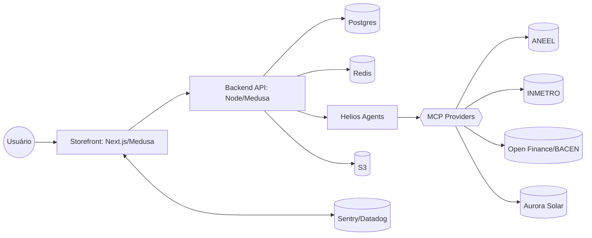
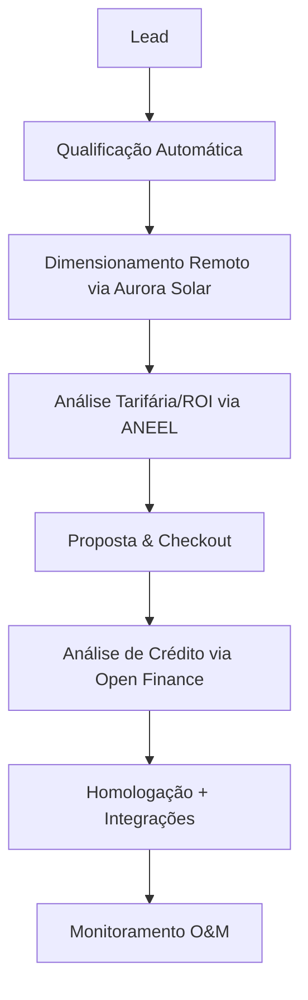
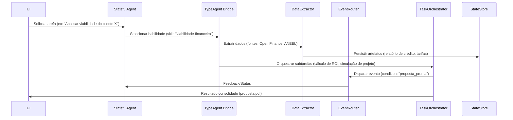
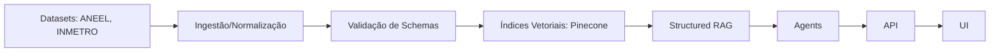

# Yello Solar Hub

Plataforma unificada para gestão 360º de projetos de energia solar, desde a qualificação do lead até o monitoramento e manutenção (O&M).


## Sumário
- [TL;DR](#tldr)
- [Arquitetura](#arquitetura)
- [Workflows de Negócio](#workflows-de-negócio)
- [Comunicações Entre Agentes](#comunicações-entre-agentes)
- [Dataflows](#dataflows)
- [MCPs: Recuperações e Consumos](#mcps-recuperações-e-consumos)
- [Instalação e Setup](#instalação-e-setup)
- [Scripts Úteis](#scripts-úteis)
- [Testes e Qualidade](#testes-e-qualidade)
- [Observabilidade e Segurança](#observabilidade-e-segurança)
- [Deploy](#deploy)
- [Roadmap](#roadmap)
- [FAQ](#faq)
- [Licença e Créditos](#licença-e-créditos)

## TL;DR
- **Quem usa:** Times de vendas, engenharia e O&M no setor de energia solar.
- **O que resolve:** Automatiza e integra o ciclo de vida de projetos solares, reduzindo custos operacionais e acelerando o tempo de fechamento.
- **Principais Módulos:** `Storefront` (Next.js/Medusa), `Backend` (Node/Medusa), `Helios Agents` (módulos de automação), `Data Platform` (ingestão e RAG).

## Arquitetura
**Diagrama Geral (C4-level 2 simplificado)**


## Workflows de Negócio
**Fluxo de Homologação/Pré-venda**


## Comunicações Entre Agentes
**Sequência Multiagente (Helios)**


## Dataflows
**Ingestão, Enriquecimento e Recuperação**


## MCPs: Recuperações e Consumos
**Tabela de Contratos MCP**
| MCP | Endpoint/Contrato | Input (schema) | Output (schema) | Rate limit | Retentativas | Erros Padrão |
|---|---|---|---|---|---|---|
| ANEEL | `/tarifas`, `/GD` | JSON Schema | JSON Schema | 100/min | backoff exp | 400, 404, 503 |
| INMETRO | `/registros/produtos` | JSON Schema | JSON Schema | 50/min | backoff exp | 400, 500 |
| Open Finance | `/consents`, `/accounts` | OAuth2 | JSON Schema | 200/min | idempotente | OIDC/OAuth |
| Aurora Solar | `/projects`, `/design` | JSON Schema | JSON Schema | 30/min | backoff exp | 403, 429, 5xx |

**Mapa de Consumo MCP pelos Agentes**
```mermaid
graph TD
  StatefulAgent -->|context| TypeAgentBridge
  TypeAgentBridge -->|skill: "analise-tarifaria"| ANEEL
  TypeAgentBridge -->|skill: "validar-componente"| INMETRO
  DataExtractor -->|ingest-financeiro| OpenFinance
  TaskOrchestrator -->|invoke: "criar-design"| AuroraSolar
```

## Instalação e Setup
✅ **Pré-requisitos:** Node.js v20+, Yarn v4+, Docker, Docker Compose, AWS CLI, Git LFS.

▶️ **Comandos:**
```bash
# 1. Habilitar Corepack (gerenciador de pacotes do Node)
corepack enable

# 2. Instalar dependências
yarn install

# 3. Configurar variáveis de ambiente (copie o exemplo)
cp .env.example .env

# 4. Iniciar serviços de infraestrutura com Docker
docker compose up -d postgres redis

# 5. Rodar migrações do banco de dados
(cd backend && yarn migrate)

# 6. Iniciar servidores de desenvolvimento (backend e storefront)
yarn dev
```
O backend estará disponível em `http://localhost:9000` e o storefront em `http://localhost:8000`.

## Scripts Úteis
```bash
# Rodar migrações do banco (após criar um novo módulo)
yarn workspace yello-solar-hub-backend migrate

# Popular banco com dados de teste
yarn workspace yello-solar-hub-backend seed

# Rodar todos os checks de qualidade (lint, tipos, testes)
yarn lint && yarn typecheck && yarn test

# Build para produção
yarn build

# Iniciar em modo produção (após build)
yarn start
```

## Testes e Qualidade
- **Tipos:** Unitários, Integração, Contrato (OpenAPI) e E2E (Playwright).
- **Execução:** `yarn test` no diretório raiz ou nos workspaces (`backend`, `storefront`).
- **Gate de CI:** O workflow de CI (`/.github/workflows/main.yml`) exige que `lint`, `typecheck` e `test` passem, com uma cobertura de testes de no mínimo 80%, antes de autorizar o merge para `main`.

## Observabilidade e Segurança
- **Monitoramento:** Logs estruturados são enviados para Datadog. Erros e exceções são capturados pelo Sentry.
- **Segurança:** Dados sensíveis (PII) são tratados com regras de ofuscação. Segredos de produção são gerenciados via AWS Secrets Manager e injetados no ambiente de execução, nunca commitados.

## Deploy
- **Storefront (UI):** Deploy contínuo na Vercel a cada merge na branch `main`.
- **Backend (API):** Deploy contínuo em AWS Lambda via GitHub Actions.
- **Migrações:** As migrações de banco de dados são executadas automaticamente como um passo do pipeline de deploy do backend.

## Roadmap
- **Q4 2025:** Implementação do módulo de O&M com alertas proativos. (Issue #123)
- **Q1 2026:** Expansão para o mercado de Geração Distribuída (GD) para clientes comerciais. (Issue #124)
- **Q2 2026:** Integração com novos MCPs de IoT para monitoramento de performance. (Issue #125)

## FAQ
1. **Como acesso o admin do Medusa?**
   - Acesse `http://localhost:9000/admin` e use `admin@medusa-test.com` com a senha `supersecret`.

2. **Onde configuro as chaves de API para os MCPs?**
   - No seu arquivo `.env`, preencha as variáveis correspondentes (ex: `AURORA_API_KEY`).

3. **Como crio um novo módulo de agente?**
   - Siga a estrutura de diretórios em `backend/src/modules/` e defina o serviço e os modelos de dados.

## Licença e Créditos
Este projeto é licenciado sob a Licença MIT. Desenvolvido pelo time Yello Solar.
