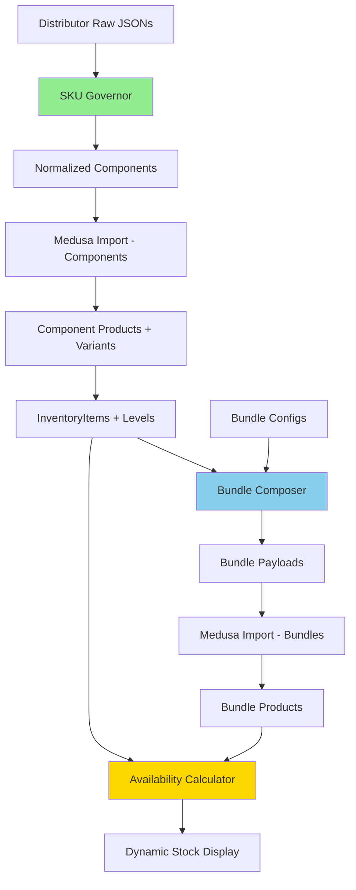

# Sistema Completo de Gestão de Inventário - YSH B2B

## 📚 Visão Geral dos Sistemas

Este repositório contém dois sistemas complementares para gestão completa do inventário de produtos solares fotovoltaicos:

### 1. SKU Governor - Validação e Normalização

**Arquivo**: `sku-governor.py`  
**Status**: ✅ Pronto para Produção  
**Documentação**: `SKU-GOVERNOR-README.md` e `SKU-GOVERNOR-USAGE.md`

Sistema que valida e normaliza produtos de distribuidores, gerando SKUs globais agnósticos.

### 2. Bundle Composer - Composição de Kits

**Arquivo**: `bundle-composer.py`  
**Status**: ✅ Pronto para Produção  
**Documentação**: `BUNDLE-COMPOSER-README.md`

Sistema que compõe kits solares como bundles virtuais, calculando disponibilidade e preços dinamicamente.

---

## 🚀 Fluxo Completo de Dados



---

## 📋 Quick Start - Fluxo Completo

### Passo 1: Validar e Normalizar Componentes

```bash
cd backend/data/products-inventory

# Processar todos os distribuidores
python run-governor-pipeline.py

# Ou processar um distribuidor específico
python sku-governor.py \
  distributors/neosolar/neosolar-panels.json \
  --category panel \
  --distributor neosolar \
  --output-dir normalized/neosolar/
```

**Output**: `normalized/{distributor}/{distributor}-{category}-normalized.json`

### Passo 2: Importar Componentes para Medusa

```bash
cd backend

# Importar componentes normalizados
node scripts/import-normalized-products.ts \
  --input ../data/products-inventory/normalized/neosolar/neosolar-panel-normalized.json
```

**Resultado**: Products, Variants, InventoryItems e InventoryLevels criados no Medusa

### Passo 3: Compor Bundles

```bash
cd backend/data/products-inventory

# Criar bundle a partir de configuração
python bundle-composer.py \
  examples/bundle-config-residential-hybrid.json \
  --output bundles/residential-hybrid-payload.json

# Ou processar múltiplas configurações
for config in configs/bundles/*.json; do
  output="bundles/$(basename $config .json)-payload.json"
  python bundle-composer.py "$config" --output "$output"
done
```

**Output**: `bundles/{bundle-name}-payload.json`

### Passo 4: Importar Bundles para Medusa

```bash
cd backend

# Importar bundles
node scripts/import-bundle-products.ts \
  --input ../data/products-inventory/bundles/residential-hybrid-payload.json
```

**Resultado**: Bundle Products com referências aos InventoryItems dos componentes

---

## 🧪 Testes

### Testar SKU Governor

```powershell
cd backend\data\products-inventory
.\test-sku-governor.ps1
```

**Valida**:
- ✅ Geração de SKUs globais
- ✅ Normalização de unidades
- ✅ Normalização de tecnologias
- ✅ Validação de campos obrigatórios
- ✅ Validação de ranges de valores

### Testar Bundle Composer

```powershell
cd backend\data\products-inventory
.\test-bundle-composer.ps1
```

**Valida**:
- ✅ Geração de SKUs de bundles
- ✅ Cálculo de disponibilidade dinâmica
- ✅ Cálculo de preço com margem
- ✅ Payload Medusa completo
- ✅ Metadata correta (is_bundle=true, manage_inventory=false)

---

## 📊 Padrões de SKU

### Componentes (SKU Governor)

| Categoria | Padrão | Exemplo |
|-----------|--------|---------|
| Painéis | `PNL-{MANU}-{MODEL}-{POWER}W{-TECH}` | `PNL-CANA-CS7N-550W-BF` |
| Inversores | `INV-{MANU}-{MODEL}-{POWER}KW{-TYPE}` | `INV-GROW-MIN-5KW-HYB` |
| Baterias | `BAT-{MANU}-{MODEL}-{CAP}KWH-{VOLT}V{-TECH}` | `BAT-BYD-BBOX-10KWH-48V-LFP` |
| Estruturas | `EST-{MANU}-{ROOF}-{CAP}P{-ORIENT}` | `EST-SOLG-CER-15P-V` |
| Cabos | `CAB-{TYPE}-{SECT}MM2-{COLOR}` | `CAB-SOLAR-6MM2-PRET` |
| Conectores | `CON-{MANU}-{TYPE}-{CURR}A` | `CON-MC4-MACHO-30A` |

### Bundles (Bundle Composer)

| Categoria | Padrão | Exemplo |
|-----------|--------|---------|
| Residencial On-Grid | `KIT-RESON-{POWER}KWP-{BRAND}` | `KIT-RESON-5KWP-GROW` |
| Residencial Híbrido | `KIT-RESHYB-{POWER}KWP-{BRAND}` | `KIT-RESHYB-8KWP-DEYE` |
| Residencial Off-Grid | `KIT-RESOFF-{POWER}KWP-{BRAND}` | `KIT-RESOFF-5KWP-GROW` |
| Comercial On-Grid | `KIT-COMON-{POWER}KWP-{BRAND}` | `KIT-COMON-25KWP-FRON` |
| Industrial On-Grid | `KIT-INDON-{POWER}KWP-{BRAND}` | `KIT-INDON-100KWP-SUNG` |

---

## 📐 Arquitetura Medusa.js

### Componentes (Products Normais)

```
Product
  ├─ title: "Painel Solar Canadian Solar 550W Bifacial"
  ├─ handle: "painel-solar-canadian-solar-550w-bifacial"
  └─ variants: [
      {
        sku: "PNL-CANA-CS7N-550W-BF",  ← SKU Global
        manage_inventory: true,
        inventory_items: [{
          inventory_item_id: "inv_pnl_cana_cs7n",
          required_quantity: 1
        }]
      }
    ]

InventoryItem (id: inv_pnl_cana_cs7n)
  ├─ sku: "PNL-CANA-CS7N-550W-BF"
  └─ InventoryLevels: [
      {
        stock_location: "neosolar",
        stocked_quantity: 450,
        metadata: { distributor_sku: "NEO-12345" }  ← SKU Original
      },
      {
        stock_location: "fortlev",
        stocked_quantity: 320,
        metadata: { distributor_sku: "FORT-PNL-789" }  ← SKU Original
      }
    ]
```

### Bundles (Products Virtuais)

```
Bundle Product
  ├─ title: "Kit Solar Residencial 8.1 kWp Híbrido"
  ├─ handle: "kit-solar-residencial-8-1-kwp-hibrido"
  ├─ metadata: { is_bundle: true }
  └─ variants: [
      {
        sku: "KIT-RESHYB-8KWP-DEYE",
        manage_inventory: false,  ← Sem estoque próprio
        inventory_items: [
          {
            inventory_item_id: "inv_pnl_jink_jkm545",  ← Painel
            required_quantity: 15
          },
          {
            inventory_item_id: "inv_inv_deye_sun8k",  ← Inversor
            required_quantity: 1
          },
          {
            inventory_item_id: "inv_bat_pylo_force",  ← Bateria
            required_quantity: 1
          }
        ],
        metadata: {
          bundle_components: [
            { variant_sku: "PNL-JINK-JKM545-540W", quantity: 15 },
            { variant_sku: "INV-DEYE-SUN8K-8KW-HYB", quantity: 1 },
            { variant_sku: "BAT-PYLO-FORCE-13KWH-384V-LFP", quantity: 1 }
          ]
        }
      }
    ]
```

**Disponibilidade do Bundle**:
```
bundle_stock = MIN(
  FLOOR(painel_stock / 15),     # 450 / 15 = 30
  FLOOR(inversor_stock / 1),    # 32 / 1 = 32
  FLOOR(bateria_stock / 1)      # 23 / 1 = 23
)
= 23 kits disponíveis
```

---

## 🔧 Configuração de Ambientes

### Desenvolvimento

```bash
# SKU Governor com dados de exemplo
python sku-governor.py \
  examples/neosolar-panels-sample.json \
  --category panel \
  --distributor neosolar \
  --output-dir test-results/

# Bundle Composer com resolvers mock
python bundle-composer.py \
  examples/bundle-config-residential-hybrid.json \
  --output test-results/bundle-payload.json \
  --mock-inventory \
  --mock-prices
```

### Staging

```bash
# SKU Governor com dados reais
python run-governor-pipeline.py \
  --distributors neosolar,fortlev \
  --categories panel,inverter,battery \
  --output-dir normalized/

# Bundle Composer sem mocks (usar resolvers reais)
python bundle-composer.py \
  configs/bundles/residential-hybrid-8kwp.json \
  --output bundles/residential-hybrid-8kwp-payload.json
```

### Produção

```bash
# Pipeline completo via cron job
0 2 * * * cd /app/data/products-inventory && \
  python run-governor-pipeline.py && \
  python create-all-bundles.py && \
  node ../backend/scripts/import-all-products.ts
```

---

## 📝 Estrutura de Arquivos

```
backend/data/products-inventory/
├── sku-governor.py                 # Sistema de validação/normalização
├── bundle-composer.py              # Sistema de composição de bundles
├── run-governor-pipeline.py        # Orquestrador SKU Governor
│
├── SKU-GOVERNOR-README.md          # Documentação SKU Governor
├── SKU-GOVERNOR-USAGE.md           # Guia de uso SKU Governor
├── BUNDLE-COMPOSER-README.md       # Documentação Bundle Composer
├── INVENTORY_BLUEPRINT_360.md      # Blueprint completo do inventário
├── COMPLETE-SYSTEM-GUIDE.md        # Este arquivo
│
├── test-sku-governor.ps1           # Testes SKU Governor
├── test-bundle-composer.ps1        # Testes Bundle Composer
│
├── examples/                       # Dados de exemplo
│   ├── neosolar-panels-sample.json
│   ├── fortlev-inverters-sample.json
│   ├── fotus-batteries-sample.json
│   ├── bundle-config-residential-hybrid.json
│   ├── bundle-config-commercial-ongrid.json
│   └── bundle-config-residential-offgrid.json
│
├── distributors/                   # JSONs brutos dos distribuidores
│   ├── neosolar/
│   ├── fortlev/
│   ├── fotus/
│   ├── odex/
│   └── solfacil/
│
├── normalized/                     # Componentes normalizados
│   ├── neosolar/
│   │   ├── neosolar-panel-normalized.json
│   │   ├── neosolar-panel-normalized-report.json
│   │   └── ...
│   └── ...
│
├── bundles/                        # Payloads de bundles
│   ├── residential-hybrid-8kwp-payload.json
│   ├── commercial-ongrid-25kwp-payload.json
│   └── ...
│
├── configs/bundles/                # Configurações de bundles
│   ├── residential-hybrid-8kwp.json
│   ├── commercial-ongrid-25kwp.json
│   └── ...
│
└── test-results/                   # Resultados de testes
    ├── neosolar/
    ├── fortlev/
    ├── bundles/
    └── pipeline-report-*.json
```

---

## 🎯 Critérios de Aceitação

### SKU Governor

- ✅ 100% dos produtos com SKU no padrão global
- ✅ Sem campos obrigatórios ausentes (ou reportados como ERROR)
- ✅ Sem unidades ambíguas (normalizadas)
- ✅ Taxa de sucesso > 95% por distribuidor
- ✅ Relatórios detalhados de validação

### Bundle Composer

- ✅ Bundle sem estoque próprio (`manage_inventory=false`)
- ✅ Cálculo de disponibilidade consistente com inventário
- ✅ Preço calculado com margem configurável
- ✅ Payload completo para Medusa (product + variant + inventory_items + prices)
- ✅ SKU do bundle no padrão `KIT-*`

---

## 📚 Referências

### Documentação Medusa.js

- [Product Module](https://docs.medusajs.com/resources/references/product/models/Product)
- [Inventory Module](https://docs.medusajs.com/resources/references/inventory/models/InventoryItem)
- [Pricing Module](https://docs.medusajs.com/resources/references/pricing/models/PriceList)
- [Inventory Kits Pattern](https://docs.medusajs.com/resources/commerce-modules/product/guides/inventory-kits)

### Arquitetura YSH B2B

- `.github/copilot-instructions.md` - Instruções gerais do projeto
- `backend/src/modules/` - Módulos B2B customizados
- `backend/src/workflows/` - Workflows de negócio
- `storefront/src/lib/data/` - Server Actions para busca de dados

---

## 🤝 Suporte

Para questões ou problemas:

1. Consulte as documentações específicas de cada sistema
2. Execute os testes automatizados
3. Revise os relatórios de validação
4. Verifique os exemplos fornecidos

---

**Desenvolvido para YSH B2B Platform**  
**Versão**: 1.0.0  
**Data**: 17 de Outubro de 2025  
**Sistemas**: SKU Governor + Bundle Composer
