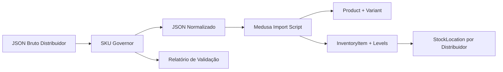

# SKU Governor - Guia de Uso Completo

## Visão Geral

O **SKU Governor** é o sistema autoritativo de validação, normalização e geração de SKUs globais agnósticos ao fornecedor para toda a plataforma YSH B2B.

### Objetivos

- ✅ **Validar** schemas JSON contra padrões mínimos de qualidade
- ✅ **Normalizar** unidades, tecnologias e nomenclaturas
- ✅ **Gerar** SKUs globais agnósticos (`PNL-`, `INV-`, `BAT-`, etc.)
- ✅ **Preservar** SKUs originais dos distribuidores em `metadata`
- ✅ **Reportar** não-conformidades com severidade (ERROR/WARNING/INFO)

### Padrão de SKU Global

```regex
^(PNL|INV|BAT|EST|CAB|CON|SBOX|EVC|KIT)-[A-Z0-9]+(-[A-Z0-9]+)*$
```

**Exemplos válidos**:

- `PNL-CANA-CS7N-550W-BF` (Painel Canadian Solar 550W Bifacial)
- `INV-GROW-MIN-5KW-HYB` (Inversor Growatt 5kW Híbrido)
- `BAT-BYD-BBOX-10KWH-48V-LFP` (Bateria BYD 10kWh 48V LFP)
- `EST-SOLG-CER-10P-V` (Estrutura Solar Group Cerâmico 10 Painéis Vertical)

## Instalação

```bash
cd backend/data/products-inventory

# Requisitos (Python 3.9+)
pip install -r requirements.txt  # Nenhuma dependência externa necessária
```

## Uso Básico

### Sintaxe

```bash
python sku-governor.py INPUT_FILE \
  --category [panel|inverter|battery|structure|cable|connector] \
  --distributor DISTRIBUTOR_NAME \
  --output-dir OUTPUT_DIRECTORY
```

### Exemplo 1: Processar Painéis da NeoSolar

```bash
python sku-governor.py \
  distributors/neosolar/neosolar-panels-raw.json \
  --category panel \
  --distributor neosolar \
  --output-dir normalized/neosolar/
```

**Output**:

```tsx
📦 Carregados 450 produtos de 'distributors/neosolar/neosolar-panels-raw.json'
✅ JSON normalizado salvo em 'normalized/neosolar/neosolar-panel-normalized.json'
📊 Relatório salvo em 'normalized/neosolar/neosolar-panel-normalized-report.json'

================================================================================
📈 RESUMO DO PROCESSAMENTO
================================================================================
Total processado: 450
Válidos: 442 (98.2%)
Inválidos: 8
Warnings: 23
Tempo: 2.35s

Produtos por categoria:
  PNL: 442
```

### Exemplo 2: Processar Inversores da Fortlev

```bash
python sku-governor.py \
  distributors/fortlev/fortlev-inverters.json \
  --category inverter \
  --distributor fortlev \
  --output-dir normalized/fortlev/
```

### Exemplo 3: Processar Baterias da Fotus

```bash
python sku-governor.py \
  distributors/fotus/fotus-batteries-raw.json \
  --category battery \
  --distributor fotus \
  --output-dir normalized/fotus/
```

## Estrutura dos Dados de Entrada

### Formato Esperado (JSON Array)

```json
[
  {
    "sku": "NEO-12345",
    "manufacturer": "Canadian Solar",
    "model": "CS7N-550TB-AG",
    "power_w": 550,
    "efficiency_percent": 21.2,
    "technology": "Mono PERC Bifacial",
    "vmp_v": 41.5,
    "imp_a": 13.25,
    "voc_v": 49.8,
    "isc_a": 14.05,
    "temp_coeff_pmax_percent": -0.35,
    "price_brl": 850.00,
    "image_url": "https://...",
    "certifications": ["INMETRO", "IEC 61215"],
    "warranty_years": 12
  }
]
```

### Campos Obrigatórios por Categoria

#### Painéis (PNL)

- `manufacturer`, `model`, `power_w`, `technology`
- `efficiency_percent`
- `vmp_v`, `imp_a`, `voc_v`, `isc_a`

#### Inversores (INV)

- `manufacturer`, `model`, `power_kw`, `type`
- `max_efficiency_percent`
- `input_voltage_range_v`, `output_voltage_v`
- `mppt_quantity`

#### Baterias (BAT)

- `manufacturer`, `model`, `capacity_kwh`, `voltage_v`
- `technology`, `chemistry`
- `dod_percent`, `cycle_life`

#### Estruturas (EST)

- `manufacturer`, `model`, `roof_type`, `material`
- `panel_capacity`, `orientation`

#### Cabos (CAB)

- `type`, `section_mm2`, `color`
- `temperature_rating_c`, `voltage_rating_v`

#### Conectores (CON)

- `type`, `manufacturer`
- `current_rating_a`, `voltage_rating_v`
- `protection_degree`

## Estrutura dos Dados de Saída

### JSON Normalizado

```json
[
  {
    "title": "Painel Solar Canadian Solar CS7N-550TB-AG 550W Mono PERC Bifacial",
    "handle": "painel-solar-canadian-solar-cs7n-550tb-ag-550w-mono-perc-bifacial",
    "category": "PNL",
    "global_sku": "PNL-CANA-CS7N-550W-BF",
    "distributor_sku": "NEO-12345",
    "distributor_name": "neosolar",
    "manufacturer": "Canadian Solar",
    "model": "CS7N-550TB-AG",
    "technical_specs": {
      "manufacturer": "Canadian Solar",
      "model": "CS7N-550TB-AG",
      "power_w": 550.0,
      "efficiency_percent": 21.2,
      "technology": "Mono PERC Bifacial",
      "vmp_v": 41.5,
      "imp_a": 13.25,
      "voc_v": 49.8,
      "isc_a": 14.05,
      "temp_coeff_pmax_percent": -0.35
    },
    "metadata": {
      "variant": {
        "manufacturer_sku": "CS7N-550TB-AG",
        "datasheets": [],
        "certifications": ["INMETRO", "IEC 61215"],
        "efficiency": 21.2,
        "temperature_coeff": -0.35,
        "warranty_years": 12
      }
    },
    "price_brl": 850.0,
    "image_url": "https://...",
    "thumbnail_url": null,
    "certifications": ["INMETRO", "IEC 61215"],
    "status": "published",
    "validation_issues": []
  }
]
```

### Relatório de Validação

```json
{
  "summary": {
    "total_processed": 450,
    "total_valid": 442,
    "total_invalid": 8,
    "total_warnings": 23,
    "processing_time_seconds": 2.35
  },
  "products_by_category": {
    "PNL": 442
  },
  "skus_generated_count": 442,
  "validation_issues": [
    {
      "severity": "WARNING",
      "category": "PNL",
      "field": "efficiency_percent",
      "message": "Eficiência fora do range típico (10-25%): 8.5%",
      "value": 8.5,
      "line_number": 127,
      "distributor_sku": "NEO-99887"
    },
    {
      "severity": "ERROR",
      "category": "PNL",
      "field": "vmp_v",
      "message": "Campo obrigatório ausente ou vazio",
      "value": null,
      "line_number": 234,
      "distributor_sku": "NEO-11223"
    }
  ]
}
```

## Regras de Normalização

### 1. Unidades

O governor normaliza automaticamente as unidades:

| Entrada | Saída Normalizada |
|---------|-------------------|
| `W`, `w`, `watts` | `Wp` |
| `KW`, `kw`, `kilowatt` | `kW` |
| `Ah`, `AH`, `ampere-hour` | `Ah` |
| `V`, `v`, `volt` | `V` |
| `mm²`, `MM2` | `mm2` |
| `°C`, `celsius` | `C` |

### 2. Tecnologias

Tecnologias são normalizadas para padrões legíveis:

| Entrada | Saída Normalizada |
|---------|-------------------|
| `mono`, `monocristalino` | `Mono PERC` |
| `n-type`, `topcon` | `N-Type TOPCon` |
| `bifacial` | `Bifacial` |
| `half-cell`, `half cell` | `Half-Cell` |
| `lifepo4`, `lfp` | `Lítio LFP` |
| `li-ion`, `nmc` | `Lítio NMC` |
| `lead-acid` | `Chumbo-Ácido` |

### 3. Strings

- Remove acentos
- Converte para uppercase (SKUs) ou lowercase (handles)
- Remove caracteres especiais
- Normaliza espaços

## Validações Aplicadas

### Severidades

- **ERROR**: Bloqueia o processamento do produto
- **WARNING**: Permite processamento mas emite alerta
- **INFO**: Informativo, não afeta processamento

### Validações por Categoria

#### Painéis

- ✅ Eficiência entre 10-25%
- ✅ Potência entre 100-800W
- ✅ Campos elétricos (Vmp, Imp, Voc, Isc) presentes
- ✅ Coeficiente de temperatura válido

#### Inversores

- ✅ Potência entre 0.3-100kW
- ✅ Eficiência entre 90-99.5%
- ✅ Quantidade de MPPT entre 1-12
- ✅ Voltagem de entrada/saída válida
- ✅ Tipo definido (Grid-Tie, Híbrido, Off-Grid)

#### Baterias

- ✅ DoD entre 30-100%
- ✅ Ciclos de vida entre 500-10000
- ✅ Tecnologia/química definida
- ✅ Capacidade e voltagem válidas

## Integração com Medusa.js

### Fluxo Completo


```mermaid
graph LR
    A[JSON Bruto Distribuidor] --> B[SKU Governor]
    B --> C[JSON Normalizado]
    B --> D[Relatório de Validação]
    C --> E[Medusa Import Script]
    E --> F[Product + Variant]
    E --> G[InventoryItem + Levels]
    G --> H[StockLocation por Distribuidor]
```

### Mapeamento para Medusa

**Produto Normalizado → Product**:

- `title` → `Product.title`
- `handle` → `Product.handle`
- `status` → `Product.status`

**Produto Normalizado → ProductVariant**:

- `global_sku` → `ProductVariant.sku`
- `price_brl` → `MoneyAmount.amount` (em centavos)
- `technical_specs` → `ProductVariant.metadata.technical_specs`

**Produto Normalizado → InventoryItem**:,

- `global_sku` → `InventoryItem.sku`
- `distributor_sku` → `InventoryLevel.metadata.distributor_sku`
- `distributor_name` → `StockLocation.name`

### Exemplo de Import para Medusa

```typescript
import { createProductsWorkflow } from "@medusajs/medusa/core-flows"
import normalizedProducts from "./normalized/neosolar/neosolar-panel-normalized.json"

const { result } = await createProductsWorkflow(container).run({
  input: {
    products: normalizedProducts.map(product => ({
      title: product.title,
      handle: product.handle,
      status: product.status,
      variants: [
        {
          title: product.title,
          sku: product.global_sku,
          manage_inventory: true,
          prices: [
            {
              currency_code: "BRL",
              amount: Math.round(product.price_brl * 100)
            }
          ],
          metadata: {
            ...product.metadata,
            technical_specs: product.technical_specs,
            distributor: {
              name: product.distributor_name,
              sku: product.distributor_sku
            }
          }
        }
      ],
      metadata: {
        manufacturer: product.manufacturer,
        model: product.model,
        certifications: product.certifications
      }
    }))
  }
})
```

## Scripts de Automação

### Processar Todos os Distribuidores

```bash
#!/bin/bash
# process-all-distributors.sh

DISTRIBUTORS=("neosolar" "fortlev" "fotus" "odex" "solfacil")
CATEGORIES=("panel" "inverter" "battery" "structure")

for dist in "${DISTRIBUTORS[@]}"; do
  for cat in "${CATEGORIES[@]}"; do
    INPUT="distributors/$dist/$dist-${cat}s.json"
    
    if [ -f "$INPUT" ]; then
      echo "Processing $dist - $cat..."
      python sku-governor.py "$INPUT" \
        --category "$cat" \
        --distributor "$dist" \
        --output-dir "normalized/$dist/"
    fi
  done
done

echo "✅ Todos os distribuidores processados!"
```

### Validar Antes de Deploy

```bash
#!/bin/bash
# validate-before-deploy.sh

# Processa produtos
python sku-governor.py input.json \
  --category panel \
  --distributor neosolar \
  --output-dir ./temp/

# Verifica se houve erros
if [ $? -ne 0 ]; then
  echo "❌ Validação falhou! Verifique o relatório."
  exit 1
fi

# Verifica taxa de sucesso
SUCCESS_RATE=$(jq '.summary.total_valid / .summary.total_processed * 100' temp/*-report.json)

if (( $(echo "$SUCCESS_RATE < 95.0" | bc -l) )); then
  echo "❌ Taxa de sucesso ($SUCCESS_RATE%) abaixo de 95%"
  exit 1
fi

echo "✅ Validação passou! Taxa de sucesso: $SUCCESS_RATE%"
```

## Troubleshooting

### Erro: "Campo obrigatório ausente"

**Causa**: Produto não possui um campo essencial para a categoria.

**Solução**:

1. Verifique o relatório para identificar o produto específico
2. Adicione o campo ausente no JSON de entrada
3. Ou remova o produto se os dados não estiverem disponíveis

### Warning: "Valor fora do range típico"

**Causa**: Valor está fora da faixa esperada mas não invalida o produto.

**Solução**:

1. Verifique se o valor está correto nos dados originais
2. Se sim, o warning pode ser ignorado
3. Se não, corrija o valor no JSON de entrada

### Erro: "SKU gerado não corresponde ao padrão"

**Causa**: Bug na lógica de geração de SKU.

**Solução**:

1. Reporte o erro com o produto específico
2. Corrija manualmente o `global_sku` no JSON normalizado
3. Ou ajuste a função geradora no código

## Próximos Passos

1. **Processar distribuidores existentes**:

   ```bash
   ./scripts/process-all-distributors.sh
   ```

2. **Validar outputs**:

   ```bash
   # Verificar quantidade de SKUs gerados
   jq '.skus_generated_count' normalized/*/\*-report.json

   # Verificar erros críticos
   jq '.validation_issues[] | select(.severity == "ERROR")' normalized/*/\*-report.json
   ```

3. **Importar para Medusa**:

   ```bash
   node import-normalized-to-medusa.ts \
     --input normalized/neosolar/neosolar-panel-normalized.json
   ```

4. **Configurar StockLocations**:
   - Um `StockLocation` por distribuidor
   - `InventoryLevel.metadata.distributor_sku` com SKU original

5. **Implementar sync periódico**:
   - Cron job diário para re-processar JSONs atualizados
   - Comparar SKUs globais para detectar mudanças
   - Atualizar apenas produtos modificados

## Suporte

Para questões ou problemas:

- Verifique o relatório de validação (`*-report.json`)
- Consulte exemplos neste guia
- Revise os schemas de entrada esperados

---

**Versão**: 1.0.0  
**Última Atualização**: 17 de Outubro de 2025  
**Autor**: YSH B2B Platform
