# Bundle Composer - Sistema de Composição de Kits

## 🎯 Visão Geral

O **Bundle Composer** é o sistema que cria kits solares como bundles virtuais a partir de SKUs de componentes validados. Ele calcula automaticamente disponibilidade dinâmica e preços com margem configurável, gerando payloads prontos para importação no Medusa.js.

### Status da Implementação

✅ **CONCLUÍDO** - Sistema pronto para uso em produção

## 🏗️ Arquitetura

### Conceito de Bundle Virtual

Bundles no Medusa.js são produtos **sem estoque próprio** que referenciam componentes:

```
Bundle (Product + Variant)
  ├─ metadata.is_bundle = true
  ├─ manage_inventory = false
  ├─ inventory_items = [
  │    {inventory_item_id: "inv_panel", required_quantity: 15},
  │    {inventory_item_id: "inv_inverter", required_quantity: 1},
  │    {inventory_item_id: "inv_battery", required_quantity: 1}
  │  ]
  └─ prices = [{amount: 4500000, currency_code: "BRL"}]
```

### Fórmulas de Cálculo

**Disponibilidade**:
```
bundle_availability = MIN(FLOOR(component_stock / required_quantity))
```

**Exemplo**:
- Painel: 150 unidades / 15 por kit = 10 kits
- Inversor: 25 unidades / 1 por kit = 25 kits
- Bateria: 8 unidades / 1 por kit = 8 kits
- **Resultado**: 8 kits disponíveis (limitado pela bateria)

**Preço**:
```
bundle_price = SUM(component_price * quantity) + margin
margin = components_cost * (margin_percent / 100)
margin = CLAMP(margin, min_margin, max_margin)
```

## 🚀 Quick Start

### 1. Criar Configuração do Bundle

```json
{
  "title": "Kit Solar Residencial 8.1 kWp Híbrido",
  "category": "residential_hybrid",
  "components": [
    {"variant_sku": "PNL-JINK-JKM545-540W", "quantity": 15},
    {"variant_sku": "INV-DEYE-SUN8K-8KW-HYB", "quantity": 1},
    {"variant_sku": "BAT-PYLO-FORCE-13KWH-384V-LFP", "quantity": 1}
  ],
  "pricing": {
    "strategy": "sum_with_margin",
    "margin_policy": {
      "margin_percent": 18.0,
      "min_margin_brl": 3000.00,
      "max_margin_brl": 8000.00
    }
  },
  "metadata": {
    "total_power_kwp": 8.1,
    "estimated_generation_month_kwh": 1134,
    "has_battery": true
  }
}
```

### 2. Executar Composer

```bash
# Com resolvers mock (para testes)
python bundle-composer.py \
  examples/bundle-config-residential-hybrid.json \
  --output bundles/residential-hybrid-payload.json \
  --mock-inventory \
  --mock-prices

# Com resolvers reais (produção)
python bundle-composer.py \
  config/bundle-comercial-25kwp.json \
  --output payloads/bundle-comercial-25kwp.json
```

### 3. Ver Payload Gerado

```json
{
  "title": "Kit Solar Residencial 8.1 kWp Híbrido Jinko + Deye + Pylontech",
  "handle": "kit-solar-residencial-8-1-kwp-hibrido-jinko-deye-pylontech",
  "variant_sku": "KIT-RESHYB-8KWP-DEYE",
  "manage_inventory": false,
  "inventory_items": [
    {"inventory_item_id": "inv_pnl_jink_jkm545_540w", "required_quantity": 15},
    {"inventory_item_id": "inv_inv_deye_sun8k_8kw_hyb", "required_quantity": 1},
    {"inventory_item_id": "inv_bat_pylo_force_13kwh_384v_lfp", "required_quantity": 1}
  ],
  "prices": [
    {"currency_code": "BRL", "amount": 4500000}
  ],
  "metadata": {
    "is_bundle": true,
    "bundle_category": "residential_hybrid",
    "pricing_strategy": "sum_with_margin",
    "margin_percent": 18.0,
    "bundle_components": [
      {"variant_sku": "PNL-JINK-JKM545-540W", "quantity": 15},
      {"variant_sku": "INV-DEYE-SUN8K-8KW-HYB", "quantity": 1},
      {"variant_sku": "BAT-PYLO-FORCE-13KWH-384V-LFP", "quantity": 1}
    ]
  },
  "availability": {
    "available_quantity": 23,
    "limiting_component": "BAT-PYLO-FORCE-13KWH-384V-LFP"
  },
  "calculated_price": {
    "total_price_brl": 45000.00,
    "components_cost_brl": 38135.59,
    "margin_brl": 6864.41,
    "margin_percent": 18.0
  }
}
```

## 📋 Configuração Detalhada

### Campos da Configuração

#### `title` (obrigatório)
Título descritivo do bundle.

```json
"title": "Kit Solar Comercial 25 kWp On-Grid Canadian Solar + Fronius"
```

#### `category` (obrigatório)
Categoria do bundle. Valores permitidos:
- `residential_ongrid` - Residencial conectado à rede
- `residential_hybrid` - Residencial híbrido (com bateria)
- `residential_offgrid` - Residencial isolado (off-grid)
- `commercial_ongrid` - Comercial conectado à rede
- `commercial_hybrid` - Comercial híbrido
- `industrial_ongrid` - Industrial conectado à rede
- `custom` - Customizado

#### `components` (obrigatório)
Array de componentes do bundle.

```json
"components": [
  {
    "variant_sku": "PNL-CANA-CS7N-550W-BF",
    "quantity": 45
  },
  {
    "variant_sku": "INV-FRON-SYMO-25KW",
    "quantity": 1
  }
]
```

**Regras**:
- Cada componente deve ter `variant_sku` válido (pattern: `^[A-Z0-9]+-[A-Z0-9-]+$`)
- `quantity` deve ser inteiro positivo

#### `pricing` (obrigatório)
Configuração de precificação do bundle.

##### Estratégia: `sum_of_components`
Preço = soma dos componentes (sem margem).

```json
"pricing": {
  "strategy": "sum_of_components"
}
```

##### Estratégia: `sum_with_margin`
Preço = soma dos componentes + margem percentual.

```json
"pricing": {
  "strategy": "sum_with_margin",
  "margin_policy": {
    "margin_percent": 18.0,
    "min_margin_brl": 3000.00,
    "max_margin_brl": 8000.00
  }
}
```

**Campos de `margin_policy`**:
- `margin_percent`: Percentual de margem (ex: 18.0 = 18%)
- `min_margin_brl`: Margem mínima em R$ (opcional)
- `max_margin_brl`: Margem máxima em R$ (opcional)

##### Estratégia: `fixed_price`
Preço fixo independente dos componentes.

```json
"pricing": {
  "strategy": "fixed_price",
  "fixed_price_brl": 42000.00
}
```

##### PriceList
Especificar PriceList do Medusa para buscar preços:

```json
"pricing": {
  "strategy": "sum_with_margin",
  "price_list_id": "plist_regional_sul",
  "margin_policy": {
    "margin_percent": 15.0
  }
}
```

#### `description` (opcional)
Descrição detalhada do bundle.

```json
"description": "Kit solar fotovoltaico residencial 8.1 kWp com sistema híbrido. Inclui 15 painéis Jinko 540W, inversor híbrido Deye 8kW, bateria Pylontech 13.5kWh e estrutura completa para telhado cerâmico."
```

#### `metadata` (opcional)
Metadados técnicos adicionais.

```json
"metadata": {
  "total_power_kwp": 8.1,
  "estimated_generation_month_kwh": 1134,
  "inverter_type": "hybrid",
  "has_battery": true,
  "battery_capacity_kwh": 13.5,
  "payback_years": 5.2
}
```

**Campos comuns**:
- `total_power_kwp`: Potência total em kWp
- `estimated_generation_month_kwh`: Geração estimada mensal
- `inverter_type`: Tipo do inversor (`grid-tie`, `hybrid`, `off-grid`)
- `has_battery`: Se inclui bateria
- `battery_capacity_kwh`: Capacidade da bateria em kWh
- `battery_autonomy_days`: Autonomia em dias (off-grid)
- `payback_years`: Payback estimado em anos

## 🔧 Geração de SKU

### Padrão de SKU

```regex
^KIT-[A-Z0-9]+(-[A-Z0-9]+)*$
```

### Formato

```
KIT-{CATEGORY}-{POWER}KWP-{INVERTER_BRAND}[-{SUFFIX}]
```

### Exemplos

| Bundle | SKU Gerado |
|--------|------------|
| Residencial Híbrido 8kWp Deye | `KIT-RESHYB-8KWP-DEYE` |
| Comercial On-Grid 25kWp Fronius | `KIT-COMON-25KWP-FRON` |
| Residencial Off-Grid 5kWp Growatt | `KIT-RESOFF-5KWP-GROW` |
| Industrial 100kWp Sungrow | `KIT-INDON-100KWP-SUNG` |

### Abreviações de Categoria

| Categoria | Abreviação |
|-----------|------------|
| `residential_ongrid` | `RESON` |
| `residential_hybrid` | `RESHYB` |
| `residential_offgrid` | `RESOFF` |
| `commercial_ongrid` | `COMON` |
| `commercial_hybrid` | `COMHYB` |
| `industrial_ongrid` | `INDON` |
| `custom` | `CUSTOM` |

## 📊 Outputs

### Payload Principal

Estrutura completa pronta para `createProductsWorkflow`:

```json
{
  "title": "...",
  "handle": "...",
  "variant_sku": "KIT-...",
  "manage_inventory": false,
  "inventory_items": [...],
  "prices": [...],
  "metadata": {...}
}
```

### Availability Snapshot

Disponibilidade calculada no momento da composição:

```json
"availability": {
  "available_quantity": 23,
  "limiting_component": "BAT-PYLO-FORCE-13KWH-384V-LFP",
  "component_stocks": {
    "PNL-JINK-JKM545-540W": 450,
    "INV-DEYE-SUN8K-8KW-HYB": 32,
    "BAT-PYLO-FORCE-13KWH-384V-LFP": 23
  },
  "calculation_notes": [
    "Disponibilidade calculada: 23 kits",
    "Componente limitante: BAT-PYLO-FORCE-13KWH-384V-LFP",
    "  PNL-JINK-JKM545-540W: 450 unidades / 15 por kit = 30 kits",
    "  INV-DEYE-SUN8K-8KW-HYB: 32 unidades / 1 por kit = 32 kits",
    "  BAT-PYLO-FORCE-13KWH-384V-LFP: 23 unidades / 1 por kit = 23 kits"
  ]
}
```

### Price Breakdown

Detalhamento do cálculo de preço:

```json
"calculated_price": {
  "total_price_brl": 45000.00,
  "components_cost_brl": 38135.59,
  "margin_brl": 6864.41,
  "margin_percent": 18.0,
  "price_breakdown": [
    {
      "sku": "PNL-JINK-JKM545-540W",
      "quantity": 15,
      "unit_price": 790.00,
      "subtotal": 11850.00
    },
    {
      "sku": "INV-DEYE-SUN8K-8KW-HYB",
      "quantity": 1,
      "unit_price": 5800.00,
      "subtotal": 5800.00
    },
    {
      "sku": "BAT-PYLO-FORCE-13KWH-384V-LFP",
      "quantity": 1,
      "unit_price": 32000.00,
      "subtotal": 32000.00
    }
  ]
}
```

## 🔌 Integração com Medusa.js

### Workflow de Importação

```typescript
import { createProductsWorkflow } from "@medusajs/medusa/core-flows"
import bundlePayload from "./bundle-residential-hybrid-payload.json"

const { result } = await createProductsWorkflow(container).run({
  input: {
    products: [
      {
        title: bundlePayload.title,
        handle: bundlePayload.handle,
        status: bundlePayload.status,
        description: bundlePayload.description,
        
        variants: [
          {
            title: bundlePayload.variant_title,
            sku: bundlePayload.variant_sku,
            manage_inventory: false,  // Bundle sem estoque próprio
            
            // Referenciar componentes via inventory_items
            inventory_items: bundlePayload.inventory_items,
            
            prices: bundlePayload.prices.map(p => ({
              currency_code: p.currency_code,
              amount: p.amount,  // Já em centavos
              price_list_id: p.price_list_id
            })),
            
            metadata: bundlePayload.metadata
          }
        ],
        
        metadata: {
          is_bundle: true,
          bundle_category: bundlePayload.metadata.bundle_category
        }
      }
    ]
  }
})
```

### Consultar Disponibilidade Dinâmica

No frontend, calcular disponibilidade em tempo real:

```typescript
import { sdk } from "@/lib/config"

async function getBundleAvailability(bundleSku: string) {
  // 1. Buscar bundle e seus componentes
  const bundle = await sdk.client.fetch(`/store/products?sku=${bundleSku}`)
  const components = bundle.metadata.bundle_components
  
  // 2. Buscar estoque de cada componente
  const availabilities = await Promise.all(
    components.map(async (comp) => {
      const inventoryLevel = await sdk.client.fetch(
        `/store/inventory/${comp.inventory_item_id}/levels`
      )
      
      const totalStock = inventoryLevel.reduce(
        (sum, level) => sum + level.stocked_quantity,
        0
      )
      
      return Math.floor(totalStock / comp.quantity)
    })
  )
  
  // 3. Retornar mínimo (componente limitante)
  return Math.min(...availabilities)
}
```

## 🧪 Testes

### Executar Suite de Testes

```powershell
cd backend\data\products-inventory
.\test-bundle-composer.ps1
```

Testa 3 configurações:
1. **Residencial Híbrido 8.1 kWp** - 7 componentes
2. **Comercial On-Grid 25 kWp** - 7 componentes
3. **Residencial Off-Grid 5.4 kWp** - 8 componentes

### Validações dos Testes

✅ Payload criado com sucesso  
✅ SKU segue padrão `^KIT-[A-Z0-9-]+$`  
✅ Handle URL-friendly  
✅ `metadata.is_bundle = true`  
✅ `manage_inventory = false`  
✅ Componentes corretos  
✅ inventory_items preenchido  
✅ Preço calculado com margem  
✅ Disponibilidade calculada  
✅ Medusa price entry em centavos  

## 🔄 Integração com Pipeline

### Fluxo Completo

```mermaid
graph LR
    A[Distributor JSONs] --> B[SKU Governor]
    B --> C[Normalized Components]
    C --> D[Medusa Import]
    D --> E[Components in Inventory]
    E --> F[Bundle Composer]
    F --> G[Bundle Configs]
    G --> H[Bundle Payloads]
    H --> I[Medusa Import Bundles]
    I --> J[Bundles Available]
```



### Script de Automação

```bash
#!/bin/bash
# create-bundles-from-configs.sh

CONFIGS_DIR="configs/bundles"
PAYLOADS_DIR="payloads/bundles"

mkdir -p $PAYLOADS_DIR

for config in $CONFIGS_DIR/*.json; do
  filename=$(basename "$config" .json)
  output="$PAYLOADS_DIR/$filename-payload.json"
  
  echo "Creating bundle: $filename"
  python bundle-composer.py "$config" \
    --output "$output"
  
  if [ $? -eq 0 ]; then
    echo "✅ Success: $output"
  else
    echo "❌ Failed: $filename"
  fi
done

echo "All bundles created in $PAYLOADS_DIR"
```

## 📚 Exemplos Práticos

### Exemplo 1: Kit Residencial Híbrido

**Configuração**: `examples/bundle-config-residential-hybrid.json`

**Componentes**:
- 15x Painel Jinko 540W
- 1x Inversor Deye 8kW Híbrido
- 1x Bateria Pylontech 13.5kWh
- 1x Estrutura para 15 painéis
- 100m Cabo Solar 6mm²
- 60x Conectores MC4

**SKU Gerado**: `KIT-RESHYB-8KWP-DEYE`

**Preço**: R$ 45.000 (margem 18%)

### Exemplo 2: Kit Comercial On-Grid

**Configuração**: `examples/bundle-config-commercial-ongrid.json`

**Componentes**:
- 45x Painel Canadian Solar 550W Bifacial
- 1x Inversor Fronius 25kW
- 1x Estrutura para 45 painéis
- 200m Cabo Solar 10mm²
- 180x Conectores MC4
- 2x String Box

**SKU Gerado**: `KIT-COMON-24KWP-FRON`

**Preço**: R$ 68.500 (margem 15%)

### Exemplo 3: Kit Residencial Off-Grid

**Configuração**: `examples/bundle-config-residential-offgrid.json`

**Componentes**:
- 10x Painel Trina 540W
- 1x Inversor Growatt 5kW 48V Off-Grid
- 1x Bateria BYD 10kWh
- 1x Estrutura solo para 10 painéis
- 80m Cabo Solar 6mm²
- 10m Cabo Bateria 25mm²
- 40x Conectores MC4

**SKU Gerado**: `KIT-RESOFF-5KWP-GROW`

**Preço**: R$ 32.800 (margem 20%)

## 🚧 Próximos Passos

### Fase 1: Validação (Esta Semana)
- ✅ Testar com configs de exemplo
- ⏳ Validar geração de SKUs
- ⏳ Validar cálculos de disponibilidade e preço

### Fase 2: Integração com Resolvers Reais (Próxima Semana)
- ⏳ Implementar `inventory_resolver` consultando Medusa Inventory API
- ⏳ Implementar `price_resolver` consultando Medusa Pricing API
- ⏳ Testar com dados reais de inventário

### Fase 3: Criação de Kits Padrão (Semana 3)
- ⏳ Criar 20-30 configurações de kits padrão (residencial, comercial, industrial)
- ⏳ Gerar payloads de todos os kits
- ⏳ Importar para Medusa staging

### Fase 4: Ferramenta de UI (Mês 2)
- ⏳ Criar interface web para composição de kits
- ⏳ Busca de componentes por categoria
- ⏳ Cálculo dinâmico de disponibilidade e preço
- ⏳ Preview do bundle antes de criar

## 📝 Troubleshooting

### Erro: "SKU gerado não segue o padrão"

**Causa**: Caracteres especiais ou espaços no nome da marca/modelo.

**Solução**: Verificar normalização de strings. A função `normalize_string()` remove acentos mas mantém espaços e caracteres especiais devem ser tratados.

### Warning: "No inventory items (mock resolver not used?)"

**Causa**: Flag `--mock-inventory` não foi passada ou resolver não está configurado.

**Solução**: Adicionar `--mock-inventory` ou implementar resolver real.

### Erro: "Componentes sem preço"

**Causa**: Preços não foram resolvidos para os componentes.

**Solução**: Adicionar `--mock-prices` ou implementar `price_resolver` real.

---

**Versão**: 1.0.0  
**Última Atualização**: 17 de Outubro de 2025  
**Autor**: YSH B2B Platform
