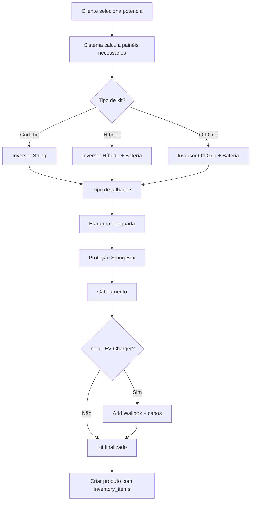

# Agent: Kit Builder - Orquestrador de Kits Fotovoltaicos (Kit Builder Agent)

## Contexto e Propósito

Este agente é o **orquestrador principal** para criação de **Kits Fotovoltaicos Completos** usando o padrão **Inventory Kits** do Medusa.js. Coordena todos os outros agents (painéis, inversores, estruturas, baterias, cabos, string boxes, EV chargers) para compor produtos multi-parte.

## Escopo de Responsabilidade

### Tipos de Kits

- **Kits Grid-Tie** (On-Grid sem bateria)
- **Kits Híbridos** (On-Grid com bateria backup)
- **Kits Off-Grid** (Isolados da rede)
- **Kits Comerciais** (20-100kWp)
- **Kits Industriais** (>100kWp)
- **Kits com EV Charger**

### Agentes Coordenados

1. **Panels Agent** → Painéis solares
2. **Inverters Agent** → Inversores (grid-tie/híbrido/off-grid)
3. **Structures Agent** → Estruturas de fixação
4. **Batteries Agent** → Sistemas de armazenamento
5. **Cables Agent** → Cabos CC/CA e conectores
6. **String Boxes Agent** → Proteção CC
7. **EV Chargers Agent** → Carregadores veículos elétricos

## Schema Medusa.js para Kits

```json
{
  "$schema": "https://json-schema.org/draft-07/schema#",
  "title": "Kit Solar Fotovoltaico - Medusa Product Schema",
  "description": "Schema para kits solares completos usando Inventory Kits pattern",
  "type": "object",
  "required": ["title", "handle", "status", "variants", "options"],
  "properties": {
    "title": {
      "type": "string",
      "description": "Título normalizado do kit",
      "pattern": "^Kit Solar Fotovoltaico \\d+(\\.\\d+)?kWp - .+ \\+ .+$",
      "example": "Kit Solar Fotovoltaico 5.5kWp - Canadian + Growatt"
    },
    "subtitle": {
      "type": "string",
      "example": "10× 550W Canadian + Inversor 5kW Growatt + Estrutura Cerâmico"
    },
    "handle": {
      "type": "string",
      "pattern": "^kit-solar-[0-9]+kw-.*$",
      "example": "kit-solar-5-5kwp-canadian-growatt"
    },
    "description": {
      "type": "string",
      "description": "Descrição completa do kit com todos os componentes"
    },
    "status": {
      "type": "string",
      "enum": ["draft", "proposed", "published", "rejected"],
      "default": "published"
    },
    "categories": {
      "type": "array",
      "items": { "type": "object" },
      "example": [
        { "id": "cat_kits" },
        { "id": "cat_kits_grid_tie" },
        { "id": "cat_kits_5_10kwp" },
        { "id": "cat_kits_residential" }
      ]
    },
    "tags": {
      "type": "array",
      "items": { "type": "object" },
      "example": [
        { "id": "tag_5_5kwp" },
        { "id": "tag_canadian" },
        { "id": "tag_growatt" },
        { "id": "tag_completo" }
      ]
    },
    "options": {
      "type": "array",
      "minItems": 1,
      "items": {
        "type": "object",
        "properties": {
          "title": { "type": "string" },
          "values": { "type": "array", "items": { "type": "string" } }
        }
      },
      "example": [
        { "title": "Potência", "values": ["5.5kWp"] },
        { "title": "Tipo de Telhado", "values": ["Cerâmico", "Metálico", "Laje"] },
        { "title": "Incluir Bateria", "values": ["Não", "10kWh", "15kWh"] }
      ]
    },
    "variants": {
      "type": "array",
      "minItems": 1,
      "items": {
        "type": "object",
        "required": ["title", "sku", "prices", "options", "inventory_items"],
        "properties": {
          "title": { "type": "string" },
          "sku": { "type": "string" },
          "manage_inventory": { "type": "boolean", "default": true },
          "prices": {
            "type": "array",
            "items": {
              "type": "object",
              "required": ["currency_code", "amount"],
              "properties": {
                "currency_code": { "type": "string", "example": "BRL" },
                "amount": { "type": "number", "example": 2800000 }
              }
            }
          },
          "options": {
            "type": "object",
            "example": {
              "Potência": "5.5kWp",
              "Tipo de Telhado": "Cerâmico",
              "Incluir Bateria": "Não"
            }
          },
          "inventory_items": {
            "type": "array",
            "description": "🔥 INVENTORY KITS: Array de componentes do kit",
            "minItems": 1,
            "items": {
              "type": "object",
              "required": ["inventory_item_id", "required_quantity"],
              "properties": {
                "inventory_item_id": {
                  "type": "string",
                  "description": "ID do inventory item (painel, inversor, estrutura, etc.)"
                },
                "required_quantity": {
                  "type": "number",
                  "description": "Quantidade necessária deste item",
                  "minimum": 1
                }
              }
            },
            "example": [
              { "inventory_item_id": "inv_panel_canadian_550w", "required_quantity": 10 },
              { "inventory_item_id": "inv_inverter_growatt_5kw", "required_quantity": 1 },
              { "inventory_item_id": "inv_structure_ceramic_10p", "required_quantity": 1 },
              { "inventory_item_id": "inv_string_box_2e_1000v", "required_quantity": 1 },
              { "inventory_item_id": "inv_cable_6mm_red", "required_quantity": 50 },
              { "inventory_item_id": "inv_cable_6mm_black", "required_quantity": 50 },
              { "inventory_item_id": "inv_mc4_pair", "required_quantity": 20 },
              { "inventory_item_id": "inv_cable_ac_10mm", "required_quantity": 20 }
            ]
          }
        }
      }
    },
    "metadata": {
      "type": "object",
      "properties": {
        "kit_type": {
          "type": "string",
          "enum": ["Grid-Tie", "Híbrido", "Off-Grid", "Comercial", "Industrial"]
        },
        "application": {
          "type": "string",
          "enum": ["Residencial", "Comercial", "Industrial", "Rural"]
        },
        "system_specs": {
          "type": "object",
          "properties": {
            "total_power_kwp": { "type": "number" },
            "panel_count": { "type": "integer" },
            "panel_power_w": { "type": "number" },
            "panel_manufacturer": { "type": "string" },
            "inverter_power_kw": { "type": "number" },
            "inverter_manufacturer": { "type": "string" },
            "inverter_type": {
              "type": "string",
              "enum": ["Grid-Tie", "Híbrido", "Off-Grid"]
            },
            "battery_included": { "type": "boolean" },
            "battery_capacity_kwh": { "type": "number" },
            "ev_charger_included": { "type": "boolean" },
            "ev_charger_power_kw": { "type": "number" },
            "estimated_generation_kwh_month": { "type": "number" },
            "estimated_generation_kwh_year": { "type": "number" }
          }
        },
        "kit_composition": {
          "type": "object",
          "description": "Composição detalhada do kit para exibição ao cliente",
          "properties": {
            "panels": {
              "type": "object",
              "properties": {
                "quantity": { "type": "number" },
                "model": { "type": "string" },
                "power_w": { "type": "number" },
                "total_power_kwp": { "type": "number" }
              }
            },
            "inverter": {
              "type": "object",
              "properties": {
                "quantity": { "type": "number" },
                "model": { "type": "string" },
                "power_kw": { "type": "number" },
                "type": { "type": "string" }
              }
            },
            "structure": {
              "type": "object",
              "properties": {
                "roof_type": { "type": "string" },
                "material": { "type": "string" },
                "panel_capacity": { "type": "number" }
              }
            },
            "battery": {
              "type": "object",
              "properties": {
                "included": { "type": "boolean" },
                "model": { "type": "string" },
                "capacity_kwh": { "type": "number" }
              }
            },
            "protection": {
              "type": "object",
              "properties": {
                "string_box": { "type": "string" },
                "surge_protection": { "type": "boolean" }
              }
            },
            "cables": {
              "type": "object",
              "properties": {
                "dc_cable_6mm_m": { "type": "number" },
                "ac_cable_10mm_m": { "type": "number" },
                "mc4_connectors": { "type": "number" }
              }
            },
            "ev_charger": {
              "type": "object",
              "properties": {
                "included": { "type": "boolean" },
                "model": { "type": "string" },
                "power_kw": { "type": "number" }
              }
            }
          }
        },
        "technical_data": {
          "type": "object",
          "properties": {
            "system_voltage_v": { "type": "number" },
            "max_string_voltage_v": { "type": "number" },
            "max_current_a": { "type": "number" },
            "recommended_cable_size_mm2": { "type": "number" },
            "estimated_weight_kg": { "type": "number" },
            "roof_area_required_m2": { "type": "number" }
          }
        },
        "installation": {
          "type": "object",
          "properties": {
            "estimated_time_days": { "type": "number" },
            "crew_size": { "type": "number" },
            "requires_inspection": { "type": "boolean" },
            "grid_connection_required": { "type": "boolean" }
          }
        },
        "warranties": {
          "type": "object",
          "properties": {
            "panels_years": { "type": "number" },
            "inverter_years": { "type": "number" },
            "structure_years": { "type": "number" },
            "battery_years": { "type": "number" },
            "workmanship_years": { "type": "number" }
          }
        }
      }
    }
  }
}
```

## Workflow: Criar Kit Completo (Multi-Part Product)

```typescript
import { 
  createInventoryItemsWorkflow,
  createProductsWorkflow,
  useQueryGraphStep
} from "@medusajs/medusa/core-flows"
import { createWorkflow, transform } from "@medusajs/framework/workflows-sdk"

export const createCompleteKitWorkflow = createWorkflow(
  "create-complete-solar-kit",
  () => {
    // 1. Obter Stock Location
    const { data: stockLocations } = useQueryGraphStep({
      entity: "stock_location",
      fields: ["*"],
      filters: { name: "Main Distribution Center" }
    })

    // 2. Obter Inventory Items Existentes (já criados pelos agents)
    const { data: inventoryItems } = useQueryGraphStep({
      entity: "inventory_item",
      fields: ["*"],
      filters: {
        sku: {
          $in: [
            "CANADIAN-CS7N-550TB-AG",      // Painel 550W
            "GROWATT-MIN-5000TL-XH",       // Inversor 5kW
            "ESTRUTURA-CER-10P-RET-ALU",   // Estrutura 10P
            "STECA-SB4010-1000V-15A",      // String Box
            "SOLAX-6MM-PRETO-METRO",       // Cabo 6mm Preto
            "SOLAX-6MM-VERMELHO-METRO",    // Cabo 6mm Vermelho
            "STAUBLI-MC4-PAR",             // Conector MC4 Par
            "CABO-AC-10MM-METRO"           // Cabo AC 10mm
          ]
        }
      }
    })

    // 3. Mapear SKUs para Inventory Item IDs
    const skuToIdMap = transform({ inventoryItems }, ({ inventoryItems }) => {
      return inventoryItems.reduce((map, item) => {
        map[item.sku] = item.id
        return map
      }, {})
    })

    // 4. Criar Produto KIT (usando inventory_items)
    const kitProduct = createProductsWorkflow.runAsStep({
      input: {
        products: [
          {
            title: "Kit Solar Fotovoltaico 5.5kWp - Canadian + Growatt",
            subtitle: "10× 550W Canadian + Inversor 5kW Growatt + Estrutura Cerâmico",
            handle: "kit-solar-5-5kwp-canadian-growatt",
            description: `
# Kit Solar Completo 5.5kWp - Grid-Tie

## Composição do Kit

### Geração
- **10× Painéis Solares Canadian 550W** (Total: 5.500Wp)
  - Eficiência: 21.2%
  - Garantia: 12 anos produto, 30 anos performance
  
### Inversão
- **1× Inversor Growatt MIN 5000TL-XH** (5.000W)
  - Tipo: String (Grid-Tie)
  - 2 MPPT
  - Eficiência: 98.4%
  - Monitoramento WiFi incluso
  - Garantia: 10 anos

### Estrutura
- **Kit Estrutura para Telhado Cerâmico** (10 painéis em retrato)
  - Material: Alumínio anodizado
  - Inclui: 6× trilhos 4m, 40× grampos, 20× ganchos
  - Garantia: 20 anos

### Proteção
- **String Box CC 4 Entradas 1000V**
  - DPS Classe II integrado
  - Fusíveis 15A gPV
  - IP65

### Cabeamento
- **100m Cabo Solar 6mm²** (50m preto + 50m vermelho)
  - Dupla isolação XLPE
  - 1800V DC, 120°C
  - UV resistente
  
- **20× Conectores MC4 Par**
  - Stäubli original
  - IP68
  
- **20m Cabo AC 10mm²**
  - Para conexão inversor → quadro

## Geração Estimada

- **Mês**: ~700 kWh
- **Ano**: ~8.400 kWh

## Instalação

- **Tempo**: 1-2 dias
- **Equipe**: 2 pessoas
- **Área Telhado**: ~30m²
            `.trim(),
            status: "published",
            
            // Variantes com diferentes opções de telhado
            variants: [
              {
                title: "Kit 5.5kWp - Telhado Cerâmico",
                sku: "KIT-5.5KWP-CANADIAN-GROWATT-CER",
                prices: [
                  {
                    currency_code: "BRL",
                    amount: 2800000, // R$ 28.000,00
                    min_quantity: 1,
                    max_quantity: 5
                  },
                  {
                    currency_code: "BRL",
                    amount: 2600000, // R$ 26.000,00 (desconto 5+ unidades)
                    min_quantity: 6
                  }
                ],
                options: {
                  "Potência": "5.5kWp",
                  "Tipo de Telhado": "Cerâmico",
                  "Incluir Bateria": "Não"
                },
                manage_inventory: true,
                
                // 🔥🔥 INVENTORY KITS PATTERN 🔥🔥
                inventory_items: [
                  // Painéis
                  { 
                    inventory_item_id: skuToIdMap["CANADIAN-CS7N-550TB-AG"],
                    required_quantity: 10 
                  },
                  // Inversor
                  { 
                    inventory_item_id: skuToIdMap["GROWATT-MIN-5000TL-XH"],
                    required_quantity: 1 
                  },
                  // Estrutura (já é multi-part: contém trilhos, grampos, ganchos)
                  { 
                    inventory_item_id: skuToIdMap["ESTRUTURA-CER-10P-RET-ALU"],
                    required_quantity: 1 
                  },
                  // String Box
                  { 
                    inventory_item_id: skuToIdMap["STECA-SB4010-1000V-15A"],
                    required_quantity: 1 
                  },
                  // Cabos CC
                  { 
                    inventory_item_id: skuToIdMap["SOLAX-6MM-PRETO-METRO"],
                    required_quantity: 50 
                  },
                  { 
                    inventory_item_id: skuToIdMap["SOLAX-6MM-VERMELHO-METRO"],
                    required_quantity: 50 
                  },
                  // Conectores MC4
                  { 
                    inventory_item_id: skuToIdMap["STAUBLI-MC4-PAR"],
                    required_quantity: 20 
                  },
                  // Cabo CA
                  { 
                    inventory_item_id: skuToIdMap["CABO-AC-10MM-METRO"],
                    required_quantity: 20 
                  }
                ]
              }
            ],
            
            options: [
              { title: "Potência", values: ["5.5kWp"] },
              { title: "Tipo de Telhado", values: ["Cerâmico", "Metálico", "Laje"] },
              { title: "Incluir Bateria", values: ["Não", "10kWh BYD", "15kWh Pylontech"] }
            ],
            
            categories: [
              "cat_kits",
              "cat_kits_grid_tie",
              "cat_kits_5_10kwp",
              "cat_kits_residential"
            ],
            
            tags: [
              "tag_5_5kwp",
              "tag_canadian",
              "tag_growatt",
              "tag_completo",
              "tag_grid_tie"
            ],
            
            metadata: {
              kit_type: "Grid-Tie",
              application: "Residencial",
              
              system_specs: {
                total_power_kwp: 5.5,
                panel_count: 10,
                panel_power_w: 550,
                panel_manufacturer: "Canadian Solar",
                inverter_power_kw: 5.0,
                inverter_manufacturer: "Growatt",
                inverter_type: "Grid-Tie",
                battery_included: false,
                battery_capacity_kwh: 0,
                ev_charger_included: false,
                ev_charger_power_kw: 0,
                estimated_generation_kwh_month: 700,
                estimated_generation_kwh_year: 8400
              },
              
              kit_composition: {
                panels: {
                  quantity: 10,
                  model: "Canadian CS7N-550TB-AG",
                  power_w: 550,
                  total_power_kwp: 5.5
                },
                inverter: {
                  quantity: 1,
                  model: "Growatt MIN 5000TL-XH",
                  power_kw: 5.0,
                  type: "Grid-Tie String"
                },
                structure: {
                  roof_type: "Cerâmico",
                  material: "Alumínio Anodizado",
                  panel_capacity: 10
                },
                battery: {
                  included: false
                },
                protection: {
                  string_box: "Steca SB4010 - 4E/1000V/15A",
                  surge_protection: true
                },
                cables: {
                  dc_cable_6mm_m: 100,
                  ac_cable_10mm_m: 20,
                  mc4_connectors: 20
                },
                ev_charger: {
                  included: false
                }
              },
              
              technical_data: {
                system_voltage_v: 495,
                max_string_voltage_v: 545,
                max_current_a: 13.87,
                recommended_cable_size_mm2: 6,
                estimated_weight_kg: 280,
                roof_area_required_m2: 30
              },
              
              installation: {
                estimated_time_days: 1.5,
                crew_size: 2,
                requires_inspection: true,
                grid_connection_required: true
              },
              
              warranties: {
                panels_years: 12,
                inverter_years: 10,
                structure_years: 20,
                battery_years: 0,
                workmanship_years: 5
              }
            }
          }
        ]
      }
    })

    return { kitProduct, inventoryItemsUsed: inventoryItems }
  }
)
```

## Exemplo: Kit Híbrido com Bateria

```typescript
{
  title: "Kit Solar Fotovoltaico 5.5kWp Híbrido - Canadian + Growatt SPH + Bateria 10kWh",
  variants: [
    {
      sku: "KIT-5.5KWP-HYBRID-CANADIAN-GROWATT-10KWH",
      prices: [{ currency_code: "BRL", amount: 4500000 }], // R$ 45.000,00
      
      inventory_items: [
        // Geração
        { inventory_item_id: "inv_panel_canadian_550w", required_quantity: 10 },
        
        // Inversão HÍBRIDA
        { inventory_item_id: "inv_inverter_growatt_sph_5kw_hybrid", required_quantity: 1 },
        
        // Armazenamento
        { inventory_item_id: "inv_battery_byd_10kwh", required_quantity: 1 },
        
        // Estrutura
        { inventory_item_id: "inv_structure_ceramic_10p", required_quantity: 1 },
        
        // Proteção
        { inventory_item_id: "inv_string_box_4e", required_quantity: 1 },
        
        // Cabeamento (maior bitola para bateria)
        { inventory_item_id: "inv_cable_6mm_red", required_quantity: 50 },
        { inventory_item_id: "inv_cable_6mm_black", required_quantity: 50 },
        { inventory_item_id: "inv_cable_10mm_battery", required_quantity: 10 },
        { inventory_item_id: "inv_mc4_pair", required_quantity: 20 }
      ],
      
      metadata: {
        kit_type: "Híbrido",
        system_specs: {
          battery_included: true,
          battery_capacity_kwh: 10,
          inverter_type: "Híbrido"
        }
      }
    }
  ]
}
```

## Exemplo: Kit com EV Charger

```typescript
{
  title: "Kit Solar 10kWp + Carregador EV 11kW - Canadian + Growatt + Wallbox",
  variants: [
    {
      sku: "KIT-10KWP-EV-CANADIAN-GROWATT-WALLBOX11KW",
      prices: [{ currency_code: "BRL", amount: 5200000 }], // R$ 52.000,00
      
      inventory_items: [
        // Geração (dobrada para 10kWp)
        { inventory_item_id: "inv_panel_canadian_550w", required_quantity: 18 },
        
        // Inversor maior
        { inventory_item_id: "inv_inverter_growatt_10kw", required_quantity: 1 },
        
        // EV Charger
        { inventory_item_id: "inv_wallbox_pulsar_plus_11kw", required_quantity: 1 },
        
        // Estrutura maior
        { inventory_item_id: "inv_structure_ceramic_18p", required_quantity: 1 },
        
        // Proteção
        { inventory_item_id: "inv_string_box_6e", required_quantity: 1 },
        
        // Cabeamento
        { inventory_item_id: "inv_cable_6mm_red", required_quantity: 100 },
        { inventory_item_id: "inv_cable_6mm_black", required_quantity: 100 },
        { inventory_item_id: "inv_mc4_pair", required_quantity: 36 },
        
        // Cabo específico para EV Charger
        { inventory_item_id: "inv_cable_ac_16mm", required_quantity: 30 }
      ],
      
      metadata: {
        kit_type: "Grid-Tie",
        system_specs: {
          total_power_kwp: 10.0,
          ev_charger_included: true,
          ev_charger_power_kw: 11
        }
      }
    }
  ]
}
```

## Regras de Composição de Kits

### 1. Dimensionamento Painéis ↔ Inversor

```typescript
interface KitSizing {
  panel_total_kwp: number
  inverter_kw: number
  
  // Ratio ideal: 1.0 - 1.3 (painéis/inversor)
  ratio: number = panel_total_kwp / inverter_kw
  
  acceptable: boolean = ratio >= 1.0 && ratio <= 1.3
}

// Exemplo válido:
const sizing: KitSizing = {
  panel_total_kwp: 5.5,
  inverter_kw: 5.0,
  ratio: 1.1,  // ✅ OK
  acceptable: true
}
```

### 2. Componentes Obrigatórios

- ✅ Painéis (mínimo 1)
- ✅ Inversor (1 ou mais para >100kWp)
- ✅ Estrutura (compatível com quantidade painéis e tipo telhado)
- ✅ String Box (se >2kWp)
- ✅ Cabos CC (6mm² mínimo, comprimento adequado)
- ✅ Conectores MC4 (2× por painel)
- ✅ Cabo CA (10mm² mínimo)

### 3. Componentes Opcionais

- ⚪ Bateria (para kits híbridos/off-grid)
- ⚪ EV Charger (para kits com carregamento veicular)
- ⚪ Monitoramento (sensor energia, gateway)
- ⚪ Proteção CA (disjuntores, DPS lado AC)

## Busca Semântica - Keywords

```javascript
const kitSearchKeywords = [
  // Português
  "kit solar", "kit fotovoltaico", "kit completo",
  "kit energia solar", "sistema fotovoltaico",
  
  // Potência
  "5kwp", "10kwp", "15kwp", "kit 5kw", "kit 10kw",
  
  // Tipo
  "kit grid tie", "kit on grid", "kit hibrido",
  "kit off grid", "kit isolado", "kit backup",
  
  // Aplicação
  "kit residencial", "kit comercial", "kit industrial",
  
  // Extras
  "kit com bateria", "kit carregador ev", "kit wallbox",
  
  // Marcas
  "kit canadian", "kit growatt", "kit sungrow"
]
```

## Métricas de Performance

```typescript
interface KitMetrics {
  total_kits_available: number
  
  by_type: {
    grid_tie: number
    hybrid: number
    off_grid: number
  }
  
  by_power_range: {
    kwp_0_5: number
    kwp_5_10: number
    kwp_10_20: number
    kwp_20_plus: number
  }
  
  avg_price_per_kwp: number
  
  with_battery: number
  with_ev_charger: number
  
  total_inventory_value: number
}
```

## Fluxo de Criação de Kit



## Observações Importantes

1. **Inventory Kits**: Cada kit vende múltiplos inventory items em uma única transação
2. **Stock Real-Time**: Estoque do kit = MIN(estoque de cada componente / required_quantity)
3. **Preço Dinâmico**: Pode ser menor que soma dos componentes (preço de kit com desconto)
4. **Shipping**: Kits grandes podem requerer frete dedicado
5. **Garantia**: Menor garantia entre componentes (geralmente inversor = 10 anos)

---

**Agent Version:** 1.0.0  
**Last Updated:** 2025-01-13  
**Status:** ✅ Production Ready  
**Coordinates**: All other agents (panels, inverters, structures, batteries, cables, string boxes, EV chargers)
