# Agent: Kit Builder - Orquestrador de Kits Fotovoltaicos (Kit Builder Agent)

## Contexto e Propósito

Este agente é o **orquestrador principal** para criação de **Kits Fotovoltaicos Completos** usando o padrão **Inventory Kits** do Medusa.js. Coordena todos os outros agents (painéis, inversores, estruturas, baterias, cabos, string boxes, EV chargers) para compor produtos multi-parte.

## Escopo de Responsabilidade

### Tipos de Bundles (Kits)

- **Bundles Grid-Tie**: Kits On-Grid sem bateria.
- **Bundles Híbridos**: Kits On-Grid com bateria para backup e otimização de consumo.
- **Bundles Off-Grid**: Sistemas isolados da rede.
- **Bundles Comerciais**: Sistemas pré-configurados para PMEs (20-75kWp).
- **Bundles com Carregador VE**: Kits que integram um EV Charger.

### Agentes Coordenados

O Kit Builder Agent invoca e consome os outputs dos seguintes agentes para compor um bundle:

1.  **`product-variant-inventory-agent`**: Para obter os `inventory_item_id` de cada componente (painel, inversor, etc.).
2.  **`panels-agent`**: Para selecionar o modelo e a quantidade de painéis.
3.  **`inverters-agent`**: Para selecionar o inversor compatível (Grid-Tie, Híbrido, Off-Grid).
4.  **`structures-agent`**: Para selecionar a estrutura correta baseada no tipo de telhado e quantidade de painéis.
5.  **`batteries-storage-agent`**: Para adicionar baterias em bundles Híbridos ou Off-Grid.
6.  **`cables-connectors-agent`**: Para calcular e adicionar o cabeamento CC/CA e conectores.
7.  **`stringboxes-protection-agent`**: Para adicionar a string box de proteção CC.
8.  **`ev-chargers-agent`**: Para adicionar um carregador de veículo elétrico.

## Schema Medusa.js para Bundles (Kits)

O agente agora segue o padrão `Inventory Kits`, onde o produto "Kit" é um invólucro virtual cuja disponibilidade é calculada a partir do estoque de seus componentes.

```json
{
  "$schema": "http://json-schema.org/draft-07/schema#",
  "title": "Product Bundle (Kit) Schema for Medusa.js",
  "description": "Defines a virtual product bundle using the Inventory Kits pattern. The bundle's stock is dynamically calculated from its components.",
  "type": "object",
  "required": ["title", "handle", "variants", "options"],
  "properties": {
    "title": {
      "type": "string",
      "description": "Normalized title for the bundle.",
      "example": "Kit Solar 5.5kWp Grid-Tie - Canadian Solar + Growatt"
    },
    "subtitle": {
      "type": "string",
      "example": "10x Painéis 550W, Inversor 5kW, Estrutura Cerâmica"
    },
    "handle": {
      "type": "string",
      "pattern": "^kit-solar-[0-9.]+kwp-.*$"
    },
    "status": {
      "type": "string",
      "enum": ["draft", "published"],
      "default": "published"
    },
    "metadata": {
      "type": "object",
      "properties": {
        "is_bundle": {
          "type": "boolean",
          "const": true
        },
        "bundle_price_strategy": {
          "type": "string",
          "enum": ["sum_of_components", "fixed_price"],
          "default": "sum_of_components"
        },
        "system_specs": {
          "type": "object",
          "properties": {
            "total_power_kwp": { "type": "number" },
            "estimated_generation_kwh_month": { "type": "number" },
            "inverter_type": { "type": "string", "enum": ["Grid-Tie", "Híbrido", "Off-Grid"] },
            "battery_capacity_kwh": { "type": "number", "default": 0 },
            "ev_charger_power_kw": { "type": "number", "default": 0 }
          }
        }
      },
      "required": ["is_bundle"]
    },
    "options": {
      "type": "array",
      "items": {
        "type": "object",
        "properties": {
          "title": { "type": "string" },
          "values": { "type": "array", "items": { "type": "string" } }
        }
      },
      "example": [
        { "title": "Tipo de Telhado", "values": ["Cerâmico", "Metálico", "Fibrocimento", "Laje"] }
      ]
    },
    "variants": {
      "type": "array",
      "items": {
        "type": "object",
        "required": ["title", "sku", "prices", "options", "inventory_items"],
        "properties": {
          "title": { "type": "string", "example": "Para Telhado Cerâmico" },
          "sku": {
            "type": "string",
            "description": "Agnostic SKU for the bundle variant.",
            "pattern": "^KIT-[0-9.]+KWP-[A-Z-]+"
          },
          "manage_inventory": {
            "type": "boolean",
            "description": "Must be `false` for bundles, as stock is virtual.",
            "const": false
          },
          "prices": {
            "type": "array",
            "items": {
              "type": "object",
              "properties": {
                "currency_code": { "type": "string", "const": "BRL" },
                "amount": { "type": "integer", "description": "Price in cents." }
              }
            }
          },
          "options": { "type": "object" },
          "inventory_items": {
            "type": "array",
            "description": "🔥 Core of the Inventory Kits pattern. Lists all components.",
            "items": {
              "type": "object",
              "properties": {
                "inventory_item_id": {
                  "type": "string",
                  "description": "The ID of the component's inventory item."
                },
                "required_quantity": {
                  "type": "integer",
                  "minimum": 1
                }
              },
              "required": ["inventory_item_id", "required_quantity"]
            },
            "example": [
              { "inventory_item_id": "iitem_PNL_CS_550W", "required_quantity": 10 },
              { "inventory_item_id": "iitem_INV_GRW_5KW", "required_quantity": 1 },
              { "inventory_item_id": "iitem_EST_CER_10P", "required_quantity": 1 },
              { "inventory_item_id": "iitem_SBOX_4E_15A", "required_quantity": 1 },
              { "inventory_item_id": "iitem_CAB_6MM_RED", "required_quantity": 50 },
              { "inventory_item_id": "iitem_CAB_6MM_BLK", "required_quantity": 50 }
            ]
          }
        }
      }
    }
  }
}
```

## Workflow: `create-bundle-product`

Este é o workflow orquestrado pelo agente para criar um novo produto do tipo bundle.

```mermaid
graph TD
    subgraph Input
        A[Definição do Bundle: Potência, Tipo, Componentes]
    end

    subgraph "1. Resolução de Componentes"
        B(Get Inventory Items) -- SKUs dos componentes --> C{Todos os itens encontrados?}
    end

    subgraph "2. Criação do Produto"
        D(createProductsWorkflow) -- Input com `inventory_items` --> E[Produto Bundle Criado]
    end

    subgraph "3. Validação"
        F(Verificar Estoque Virtual) -- `inventoryService.retrieveAvailableQuantity` --> G[Disponibilidade Calculada]
    end

    A --> B
    C -- Sim --> D
    C -- Não --> H(Erro: Componente não encontrado)
    D --> E
    E --> F
    F --> G
```



### Lógica Detalhada do Workflow

1.  **Input**: O agente recebe uma especificação de alto nível, como:
    *   `potencia_desejada`: 5.5 kWp
    *   `tipo_inversor`: "Grid-Tie"
    *   `tipo_telhado`: "Cerâmico"
    *   `incluir_bateria`: `false`

2.  **Resolução de Componentes**:
    *   O agente consulta os agentes especialistas para obter os SKUs ideais (ex: `panels-agent` recomenda o painel com melhor custo-benefício em estoque).
    *   Com a lista de SKUs (`PNL-CS-550W`, `INV-GRW-5KW`, etc.), ele usa o `product-variant-inventory-agent` para obter os `inventory_item_id` de cada um.

3.  **Criação do Produto Bundle**:
    *   O agente monta o objeto `Product` conforme o schema acima.
    *   O campo `variants[0].inventory_items` é populado com os `inventory_item_id` e as quantidades necessárias.
    *   O `manage_inventory` da variante do bundle é **obrigatoriamente `false`**.
    *   O workflow `createProducts` do Medusa é invocado.

4.  **Validação e Resposta**:
    *   Após a criação, o agente invoca o `InventoryService` para verificar o estoque virtual calculado do novo bundle.
    *   Retorna o `product.handle` do novo kit e sua disponibilidade.

## Exemplo de Interação com o Agente

**Usuário:** "Crie um kit residencial de aproximadamente 8 kWp para telhado metálico, com inversor híbrido e uma bateria de 15 kWh."

**Kit Builder Agent (Passos Internos):**

1.  **`panels-agent`**: "Qual o melhor painel para 8kWp?" -> Retorna: `15x PNL-JINKO-540W`.
2.  **`inverters-agent`**: "Qual o melhor inversor híbrido para 8kWp?" -> Retorna: `1x INV-DEYE-8K-HYB`.
3.  **`batteries-storage-agent`**: "Qual a melhor bateria de 15kWh compatível com Deye?" -> Retorna: `1x BAT-PYLONTECH-15KWH`.
4.  **`structures-agent`**: "Qual a estrutura para 15 painéis em telhado metálico?" -> Retorna: `1x EST-METAL-15P`.
5.  ... (consulta os outros agentes para cabos, proteções, etc.)
6.  **`product-variant-inventory-agent`**: Obtém os `inventory_item_id` para todos os SKUs acima.
7.  **Monta o `Product` JSON** com a lista de `inventory_items`.
8.  **Invoca o workflow `create-bundle-product`**.
9.  **Retorna para o usuário**: "Kit Híbrido 8.1 kWp criado com sucesso! Handle: `kit-solar-8-1kwp-hibrido-jinko-deye`. Disponibilidade: 23 unidades."

---

**Versão do Agente:** 2.0.0  
**Status:** ✅ Alinhado com a Arquitetura de Bundles Medusa.js  
**Última Atualização:** 17 de Outubro de 2025