# Arquitetura HaaS: Modelo Híbrido SaaS-PaaS

## Visão Geral

O modelo HaaS (Homologação como Serviço) é uma arquitetura híbrida que combina:

- **80% SaaS**: Plataforma tecnológica de automação
- **20% PaaS**: Serviço gerenciado com rede de engenheiros

Esta estrutura resolve o dilema central da escalabilidade no mercado de homologação solar.

## 🎯 O Desafio da Escalabilidade

### Por que não SaaS puro?

- Homologação **exige intervenção humana** qualificada
- **ART (Anotação de Responsabilidade Técnica)** deve ser assinada por engenheiro certificado
- Requisito legal não automatizável

### Por que não serviço tradicional?

- Modelo linear não escalável
- Margens comprimidas
- Crescimento limitado por headcount

### A Solução: Híbrido SaaS-PaaS

Combina **escalabilidade tecnológica** com **expertise humana gerenciada**.

---

## 🏗️ Componentes da Arquitetura

### 1. Camada SaaS (Plataforma Tecnológica)

#### Portal Web do Integrador

```
Funcionalidades:
├── Submissão de Projetos
│   ├── Upload de documentos (contas de energia, fotos, especificações)
│   ├── Formulário guiado passo-a-passo
│   └── Validação automática de dados
├── Dashboard em Tempo Real
│   ├── Status de todos os projetos
│   ├── Notificações de mudanças de status
│   └── Histórico completo de interações
└── Gestão de Conta
    ├── Faturamento e pagamentos
    ├── Relatórios de performance
    └── Configurações de equipe
```

#### Motor de Automação de Documentos

**Capacidades:**

- Geração automática de memorial descritivo
- Preenchimento inteligente de formulários específicos por concessionária
- Validação de completude e conformidade
- Minimização de erros manuais

**Tecnologias Propostas:**

- Template engines para geração de documentos
- OCR para extração de dados de documentos enviados
- Regras de validação configuráveis por concessionária

#### Sistema de Tracking & Workflow

**Features:**

- Rastreamento de status em tempo real
- Alertas automáticos sobre prazos
- Histórico auditável de todas as ações
- Integração com sistemas das concessionárias (quando disponível)

#### APIs de Integração

**Objetivo:** Facilitar integração com ferramentas de terceiros usadas pelos integradores.
**Integrações Planejadas:**

1. **Softwares de Projeto**: PVSol, AutoCAD, outros
2. **CRMs**: Pipedrive, RD Station, HubSpot
3. **ERPs**: TOTVS, SAP Business One
4. **Contabilidade**: ContaAzul, Omie

**Benefício:** Fluxo de trabalho sem fricção para o integrador.

---

### 2. Camada PaaS (Serviço Gerenciado)

#### Rede de Engenheiros Freelance

**Modelo "Gig Economy":**

```tsx
Características:
├── Engenheiros Eletricistas Certificados
│   ├── Verificação de CREA ativa
│   ├── Experiência com concessionárias específicas
│   └── Avaliação contínua de qualidade
├── Trabalho sob Demanda
│   ├── Não empregados full-time
│   ├── Pagamento por projeto
│   └── Flexibilidade de escala
└── Gerenciamento pela Plataforma
    ├── Atribuição inteligente de projetos
    ├── Controle de qualidade
    └── Pagamento automatizado
```

**Vantagens do Modelo:**

- ✅ CPV variável (escala com receita)
- ✅ Sem custos fixos de folha de pagamento
- ✅ Escalabilidade instantânea
- ✅ Acesso a expertise regional especializada
- ✅ Economia unitária positiva desde o projeto #1

#### Sistema de Atribuição Inteligente

**Algoritmo considera:**

- Experiência do engenheiro com a concessionária específica
- Taxa de aprovação histórica
- Carga de trabalho atual
- Localização geográfica
- Especialização (micro vs. mini geração)
- Avaliações de clientes

#### Workflow Padronizado

**Processo para o Engenheiro:**

1. Recebe notificação de novo projeto
2. Acessa dados pré-processados pela plataforma
3. Realiza cálculos e revisões necessárias
4. Assina digitalmente a ART
5. Submete para revisão interna (se necessário)
6. Projeto avança automaticamente

**Tempo estimado do engenheiro:** 45-90 minutos por projeto.

#### Equipe de Operações Central

**Responsabilidades:**

- Comunicação direta com concessionárias
- Resolução de pendências e rejeições
- Controle de qualidade
- Suporte aos engenheiros e integradores
- Coleta e análise de dados

**Tamanho da equipe:** Escala sub-linearmente com volume.

---

## 💰 Modelo de Custo: Estrutura Variável vs. Fixa

### Custos Variáveis (CPV - escalam com receita)

| Item | Valor por Projeto | % da Receita (R$450) |
|------|-------------------|---------------------|
| Pagamento ao Engenheiro | R$ 180-220 | 40-49% |
| Hosting & APIs | R$ 20-30 | 4-7% |
| Processamento de Pagamentos | R$ 10-15 | 2-3% |
| **Total CPV** | **R$ 210-265** | **47-59%** |

### Custos Fixos (OpEx - não escalam diretamente)

```tsx
P&D (Pesquisa & Desenvolvimento):
├── Desenvolvedores: 3-5 pessoas
├── Product Manager: 1 pessoa
└── Designer: 1 pessoa
    → Custo mensal: R$ 60k-100k

V&M (Vendas & Marketing):
├── Digital Marketing
├── Content Marketing
├── Inside Sales: 2-3 pessoas
└── Customer Success: 2 pessoas
    → Custo mensal: R$ 50k-80k

G&A (Geral & Administrativo):
├── Founders/C-level
├── Financeiro/Jurídico
└── Infraestrutura
    → Custo mensal: R$ 30k-50k

Total OpEx Mensal: R$ 140k-230k
```

### Break-even Analysis

**Cenário Neutro (Receita R$450, CPV R$225):**

- Margem bruta por projeto: R$ 225
- OpEx mensal médio: R$ 185k
- **Break-even: ~822 projetos/mês ou ~27 projetos/dia**

Para contexto: Mercado tem **26.000+ integradores ativos**.

---

## 🔄 Fluxo de Valor: Cliente End-to-End

### Jornada do Cliente Integrador

```mermaid
graph LR
    A[Integrador fecha venda] --> B[Acessa Plataforma HaaS]
    B --> C[Upload de documentos do projeto]
    C --> D[Plataforma gera documentos automaticamente]
    D --> E[Engenheiro revisa e assina ART]
    E --> F[Ops Team submete à concessionária]
    F --> G[Tracking em tempo real]
    G --> H[Aprovação pela concessionária]
    H --> I[Notificação ao integrador]
    I --> J[Instalação e vistoria]
    J --> K[Conexão à rede]
```



**Tempo total:**

- Tradicional: 20-40+ dias
- Com HaaS: 12-20 dias (target)

### Proposta de Valor Quantificada

**Para um integrador médio (10 projetos/mês):**

| Métrica | Sem HaaS | Com HaaS | Delta |
|---------|----------|----------|-------|
| Tempo médio de homologação | 28 dias | 15 dias | -13 dias |
| Capital imobilizado | R$ 32.760 | R$ 17.550 | **-R$ 15.210** |
| Custo interno (horas de engenheiro) | 15h × R$ 80 = R$ 1.200 | R$ 0 | **-R$ 1.200** |
| Taxa de rejeição/retrabalho | 18% | 5% | -13% |
| Custo HaaS | R$ 0 | R$ 450 | +R$ 450 |
| **Benefício Líquido por Projeto** | - | - | **R$ 750** |

**ROI para o integrador: 167%**

---

## 🚀 Vantagens Competitivas da Arquitetura

### 1. Escalabilidade Tecnológica

- Custo marginal próximo de zero para adicionar novo cliente
- Infraestrutura cloud elástica
- Automação crescente com dados

### 2. Expertise Humana Preservada

- Conformidade legal mantida
- Qualidade assegurada
- Relacionamento com concessionárias gerenciado

### 3. Economia de Rede

**Efeito Volante (Flywheel):**

```tsx
Mais Integradores 
    → Mais Projetos Processados
        → Mais Dados sobre Concessionárias
            → Melhor Previsibilidade
                → Maior Proposta de Valor
                    → Mais Integradores
```

### 4. Custos de Mudança (Lock-in Positivo)

- Integração profunda com workflow do cliente
- APIs embarcadas em ferramentas diárias
- Dados históricos valiosos na plataforma
- Relacionamento com rede de engenheiros

---

## 🎯 Roadmap de Evolução da Arquitetura

### Fase 1: MVP (Meses 0-6)

- Portal web básico
- Automação de documentos para 2-3 concessionárias principais
- Rede inicial de 10-15 engenheiros
- Tracking manual com notificações automáticas

### Fase 2: Escala (Meses 6-18)

- Automação completa para top 20 concessionárias
- Rede de 100+ engenheiros
- APIs de integração com softwares principais
- Dashboard avançado com analytics

### Fase 3: Inteligência (Meses 18-36)

- Machine Learning para previsão de aprovação
- Recomendações automáticas de otimização de projeto
- Integração bidirecional com concessionárias
- Marketplace de serviços adjacentes

### Fase 4: Plataforma (Meses 36+)

- Abertura de APIs para terceiros
- Expansão para financiamento e seguros
- Serviços de O&M (Operação & Manutenção)
- **Objetivo:** Tornar-se a "AWS" do ecossistema de GD

---

## 📊 Comparação: HaaS vs. Modelos Tradicionais

| Característica | Serviço Tradicional | SaaS Puro | **HaaS Híbrido** |
|---------------|---------------------|-----------|------------------|
| Margem Bruta | 20-30% | 75-85% | **50-65%** |
| Escalabilidade | Linear | Exponencial | **Semi-Exponencial** |
| Conformidade Legal | ✅ Alta | ❌ Impossível | ✅ **Alta** |
| Custo de Aquisição | Alto | Médio | **Médio-Baixo** |
| Defensibilidade | Baixa | Média | **Alta (dados)** |
| Capital Requerido | Alto | Médio | **Médio** |

**Conclusão:** HaaS captura o melhor dos dois mundos.

---

## 🔗 Próximos Passos

1. **Validar arquitetura técnica** com CTOs de startups B2B
2. **Prototipar MVP** do portal e workflow de engenheiros
3. **Recrutar 5-10 engenheiros piloto** no mercado-alvo
4. **Validar precificação** com 20+ integradores potenciais
5. **Construir modelo financeiro detalhado** por região

---

**Documento:** Arquitetura HaaS  
**Versão:** 1.0  
**Última Atualização:** Outubro 2025  
**Status:** 📋 Conceitual
