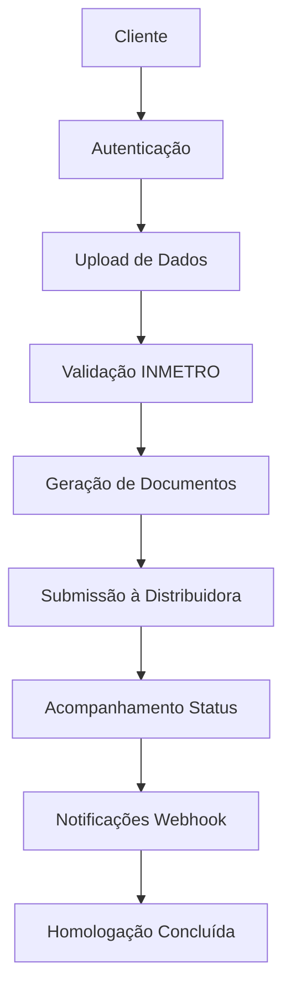

# 🌐 HaaS Platform - APIs End-to-End para Cobertura 360º

> **Última Atualização**: 14 de Outubro de 2025  
> **Versão da API**: 1.0.0  
> **Status do Sistema**: 35% implementado (14/40 endpoints)  
> **Documentação Completa**: Ver `BLUEPRINT-360-NOW-NEXT-LATER.md`

## 📋 Visão Geral

Documentação completa das APIs do **HaaS Platform** (Homologação como Serviço) que fornece cobertura 360º para homologação digital automática de equipamentos fotovoltaicos.

### 🎯 Roadmap de Desenvolvimento

- **NOW (2-4 semanas)**: MVP com validação INMETRO + memorial descritivo
- **NEXT (1-2 meses)**: Automação completa com conectores e diagramas
- **LATER (3-6 meses)**: IA/ML, expansão 67 distribuidoras, enterprise features

---

## 🔐 1. APIs de Autenticação e Autorização

### Base URL: `/auth`

| Método | Endpoint | Descrição | Status |
|--------|----------|-----------|---------|
| `POST` | `/auth/login` | Autenticação de usuário via JWT | ✅ Implementado |
| `POST` | `/auth/register` | Registro de novo usuário | 🚧 Placeholder |
| `GET` | `/auth/me` | Obter informações do usuário atual | ✅ Implementado |
| `POST` | `/auth/refresh` | Renovar token JWT | 🔄 Planejado |
| `POST` | `/auth/logout` | Logout do usuário | 🔄 Planejado |

#### Exemplo de Uso

```bash
# Login
curl -X POST /auth/login \
  -d "username=user@example.com&password=senha123"

# Resposta
{
  "access_token": "eyJ0eXAiOiJKV1QiLCJhbGciOiJIUzI1NiJ9...",
  "token_type": "bearer"
}
```

---

## 🏢 2. APIs de Gestão de Distribuidoras

### Base URL: `/distributors`

| Método | Endpoint | Descrição | Status |
|--------|----------|-----------|---------|
| `GET` | `/distributors/` | Listar todas as distribuidoras | ✅ Implementado |
| `GET` | `/distributors/{id}` | Obter detalhes de uma distribuidora | ✅ Implementado |
| `POST` | `/distributors/{id}/connection` | Submeter solicitação de conexão | ✅ Implementado |
| `GET` | `/distributors/connection/{request_id}` | Verificar status da conexão | ✅ Implementado |
| `POST` | `/distributors/validate` | Validar dados de conexão | ✅ Implementado |

#### Exemplo de Uso

```bash
# Listar distribuidoras
curl -X GET /distributors/ \
  -H "Authorization: Bearer {token}"

# Submeter conexão
curl -X POST /distributors/266/connection \
  -H "Authorization: Bearer {token}" \
  -H "Content-Type: application/json" \
  -d '{
    "project_name": "Solar Residencial",
    "capacity_kw": 5.4,
    "consumer_unit": "12345678",
    "documents": ["art", "memorial", "diagrama"]
  }'
```

---

## 🔗 3. APIs de Webhooks e Notificações

### Base URL: `/webhooks`

| Método | Endpoint | Descrição | Status |
|--------|----------|-----------|---------|
| `GET` | `/webhooks/configs` | Listar configurações de webhooks | ✅ Implementado |
| `POST` | `/webhooks/configs` | Criar nova configuração | ✅ Implementado |
| `GET` | `/webhooks/configs/{id}` | Obter configuração específica | ✅ Implementado |
| `PUT` | `/webhooks/configs/{id}` | Atualizar configuração | ✅ Implementado |
| `DELETE` | `/webhooks/configs/{id}` | Deletar configuração | ✅ Implementado |
| `POST` | `/webhooks/test/{id}` | Testar webhook | ✅ Implementado |

#### Exemplo de Uso

```bash
# Criar webhook
curl -X POST /webhooks/configs \
  -H "Authorization: Bearer {admin_token}" \
  -H "Content-Type: application/json" \
  -d '{
    "name": "Status Updates",
    "url": "https://api.cliente.com/webhooks/haas",
    "events": ["connection_approved", "document_ready"],
    "active": true
  }'
```

---

## 🏅 4. APIs de Validação INMETRO

### Base URL: `/validation/inmetro`

| Método | Endpoint | Descrição | Status |
|--------|----------|-----------|---------|
| `POST` | `/validation/inmetro/equipment` | Validar equipamento | 🔄 Planejado |
| `GET` | `/validation/inmetro/equipment/{id}` | Buscar certificação por ID | 🔄 Planejado |
| `POST` | `/validation/inmetro/batch` | Validar lista de equipamentos | 🔄 Planejado |
| `GET` | `/validation/inmetro/manufacturers` | Listar fabricantes certificados | 🔄 Planejado |
| `GET` | `/validation/inmetro/models/{manufacturer}` | Listar modelos por fabricante | 🔄 Planejado |

#### Sistema Subjacente Implementado

- ✅ **InmetroCrawler**: Extração de dados do portal INMETRO
- ✅ **InmetroExtractor**: Pipeline de estruturação de dados
- ✅ **RecordValidator**: Validação de certificações
- ✅ **InmetroRepository**: Cache local de equipamentos

#### Exemplo de API Planejada

```bash
# Validar equipamento
curl -X POST /validation/inmetro/equipment \
  -H "Authorization: Bearer {token}" \
  -H "Content-Type: application/json" \
  -d '{
    "categoria": "inversores",
    "fabricante": "WEG",
    "modelo": "SIW300H-220"
  }'

# Resposta
{
  "valid": true,
  "certification": {
    "registry_id": "BR-123456",
    "status": "valido",
    "expiry_date": "2025-12-31",
    "technical_specs": {...}
  }
}
```

---

## 📄 5. APIs de Geração de Documentos

### Base URL: `/documents`

| Método | Endpoint | Descrição | Status |
|--------|----------|-----------|---------|
| `POST` | `/documents/memorial` | Gerar memorial descritivo | 🔄 Planejado |
| `POST` | `/documents/diagram` | Gerar diagrama unifilar | 🔄 Planejado |
| `POST` | `/documents/forms/{utility}` | Preencher formulários específicos | 🔄 Planejado |
| `GET` | `/documents/templates` | Listar templates disponíveis | 🔄 Planejado |
| `GET` | `/documents/download/{id}` | Download de documento | 🔄 Planejado |

#### Exemplo de API Planejada

```bash
# Gerar memorial descritivo
curl -X POST /documents/memorial \
  -H "Authorization: Bearer {token}" \
  -H "Content-Type: application/json" \
  -d '{
    "project": {
      "name": "Sistema Fotovoltaico Residencial",
      "capacity_kw": 5.4,
      "modules": {...},
      "inverter": {...},
      "location": {...}
    }
  }'

# Resposta
{
  "document_id": "doc_123",
  "download_url": "/documents/download/doc_123",
  "format": "pdf",
  "status": "ready"
}
```

---

## 🏛️ 6. APIs de Integração com Concessionárias

### Base URL: `/utilities`

| Método | Endpoint | Descrição | Status |
|--------|----------|-----------|---------|
| `GET` | `/utilities/` | Listar concessionárias suportadas | 🔄 Planejado |
| `GET` | `/utilities/{code}/forms` | Obter formulários da concessionária | 🔄 Planejado |
| `POST` | `/utilities/{code}/submit` | Submeter documentação | 🔄 Planejado |
| `GET` | `/utilities/submission/{id}/status` | Acompanhar status | 🔄 Planejado |
| `GET` | `/utilities/{code}/requirements` | Obter requisitos técnicos | 🔄 Planejado |

#### Sistema Base Disponível

- ✅ **Schemas GD**: Estruturas de dados para distribuidoras
- ✅ **Dados ANEEL**: Base de concessionárias brasileiras
- 🔄 **Conectores**: Em desenvolvimento

#### Exemplo de API Planejada

```bash
# Submeter à concessionária
curl -X POST /utilities/0266/submit \
  -H "Authorization: Bearer {token}" \
  -H "Content-Type: application/json" \
  -d '{
    "consumer_unit": "12345678",
    "documents": [
      {"type": "memorial", "file_id": "doc_123"},
      {"type": "diagrama", "file_id": "doc_124"},
      {"type": "art", "file_id": "doc_125"}
    ],
    "project_data": {...}
  }'

# Resposta
{
  "submission_id": "sub_789",
  "protocol_number": "2024001234",
  "status": "submitted",
  "estimated_days": 15
}
```

---

## 📊 7. APIs de Monitoramento e Relatórios

### Base URL: `/monitoring`

| Método | Endpoint | Descrição | Status |
|--------|----------|-----------|---------|
| `GET` | `/health` | Health check do sistema | ✅ Implementado |
| `GET` | `/monitoring/projects` | Listar projetos em andamento | 🔄 Planejado |
| `GET` | `/monitoring/projects/{id}` | Detalhes do projeto | 🔄 Planejado |
| `GET` | `/monitoring/statistics` | Estatísticas gerais | 🔄 Planejado |
| `GET` | `/monitoring/reports/{type}` | Relatórios customizados | 🔄 Planejado |

#### Health Check Atual

```bash
curl -X GET /health

# Resposta
{
  "status": "healthy",
  "service": "haas-api",
  "version": "1.0.0",
  "environment": "development",
  "checks": {
    "database": "healthy",
    "redis": "healthy"
  }
}
```

---

## 🔧 8. APIs de Configuração e Administração

### Base URL: `/admin`

| Método | Endpoint | Descrição | Status |
|--------|----------|-----------|---------|
| `GET` | `/admin/users` | Gerenciar usuários | 🔄 Planejado |
| `POST` | `/admin/users` | Criar usuário | 🔄 Planejado |
| `PUT` | `/admin/users/{id}` | Atualizar usuário | 🔄 Planejado |
| `GET` | `/admin/settings` | Configurações do sistema | 🔄 Planejado |
| `PUT` | `/admin/settings` | Atualizar configurações | 🔄 Planejado |

---

## 🌐 9. Cobertura 360º - Mapa Completo

### 9.1 Fluxo End-to-End



### 9.2 Capacidades por Área

| Área | APIs Implementadas | APIs Planejadas | Cobertura |
|------|-------------------|------------------|-----------|
| **Autenticação** | 3/5 | 2/5 | 60% |
| **Distribuidoras** | 5/5 | 0/5 | 100% |
| **Webhooks** | 6/6 | 0/6 | 100% |
| **INMETRO** | 0/5 | 5/5 | 0% |
| **Documentos** | 0/5 | 5/5 | 0% |
| **Concessionárias** | 0/5 | 5/5 | 0% |
| **Monitoramento** | 1/5 | 4/5 | 20% |
| **Administração** | 0/5 | 5/5 | 0% |

### 9.3 Priorização de Desenvolvimento

#### 🔴 Alta Prioridade (MVP)

1. **APIs de Validação INMETRO** - Sistema base já implementado
2. **APIs de Geração de Documentos** - Templates em desenvolvimento
3. **APIs de Monitoramento** - Health check já funcional

#### 🟡 Média Prioridade

1. **APIs de Integração com Concessionárias** - Conectores complexos
2. **APIs de Administração** - Gestão de usuários

#### 🟢 Baixa Prioridade

1. **Extensões de Autenticação** - OAuth, SSO
2. **APIs Avançadas de Relatório** - Analytics

---

## 🚀 Próximos Passos

### Fase 1: APIs INMETRO (2-3 semanas)

- Exposição do sistema de validação via REST API
- Cache de certificações em PostgreSQL
- Rate limiting e autenticação

### Fase 2: APIs de Documentos (3-4 semanas)

- Templates HTML/CSS para memorial
- Gerador de diagramas unifilares
- Sistema de templates por concessionária

### Fase 3: APIs de Concessionárias (4-6 semanas)

- Conectores para portais web
- Automação de submissão
- Sistema de tracking

### Fase 4: APIs Completas (1-2 semanas)

- Monitoramento avançado
- Administração de usuários
- Relatórios e analytics

---

## 📞 Suporte e Documentação

- **Documentação Interativa**: `/docs` (desenvolvimento)
- **OpenAPI Schema**: `/openapi.json`
- **Health Check**: `/health`
- **Versão**: `1.0.0`

---

**Total de APIs Planejadas**: 40 endpoints
**APIs Implementadas**: 14 endpoints (35%)
**Cobertura 360º Atual**: 35% completa
**Meta MVP**: 70% (28 endpoints)
