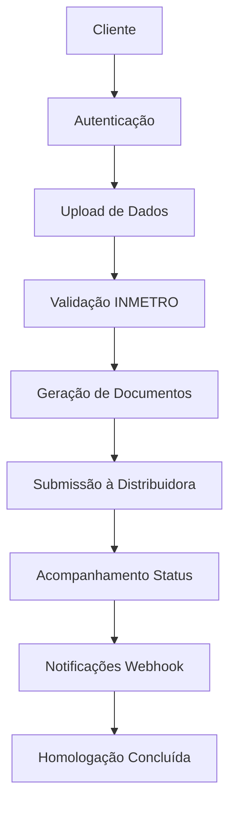

# 🌐 HaaS Platform - APIs End-to-End para Cobertura 360º

> **Última Atualização**: 14 de Outubro de 2025  
> **Versão da API**: 1.0.0  
> **Status do Sistema**: 35% implementado (14/40 endpoints)  
> **Documentação Completa**: Ver `BLUEPRINT-360-NOW-NEXT-LATER.md`

## 📋 Visão Geral

Documentação completa das APIs do **HaaS Platform** (Homologação como Serviço) que fornece cobertura 360º para homologação digital automática de equipamentos fotovoltaicos.

### 🎯 Roadmap de Desenvolvimento

- **NOW (2-4 semanas)**: MVP com validação INMETRO + memorial descritivo
- **NEXT (1-2 meses)**: Automação completa com conectores e diagramas
- **LATER (3-6 meses)**: IA/ML, expansão 67 distribuidoras, enterprise features

---

## 🔐 1. APIs de Autenticação e Autorização

### Base URL: `/auth`

| Método | Endpoint | Descrição | Status | Prioridade |
|--------|----------|-----------|--------|------------|
| `POST` | `/auth/login` | Autenticação de usuário via JWT | ✅ Implementado | - |
| `POST` | `/auth/register` | Registro de novo usuário | 🚧 Placeholder | 🟢 Baixa |
| `GET` | `/auth/me` | Obter informações do usuário atual | ✅ Implementado | - |
| `POST` | `/auth/refresh` | Renovar token JWT | 🔄 NOW | 🔴 Crítica |
| `POST` | `/auth/logout` | Logout do usuário | 🔄 NOW | 🔴 Crítica |

#### Exemplo de Uso

```bash
# Login
curl -X POST /auth/login \
  -d "username=user@example.com&password=senha123"

# Resposta
{
  "access_token": "eyJ0eXAiOiJKV1QiLCJhbGciOiJIUzI1NiJ9...",
  "token_type": "bearer"
}
```

---

## 🏢 2. APIs de Gestão de Distribuidoras

### Base URL: `/distributors`

| Método | Endpoint | Descrição | Status |
|--------|----------|-----------|---------|
| `GET` | `/distributors/` | Listar todas as distribuidoras | ✅ Implementado |
| `GET` | `/distributors/{id}` | Obter detalhes de uma distribuidora | ✅ Implementado |
| `POST` | `/distributors/{id}/connection` | Submeter solicitação de conexão | ✅ Implementado |
| `GET` | `/distributors/connection/{request_id}` | Verificar status da conexão | ✅ Implementado |
| `POST` | `/distributors/validate` | Validar dados de conexão | ✅ Implementado |

#### Exemplo de Uso

```bash
# Listar distribuidoras
curl -X GET /distributors/ \
  -H "Authorization: Bearer {token}"

# Submeter conexão
curl -X POST /distributors/266/connection \
  -H "Authorization: Bearer {token}" \
  -H "Content-Type: application/json" \
  -d '{
    "project_name": "Solar Residencial",
    "capacity_kw": 5.4,
    "consumer_unit": "12345678",
    "documents": ["art", "memorial", "diagrama"]
  }'
```

---

## 🔗 3. APIs de Webhooks e Notificações

### Base URL: `/webhooks`

| Método | Endpoint | Descrição | Status |
|--------|----------|-----------|---------|
| `GET` | `/webhooks/configs` | Listar configurações de webhooks | ✅ Implementado |
| `POST` | `/webhooks/configs` | Criar nova configuração | ✅ Implementado |
| `GET` | `/webhooks/configs/{id}` | Obter configuração específica | ✅ Implementado |
| `PUT` | `/webhooks/configs/{id}` | Atualizar configuração | ✅ Implementado |
| `DELETE` | `/webhooks/configs/{id}` | Deletar configuração | ✅ Implementado |
| `POST` | `/webhooks/test/{id}` | Testar webhook | ✅ Implementado |

#### Exemplo de Uso

```bash
# Criar webhook
curl -X POST /webhooks/configs \
  -H "Authorization: Bearer {admin_token}" \
  -H "Content-Type: application/json" \
  -d '{
    "name": "Status Updates",
    "url": "https://api.cliente.com/webhooks/haas",
    "events": ["connection_approved", "document_ready"],
    "active": true
  }'
```

---

## 🏅 4. APIs de Validação INMETRO

### Base URL: `/validation/inmetro`

| Método | Endpoint | Descrição | Status | Prioridade |
|--------|----------|-----------|--------|------------|
| `POST` | `/validation/inmetro/equipment` | Validar equipamento | 🔄 NOW | 🔴 Crítica |
| `GET` | `/validation/inmetro/equipment/{id}` | Buscar certificação por ID | 🔄 NOW | 🔴 Crítica |
| `POST` | `/validation/inmetro/batch` | Validar lista de equipamentos | 🔄 NOW | 🔴 Crítica |
| `GET` | `/validation/inmetro/manufacturers` | Listar fabricantes certificados | 🔄 NOW | 🟡 Alta |
| `GET` | `/validation/inmetro/models/{manufacturer}` | Listar modelos por fabricante | 🔄 NOW | 🟡 Alta |

#### Sistema Subjacente Implementado

- ✅ **InmetroCrawler**: Extração de dados do portal INMETRO
- ✅ **InmetroExtractor**: Pipeline de estruturação de dados
- ✅ **RecordValidator**: Validação de certificações
- ✅ **InmetroRepository**: Cache local de equipamentos

#### Exemplo de API Planejada

```bash
# Validar equipamento
curl -X POST /validation/inmetro/equipment \
  -H "Authorization: Bearer {token}" \
  -H "Content-Type: application/json" \
  -d '{
    "categoria": "inversores",
    "fabricante": "WEG",
    "modelo": "SIW300H-220"
  }'

# Resposta
{
  "valid": true,
  "certification": {
    "registry_id": "BR-123456",
    "status": "valido",
    "expiry_date": "2025-12-31",
    "technical_specs": {...}
  }
}
```

---

## 📄 5. APIs de Geração de Documentos

### Base URL: `/documents`

| Método | Endpoint | Descrição | Status | Prioridade |
|--------|----------|-----------|--------|------------|
| `POST` | `/documents/memorial` | Gerar memorial descritivo | 🔄 NOW | 🟡 Alta |
| `POST` | `/documents/diagram` | Gerar diagrama unifilar | 🔄 NEXT | 🟡 Alta |
| `POST` | `/documents/forms/{utility}` | Preencher formulários específicos | 🔄 NEXT | 🟡 Alta |
| `GET` | `/documents/templates` | Listar templates disponíveis | 🔄 NOW | 🟢 Média |
| `GET` | `/documents/download/{id}` | Download de documento | 🔄 NOW | 🟡 Alta |

#### Exemplo de API Planejada

```bash
# Gerar memorial descritivo
curl -X POST /documents/memorial \
  -H "Authorization: Bearer {token}" \
  -H "Content-Type: application/json" \
  -d '{
    "project": {
      "name": "Sistema Fotovoltaico Residencial",
      "capacity_kw": 5.4,
      "modules": {...},
      "inverter": {...},
      "location": {...}
    }
  }'

# Resposta
{
  "document_id": "doc_123",
  "download_url": "/documents/download/doc_123",
  "format": "pdf",
  "status": "ready"
}
```

---

## 🏛️ 6. APIs de Integração com Concessionárias

### Base URL: `/utilities`

| Método | Endpoint | Descrição | Status | Prioridade |
|--------|----------|-----------|--------|------------|
| `GET` | `/utilities/` | Listar concessionárias suportadas | 🔄 NOW | 🟡 Alta |
| `GET` | `/utilities/{code}/forms` | Obter formulários da concessionária | 🔄 NEXT | 🟡 Alta |
| `POST` | `/utilities/{code}/submit` | Submeter documentação | 🔄 NEXT | 🟢 Média |
| `GET` | `/utilities/submission/{id}/status` | Acompanhar status | 🔄 NEXT | 🟢 Média |
| `GET` | `/utilities/{code}/requirements` | Obter requisitos técnicos | 🔄 NOW | 🟡 Alta |

#### Sistema Base Disponível

- ✅ **Schemas GD**: Estruturas de dados para distribuidoras
- ✅ **Dados ANEEL**: Base de concessionárias brasileiras
- 🔄 **Conectores**: Em desenvolvimento

#### Exemplo de API Planejada

```bash
# Submeter à concessionária
curl -X POST /utilities/0266/submit \
  -H "Authorization: Bearer {token}" \
  -H "Content-Type: application/json" \
  -d '{
    "consumer_unit": "12345678",
    "documents": [
      {"type": "memorial", "file_id": "doc_123"},
      {"type": "diagrama", "file_id": "doc_124"},
      {"type": "art", "file_id": "doc_125"}
    ],
    "project_data": {...}
  }'

# Resposta
{
  "submission_id": "sub_789",
  "protocol_number": "2024001234",
  "status": "submitted",
  "estimated_days": 15
}
```

---

## 📊 7. APIs de Monitoramento e Relatórios

### Base URL: `/monitoring`

| Método | Endpoint | Descrição | Status | Prioridade |
|--------|----------|-----------|--------|------------|
| `GET` | `/health` | Health check do sistema | ✅ Implementado | - |
| `GET` | `/monitoring/projects` | Listar projetos em andamento | 🔄 NOW | 🟡 Alta |
| `GET` | `/monitoring/projects/{id}` | Detalhes do projeto | 🔄 NOW | 🟡 Alta |
| `GET` | `/monitoring/statistics` | Estatísticas gerais | 🔄 NOW | 🟡 Alta |
| `GET` | `/monitoring/reports/{type}` | Relatórios customizados | 🔄 NEXT | 🟢 Média |

#### Health Check Atual

```bash
curl -X GET /health

# Resposta
{
  "status": "healthy",
  "service": "haas-api",
  "version": "1.0.0",
  "environment": "development",
  "checks": {
    "database": "healthy",
    "redis": "healthy"
  }
}
```

---

## 🔧 8. APIs de Configuração e Administração

### Base URL: `/admin`

| Método | Endpoint | Descrição | Status | Prioridade |
|--------|----------|-----------|--------|------------|
| `GET` | `/admin/users` | Gerenciar usuários | 🔄 LATER | 🟢 Média |
| `POST` | `/admin/users` | Criar usuário | 🔄 LATER | 🟢 Média |
| `PUT` | `/admin/users/{id}` | Atualizar usuário | 🔄 LATER | 🟢 Média |
| `GET` | `/admin/settings` | Configurações do sistema | 🔄 LATER | 🟢 Baixa |
| `PUT` | `/admin/settings` | Atualizar configurações | 🔄 LATER | 🟢 Baixa |

---

## 🌐 9. Cobertura 360º - Mapa Completo

### 9.1 Fluxo End-to-End



### 9.2 Capacidades por Área e Roadmap

| Área | Implementadas | NOW | NEXT | LATER | Status |
|------|---------------|-----|------|-------|--------|
| **Autenticação** | 3 | 2 | 0 | 0 | 60% ✅ |
| **Distribuidoras** | 5 | 0 | 0 | 0 | 100% ✅ |
| **Webhooks** | 6 | 0 | 0 | 0 | 100% ✅ |
| **INMETRO** | 0 | 5 | 0 | 0 | 0% 🔴 |
| **Documentos** | 0 | 3 | 2 | 0 | 0% 🔴 |
| **Concessionárias** | 0 | 2 | 3 | 0 | 0% 🔴 |
| **Monitoramento** | 1 | 3 | 1 | 0 | 20% 🟡 |
| **Administração** | 0 | 0 | 0 | 5 | 0% 🟢 |
| **TOTAL** | **15** | **15** | **6** | **5** | **37%** |

### 9.3 Cronograma de Desenvolvimento

#### 🔴 NOW (2-4 semanas) - MVP Crítico

**15 endpoints prioritários**:

1. **Autenticação** (2 endpoints)
   - Refresh token + Logout
   - Tempo: 3 dias

2. **INMETRO** (5 endpoints)
   - Sistema base 100% implementado
   - Apenas expor via REST API
   - Tempo: 5 dias

3. **Documentos** (3 endpoints)
   - Memorial descritivo (Jinja2 + WeasyPrint)
   - Templates + Download
   - Tempo: 4 dias

4. **Concessionárias** (2 endpoints)
   - Listagem + Requisitos
   - Base ANEEL pronta
   - Tempo: 3 dias

5. **Monitoramento** (3 endpoints)
   - Projetos + Estatísticas
   - Tempo: 3 dias

**Total NOW**: 18 dias úteis → Meta 70% cobertura

#### 🟡 NEXT (1-2 meses) - Automação

**6 endpoints**:

- Diagramas unifilares (NBR 5410)
- Formulários automáticos (CPFL, Enel, CEMIG)
- Conectores web (Playwright)
- Relatórios customizados

**Total NEXT**: 8-10 semanas

#### 🟢 LATER (3-6 meses) - Enterprise

**5 endpoints**:

- Administração completa
- IA/ML features
- Multi-tenancy
- Analytics avançado

**Total LATER**: 6 meses paralelizados

---

## 🚀 Quick Wins Identificados

### Semana 1-2: APIs INMETRO (Maior ROI)

**Por que é Quick Win?**

- ✅ Sistema base 100% implementado (`InmetroCrawler`, `InmetroExtractor`, `RecordValidator`)
- ✅ Apenas precisa expor via REST API
- ✅ Alto valor percebido pelos clientes
- ⚡ 5 dias de desenvolvimento

**Endpoints**:

```python
POST   /validation/inmetro/equipment      # Reutiliza validate_equipment()
POST   /validation/inmetro/batch          # Loop sobre validate_equipment()
GET    /validation/inmetro/equipment/{id} # Consulta ao repository
GET    /validation/inmetro/manufacturers  # Query no cache local
GET    /validation/inmetro/models/{mfr}   # Filtro por fabricante
```

### Semana 2-3: Memorial Descritivo (Alta Percepção)

**Por que é Quick Win?**

- 📄 Geração de PDF profissional impacta cliente
- 🎨 Template HTML/CSS reutilizável
- 📦 Biblioteca Jinja2 + WeasyPrint (maduras)
- ⚡ 4 dias de desenvolvimento

### Semana 3-4: Dashboard Monitoramento

**Por que é Quick Win?**

- 📊 Visibilidade do sistema
- 🎯 Gestão de projetos
- 💼 Valor para stakeholders
- ⚡ 3 dias de desenvolvimento

---

## 📞 Documentação e Recursos

### Acesso à Documentação

- **Docs Interativos**: `/docs` (ambiente dev)
- **ReDoc**: `/redoc` (ambiente dev)
- **OpenAPI Schema**: `/openapi.json`
- **Health Check**: `/health`
- **Blueprint Completo**: `BLUEPRINT-360-NOW-NEXT-LATER.md`

### Status Atual do Sistema

| Métrica | Valor | Meta MVP |
|---------|-------|----------|
| **Endpoints Implementados** | 15/41 | 30/41 |
| **Cobertura 360º** | 37% | 73% |
| **Sistemas Base Prontos** | 4/8 | 7/8 |
| **Tempo para MVP** | - | 18 dias |

### Legenda de Status

- ✅ **Implementado**: Funcional em produção
- 🔄 **NOW**: Próximas 2-4 semanas (MVP)
- 🔄 **NEXT**: 1-2 meses (Automação)
- 🔄 **LATER**: 3-6 meses (Enterprise)
- 🚧 **Placeholder**: Estrutura básica, não funcional

### Legenda de Prioridade

- 🔴 **Crítica**: Bloqueador para MVP
- 🟡 **Alta**: Importante para value proposition
- 🟢 **Média**: Nice to have
- 🟢 **Baixa**: Future enhancements

---

## 📈 Projeções

### Após NOW (4 semanas)

- ✅ 30 endpoints funcionais (73% cobertura)
- ✅ Validação INMETRO completa
- ✅ Memorial descritivo automático
- ✅ Dashboard operacional
- ✅ Base 67 concessionárias

### Após NEXT (3 meses)

- ✅ Diagramas unifilares NBR 5410
- ✅ Formulários 3 principais distribuidoras
- ✅ Conectores web automáticos
- ✅ 36 endpoints (88% cobertura)

### Após LATER (6 meses)

- ✅ IA/ML para validação inteligente
- ✅ Predição de aprovação
- ✅ 67 distribuidoras cobertas
- ✅ Multi-tenancy e white label
- ✅ 41 endpoints (100% cobertura)

---

**Versão da Documentação**: 1.1.0  
**Última Atualização**: 14 de Outubro de 2025  
**Próxima Revisão**: Fim de NOW (após 4 semanas)
