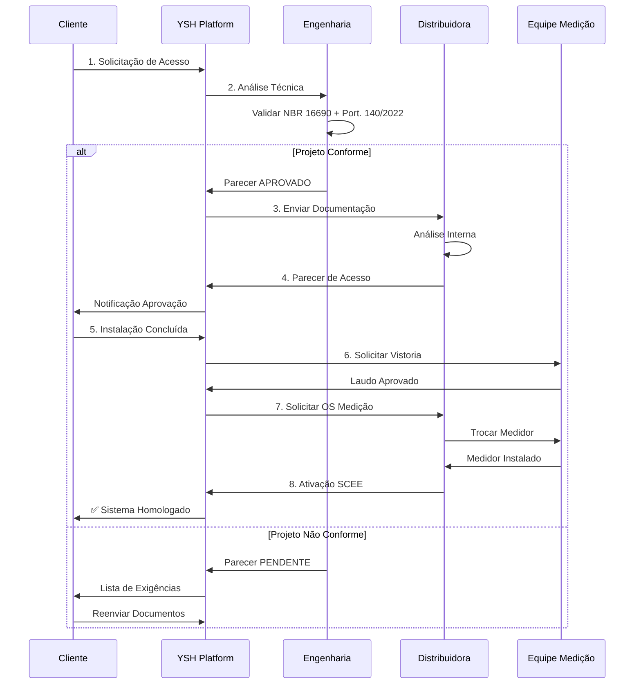

# 📘 Regras de Negócio Extraídas - YSH Solar Platform

**Data de Extração:** 14 de Outubro de 2025  
**Versão:** 3.0.0 - **Precificação e Margens Completas**  
**Fontes:**

- STOREFRONT_BACKEND_JTBD_MAPPING.md
- MARKETPLACE_KIT_RULES.md
- Homologação Digital 360° YSH
- YSH-SOLAR-360-SPLITS-STRUCTURE.md
- COMPARATIVE_PRICING_ANALYSIS.md
- Análise Gemini - Custos e Margens

---

## 💰 Resumo Executivo - Estrutura de Precificação YSH

### Margens por Cenário

| Cenário | Sudeste | Sul | C-Oeste | Nordeste | Norte | Média Nacional |
|---------|---------|-----|---------|----------|-------|----------------|
| **Otimista** | 35-40% | 33-38% | 32-37% | 34-39% | 30-35% | **33-38%** |
| **Neutro** | 28-32% | 28-31% | 26-30% | 29-33% | 25-29% | **27-31%** |
| **Pessimista** | 22-25% | 23-26% | 20-24% | 24-28% | 19-23% | **22-25%** |

**Margem-alvo YSH:** 25-35% (cenário neutro)  
**Margem mínima viável:** 15% (abaixo disso, rejeitar projeto)

### Pricing HaaS vs SaaS

| Categoria | HaaS Sudeste | SaaS Sudeste | Margem HaaS | Margem SaaS |
|-----------|--------------|--------------|-------------|-------------|
| P (4-10 kWp) | R$ 699 | R$ 299 | 28.5% | 66.5% |
| M (10-25 kWp) | R$ 849 | R$ 349 | ~30% | ~68% |
| G (25-75 kWp) | R$ 999 | R$ 399 | ~32% | ~70% |

### Splits de Projeto (Exemplo R$ 50.000)

```text
CENÁRIO NEUTRO:
├─ Equipamentos:        60% (R$ 30.000)
├─ Mão de Obra:         13% (R$  6.500)
├─ Projeto/ART:         10% (R$  5.000)
├─ Homologação:          3% (R$  1.500)
├─ Comissão:             5% (R$  2.500)
├─ Logística:            4% (R$  2.000)
└─ Margem/Contingência:  5% (R$  2.500)

CENÁRIO OTIMISTA:
├─ Equipamentos:        55% (R$ 27.500) ⬇️ -R$ 2.500
├─ Mão de Obra:         15% (R$  7.500) ⬆️ +R$ 1.000 (premium)
├─ Projeto/ART:          9% (R$  4.500)
├─ Homologação:          3% (R$  1.500)
├─ Comissão:             6% (R$  3.000)
├─ Logística:            4% (R$  2.000)
└─ Margem:               8% (R$  4.000) ⬆️ +R$ 1.500 lucro
```

### Comissões por Perfil

- **B1 Residencial:** 6.5% (5% vendedor + 1% gerente + 0.5% master)
- **B3 Comercial:** 10% (7% + 2% + 1%)
- **B6 Industrial:** 15% (10% + 3% + 2%)

**Pagamento:** 50% aprovação / 30% instalação / 20% pós-venda

---

## 📑 Índice

1. [Dimensionamento e Geração Solar](#1-dimensionamento-e-geração-solar)
2. [Classificação de Projetos por Porte](#2-classificação-de-projetos-por-porte)
3. [Tiers de Geração vs Consumo](#3-tiers-de-geração-vs-consumo)
4. [Variações Regionais Brasileiras](#4-variações-regionais-brasileiras)
5. [Estrutura de Custos e Margens](#5-estrutura-de-custos-e-margens)
6. [Pricing de Homologação](#6-pricing-de-homologação)
7. [Classificação de Clientes (B1-B6)](#7-classificação-de-clientes-b1-b6)
8. [Modalidades Tarifárias](#8-modalidades-tarifárias)
9. [Workflows de Homologação](#9-workflows-de-homologação)
10. [Validações e Conformidades](#10-validações-e-conformidades)
11. [Estratégia Multi-Distribuidor](#11-estratégia-multi-distribuidor)
12. [KPIs e Métricas](#12-kpis-e-métricas)

---

## 1. Dimensionamento e Geração Solar

### 1.1 Fórmula Base de Dimensionamento

```typescript
// Cálculo de potência necessária (kWp)
const potenciaNecessaria = (consumoMensal_kWh * fatorGeracao) / 135;

// Onde:
// - consumoMensal_kWh: Consumo médio mensal do cliente
// - fatorGeracao: 1.15 (Moderado), 1.30 (Consciente), 1.45 (Acelerado)
// - 135: Horas de sol equivalentes médias por mês (Brasil)
```

### 1.2 Fórmula de Geração Anual Estimada

```typescript
// IEC 61724
const geracaoAnual_kWh = H_POA * potencia_kWp * PR;

// Onde:
// - H_POA: Irradiância anual no plano de array (kWh/m²/ano)
// - potencia_kWp: Potência instalada
// - PR (Performance Ratio): 0.75 - 0.85 típico
```

**Fontes de Dados de Irradiância:**

- **PVGIS**: <https://re.jrc.ec.europa.eu/pvgis.html>
- **NASA POWER**: <https://power.larc.nasa.gov/>
- **ONS Dados Abertos**: <https://dados.ons.org.br/>

### 1.3 Horas de Sol Equivalentes por Região (HSP)

| Região | HSP Médio (h/dia) | HSP Mensal | Fator Ajuste |
|--------|-------------------|------------|--------------|
| **Nordeste** | 5.5 | 165 | 1.10 |
| **Centro-Oeste** | 5.4 | 162 | 1.08 |
| **Sudeste** | 5.0 | 150 | 1.00 (base) |
| **Norte** | 4.9 | 147 | 0.98 |
| **Sul** | 4.5 | 135 | 0.90 |

**Regra de Negócio RN-001:**
> Para calcular a potência necessária em qualquer região, ajustar o divisor base (150) pelo fator regional:
>
> ```tsx
> divisorRegional = 150 / fatorAjuste
> ```

---

## 2. Classificação de Projetos por Porte

### 2.1 Categorias YSH (XPP até XXG)

| Categoria | Porte Regulatório | Potência (kWp) | Perfil Cliente | Geração Mensal (kWh) | Nº Painéis |
|-----------|-------------------|----------------|----------------|----------------------|------------|
| **XPP** | Microgeração | 1.2 - 2.0 | Residencial baixo | 150 - 280 | 2 - 4 |
| **PP** | Microgeração | 2.1 - 4.0 | Residencial médio | 280 - 550 | 4 - 8 |
| **P** | Microgeração | 4.1 - 10.0 | Residencial alto/Comercial | 550 - 1.350 | 8 - 18 |
| **M** | Microgeração | 10.1 - 25.0 | Comercial médio/Rural | 1.350 - 3.400 | 18 - 45 |
| **G** | Microgeração | 25.1 - 75.0 | Comercial grande/Industrial | 3.400 - 10.200 | 45 - 136 |
| **XG** | Minigeração | 76.0 - 500.0 | Industrial/Fazendas solares | 10.200 - 67.500 | 137 - 910 |
| **XXG** | Minigeração | 501.0 - 3.000.0 | Grandes complexos/GC | 67.500 - 405.000 | 911 - 5.455 |

**Regra de Negócio RN-002:**
>
> - **Microgeração**: ≤ 75 kWp (formulário PRODIST 3.A)
> - **Minigeração**: 76 kWp - 3.000 kWp (formulário PRODIST 3.B/3.C)

### 2.2 Kits Padronizados YSH

**Regra de Negócio RN-003:**
> YSH trabalha com 4 kits principais padronizados:
>
> - **Kit 3 kWp**: Residencial pequeno (150-250 kWh/mês)
> - **Kit 5 kWp**: Residencial médio (250-400 kWh/mês)
> - **Kit 8 kWp**: Residencial grande/Comercial (400-650 kWh/mês)
> - **Kit 10 kWp**: Comercial/Rural (650-800 kWh/mês)

**Regra de Arredondamento:**
> Sempre arredondar `kwp_est` para o kit **imediatamente superior** disponível.

---

## 3. Tiers de Geração vs Consumo

### 3.1 Definição dos Tiers

| Tier | Fator | Descrição | Uso Recomendado | ROI Esperado |
|------|-------|-----------|-----------------|--------------|
| **🟢 Moderado** | 115% | Sistema básico | Budget-conscious | 35% a.a. |
| **🟡 Consciente** | 130% | **RECOMENDADO** | Crescimento futuro | 40% a.a. |
| **🔴 Acelerado** | 145% | Alta performance | VE/expansão | 45% a.a. |
| **⚫ Ultra** | 160% | Pré-eletrificação | Off-grid híbrido | 50%+ a.a. |

**Regra de Negócio RN-004:**
> O tier **Consciente (130%)** é sempre o recomendado por padrão, pois:
>
> - Compensa degradação natural dos painéis (~0.5% a.a.)
> - Permite crescimento de consumo (15-20% comum em 5 anos)
> - Gera "colchão" de créditos para meses de menor geração

### 3.2 Tabela de Conversão (Exemplo Sudeste)

**Base:** 1 kWp gera ~150 kWh/mês no Sudeste

| Consumo (kWh/mês) | Tier Moderado (115%) | Tier Consciente (130%) | Tier Acelerado (145%) |
|-------------------|---------------------|------------------------|----------------------|
| 100 | 115 kWh → 0.8 kWp | 130 kWh → 0.9 kWp | 145 kWh → 1.0 kWp |
| 200 | 230 kWh → 1.5 kWp | 260 kWh → 1.7 kWp | 290 kWh → 1.9 kWp |
| 300 | 345 kWh → 2.3 kWp | 390 kWh → 2.6 kWp | 435 kWh → 2.9 kWp |
| 500 | 575 kWh → 3.8 kWp | 650 kWh → 4.3 kWp | 725 kWh → 4.8 kWp |
| 1000 | 1150 kWh → 7.7 kWp | 1300 kWh → 8.7 kWp | 1450 kWh → 9.7 kWp |

---

## 4. Variações Regionais Brasileiras

### 4.1 Geração Mensal por Região (por kWp instalado)

| Categoria | Potência | Nordeste | Centro-Oeste | Sudeste | Norte | Sul |
|-----------|----------|----------|--------------|---------|-------|-----|
| XPP | 1.4 kWp | 240 kWh | 235 kWh | 220 kWh | 215 kWh | 200 kWh |
| PP | 2.8 kWp | 465 kWh | 458 kWh | 427 kWh | 418 kWh | 388 kWh |
| P | 6.9 kWp | 1.170 kWh | 1.145 kWh | 1.070 kWh | 1.045 kWh | 970 kWh |
| M | 21.5 kWp | 3.640 kWh | 3.560 kWh | 3.333 kWh | 3.250 kWh | 3.020 kWh |
| G | 55.0 kWp | 9.300 kWh | 9.100 kWh | 8.525 kWh | 8.300 kWh | 7.725 kWh |

**Regra de Negócio RN-005:**
> Fator de produtividade por região (base Sudeste = 1.00):
>
> - Nordeste: 1.09x
> - Centro-Oeste: 1.07x
> - Sudeste: 1.00x (referência)
> - Norte: 0.98x
> - Sul: 0.91x

### 4.2 Consumo Atendido por Tier e Região

#### **Exemplo: Kit 6.9 kWp (categoria P)**

| Região | Geração Mensal | Consumo Tier 115% | Consumo Tier 130% | Consumo Tier 145% |
|--------|----------------|-------------------|-------------------|-------------------|
| Nordeste | 1.170 kWh | 1.017 kWh | 900 kWh | 807 kWh |
| C-Oeste | 1.145 kWh | 996 kWh | 881 kWh | 790 kWh |
| Sudeste | 1.070 kWh | 930 kWh | 823 kWh | 738 kWh |
| Norte | 1.045 kWh | 909 kWh | 804 kWh | 721 kWh |
| Sul | 970 kWh | 843 kWh | 746 kWh | 669 kWh |

---

## 5. Estrutura de Custos e Margens

### 5.1 Divisão de Custos YSH (Base de Projeto)

| Componente | % do Total | Descrição | Variação Regional |
|------------|-----------|-----------|-------------------|
| **Equipamentos** | 55-65% | Painéis + Inversores + Estrutura | ±10% (logística) |
| **Mão de Obra** | 10-15% | Instalação + Commissioning | Sudeste +20%, NE -15% |
| **Projeto Técnico** | 6-9% | Engenharia + Memorial | ±3% (complexidade) |
| **ART/TRT** | 2% | Anotação Responsabilidade | Varia por CREA |
| **Homologação** | 3-5% | Processo na concessionária | ±2% |
| **Comissão** | 4-6% | Vendas + Integradores | 3-7% negociável |
| **Logística** | 3-7% | Frete + Armazenagem | Norte +50%, Sul +20% |
| **Contingência** | 2-11% | Imprevistos + Buffer | Varia por região/cenário |

**Regra de Negócio RN-006:**
> Margem-alvo YSH: **25-35%** sobre o custo total do projeto
>
> **Splits por Cenário:**
>
> - **Pessimista:** 19-28% (mercado competitivo, custos altos)
> - **Neutro:** 25-32% (condições normais de mercado)
> - **Otimista:** 32-40% (economia de escala, parcerias estratégicas)

### 5.2 Custos Recorrentes (Pós-Instalação)

| Item | % Anual | Base de Cálculo | Frequência |
|------|---------|----------------|------------|
| **Manutenção Preventiva** | 0.3-0.5% | Investimento total | Semestral |
| **Manutenção Corretiva** | 0.1-0.2% | Investimento total | Sob demanda |
| **Seguro RD** (Riscos Diversos) | 0.3-0.5% | Valor instalado | Anual |
| **Seguro RE** (Resp. Civil) | 0.1-0.2% | Valor instalado | Anual |
| **Monitoramento SaaS** | R$ 15-40/mês | Por sistema | Mensal (opcional) |

**Regra de Negócio RN-007:**
> Custos anuais recorrentes: **~1.0-1.5%** do investimento inicial

### 5.3 Cenários de Margem por Região

#### Cenário Otimista (Melhores Condições)

| Região | Margem Bruta | Split Equipamentos | Split MO | Fatores de Vantagem |
|--------|--------------|-------------------|----------|---------------------|
| Sudeste | 35-40% | 55% | 15% | Compra em volume, processos ágeis, logística otimizada |
| Sul | 33-38% | 55% | 15% | Parcerias fabricantes, especialização premium |
| Centro-Oeste | 32-37% | 55% | 10% | Hubs logísticos regionais, especialização agro |
| Nordeste | 34-39% | 55% | 11% | Vantagem custo regional, capacitação massiva |
| Norte | 30-35% | 55% | 10% | Hubs Manaus/Belém, programas qualificação |

#### Cenário Neutro (Médias de Mercado)

| Região | Margem Bruta | Split Equipamentos | Split MO | Observações |
|--------|--------------|-------------------|----------|-------------|
| Sudeste | 28-32% | 60% | 13% | Referência nacional, mercado equilibrado |
| Sul | 28-31% | 60% | 13% | Mercado maduro, qualificação adequada |
| Centro-Oeste | 26-30% | 60% | 10% | Crescimento oferta local, desenvolvimento |
| Nordeste | 29-33% | 60% | 11% | Mercado em expansão, boa disponibilidade |
| Norte | 25-29% | 60% | 10% | Melhoria oferta, capacitação iniciando |

#### Cenário Pessimista (Desafios Operacionais)

| Região | Margem Bruta | Split Equipamentos | Split MO | Riscos |
|--------|--------------|-------------------|----------|--------|
| Sudeste | 22-25% | 62% | 15% | Guerras de preço, saturação, alta competitividade |
| Sul | 23-26% | 62% | 14% | Clima adverso, sistemas maiores (menor HSP) |
| Centro-Oeste | 20-24% | 65% | 10% | Fretes caros, escassez profissionais |
| Nordeste | 24-28% | 63% | 12% | Competição regional, infraestrutura variável |
| Norte | 19-23% | 65% | 10% | Logística cara, baixa escala, mercado emergente |

**Regra de Negócio RN-008:**
> Margem mínima viável: **15%** (abaixo disso, avaliar viabilidade do projeto)
>
> **Cálculo de Split Equipamentos por Cenário:**
>
> - **Otimista:** 55% (negociações favoráveis, compra volume)
> - **Neutro:** 60% (preço médio de mercado)
> - **Pessimista:** 62-65% (competitividade alta, custos elevados)

---

## 6. Pricing de Homologação

### 6.1 Modelo HaaS (Homologation as a Service)

**Serviço Completo:** Inclui plataforma, elaboração projeto, ART/TRT, acompanhamento

| Categoria | Sudeste | Sul | Centro-Oeste | Nordeste | Norte |
|-----------|---------|-----|--------------|----------|-------|
| XPP (≤2.0 kWp) | R$ 499 | R$ 479 | R$ 429 | R$ 429 | R$ 449 |
| PP (2.1-4.0 kWp) | R$ 599 | R$ 569 | R$ 509 | R$ 509 | R$ 539 |
| P (4.1-10.0 kWp) | R$ 699 | R$ 669 | R$ 599 | R$ 599 | R$ 629 |
| M (10.1-25.0 kWp) | R$ 849 | R$ 809 | R$ 729 | R$ 729 | R$ 769 |
| G (25.1-75.0 kWp) | R$ 999 | R$ 949 | R$ 849 | R$ 849 | R$ 899 |
| XG (76-500 kWp) | R$ 1.299 + R$ 5/kWp | R$ 1.239 + R$ 5/kWp | R$ 1.109 + R$ 5/kWp | R$ 1.109 + R$ 5/kWp | R$ 1.169 + R$ 5/kWp |
| XXG (501-3000 kWp) | R$ 1.599 + R$ 5/kWp | R$ 1.519 + R$ 5/kWp | R$ 1.359 + R$ 5/kWp | R$ 1.359 + R$ 5/kWp | R$ 1.439 + R$ 5/kWp |

**Estrutura de Custos HaaS (Exemplo: Projeto P - R$ 699):**

```text
Receita Unitária:        R$ 699,00 (100%)
├─ Engenheiro:           R$ 250,00 (35.8%) - Terceirizado
├─ ART/TRT:              R$ 100,00 (14.3%) - Taxa CREA
├─ Plataforma:           R$  80,00 (11.4%) - Infraestrutura
├─ Operacional:          R$  70,00 (10.0%) - Suporte + QA
├─ MARGEM BRUTA:         R$ 199,00 (28.5%)
└─ MARGEM OPERACIONAL:   R$ 150,00 (21.5%)
```

### 6.2 Modelo SaaS (Platform Only)

**Software apenas:** Cliente tem engenheiro próprio, plataforma automatiza processos

| Categoria | Sudeste | Demais Regiões |
|-----------|---------|----------------|
| XPP (≤2.0 kWp) | R$ 199 | R$ 179 |
| PP (2.1-4.0 kWp) | R$ 249 | R$ 229 |
| P (4.1-10.0 kWp) | R$ 299 | R$ 269 |
| M (10.1-25.0 kWp) | R$ 349 | R$ 319 |
| G (25.1-75.0 kWp) | R$ 399 | R$ 359 |
| XG (76-500 kWp) | R$ 599 + R$ 2/kWp | R$ 539 + R$ 2/kWp |
| XXG (501-3000 kWp) | R$ 799 + R$ 2/kWp | R$ 719 + R$ 2/kWp |

**Inclui:** Acesso plataforma, automação documentos, tracking, suporte  
**Não Inclui:** ART/TRT (cliente usa profissional próprio)

**Estrutura de Custos SaaS (Exemplo: Projeto P - R$ 299):**

```text
Receita Unitária:        R$ 299,00 (100%)
├─ Infraestrutura:       R$  35,00 (11.7%) - Hosting + APIs
├─ Suporte:              R$  25,00  (8.4%) - Help desk
├─ Desenvolvimento:      R$  40,00 (13.4%) - Amortizado
├─ MARGEM BRUTA:         R$ 199,00 (66.5%)
└─ MARGEM OPERACIONAL:   R$ 180,00 (60.2%)
```

**Regra de Negócio RN-009:**
> Composição do preço HaaS:
>
> 1. Taxa ART/TRT: R$ 55-263 (varia por estado e valor do projeto)
> 2. Honorários Responsável Técnico: R$ 200-800 (proporcional ao kWp)
> 3. Taxa Plataforma YSH: R$ 150-500 (automação + suporte)
> 4. Margem Operacional Target: 20-25% (sustentabilidade negócio)
>
> **Benchmark Margens SaaS/PaaS:**
>
> - SaaS Puro (Stripe, Salesforce): 75-85% margem bruta
> - PaaS (Heroku, AWS Elastic): 60-80% margem bruta
> - IaaS (AWS, Azure, GCP): 30-50% margem bruta
> - MSP (Managed Services): 30-40% margem bruta
> - **YSH HaaS:** 28.5% margem bruta, 21.5% operacional
> - **YSH SaaS:** 66.5% margem bruta, 60% operacional

### 6.3 Componentes da ART/TRT

| Valor do Contrato | Taxa CREA (ART) | Taxa CFT (TRT) |
|-------------------|----------------|----------------|
| Até R$ 15.000 | R$ 99,64 | R$ 55,00 |
| Acima R$ 15.000 | R$ 262,55 | R$ 85,00 |

**Regra de Negócio RN-010:**
> Para projetos acima de 100 kWp, considerar honorários de engenharia:
>
> - 5-8% do valor do projeto para estudos completos
> - 2-3% para projetos padronizados

### 6.4 Estratégias de Upselling/Cross-Selling

**Pacotes Premium (Incremento de Receita):**

| Upgrade | Descrição | Preço Adicional | Margem |
|---------|-----------|----------------|--------|
| **Express** | Prioridade fila homologação (-50% tempo) | +30% base | 80% |
| **Premium** | Acompanhamento executivo dedicado | +50% base | 75% |
| **Garantia Estendida** | 5 anos cobertura projeto + instalação | +R$ 299-999 | 90% |
| **Monitoramento IoT** | Dashboard real-time (SaaS recorrente) | R$ 49/mês | 85% |
| **Bateria Backup** | Sistema híbrido (equipamento+projeto) | +R$ 8.000-25.000 | 25% |
| **Manutenção Preventiva** | Contrato anual limpeza+inspeção | R$ 99-399/ano | 70% |

**Impacto Financeiro (Exemplo Projeto R$ 50.000):**

```text
Projeto Base:              R$ 50.000 (margem 28% = R$ 14.000)

Com Upselling (30% conversão):
├─ 10% Express:            + R$ 1.500 × 80% = R$ 1.200
├─ 10% Monitoramento:      + R$ 588/ano × 85% = R$ 500/ano
├─ 10% Bateria:            + R$ 15.000 × 25% = R$ 3.750
└─ Total Incremental:      R$ 5.450 (39% aumento margem)

Margem Final:              R$ 19.450 (38.9% do projeto)
```

**Regra de Negócio RN-010-A:**
> Upselling target: 30% dos projetos devem converter pelo menos 1 upgrade
>
> Impacto esperado: +35-40% na margem total do projeto

### 6.5 Modelo de Distribuição de Receita (Split de Projeto)

**Exemplo: Projeto R$ 50.000 - Split Tradicional (Integrador Full-Service)**

```text
Cliente Final:           R$ 50.000,00 (100%)
│
├─ Distribuidor/Fabricante: R$ 30.000,00 (60%) - Equipamentos
├─ Mão de Obra:             R$  6.500,00 (13%) - Instaladores
├─ Projeto Técnico:         R$  4.000,00  (8%) - Engenheiro
├─ ART/TRT:                 R$  1.000,00  (2%) - CREA/CFT
├─ Homologação YSH:         R$  1.500,00  (3%) - Plataforma
├─ Comissão Vendas:         R$  2.500,00  (5%) - Comercial
├─ Logística:               R$  2.000,00  (4%) - Transporte
└─ Contingência/Lucro:      R$  2.500,00  (5%) - Integrador
```

**Exemplo: Projeto R$ 50.000 - Split com Plataforma YSH (Modelo Híbrido)**

```text
Cliente Final:           R$ 50.000,00 (100%)
│
├─ Distribuidor/Fabricante: R$ 30.000,00 (60%) - Equipamentos
├─ Mão de Obra:             R$  7.500,00 (15%) - Premium Quality
├─ Projeto YSH (HaaS):      R$  3.500,00  (7%) - Automatizado
│   ├─ Plataforma:          R$  1.200,00
│   ├─ Engenheiro:          R$  1.800,00
│   └─ ART/TRT:             R$    500,00
├─ Homologação Digital:     R$    300,00  (0.6%) - Processo
├─ Comissão Vendas:         R$  3.000,00  (6%) - Incentivada
├─ Logística:               R$  2.000,00  (4%) - Otimizada
└─ Margem Integrador:       R$  3.700,00  (7.4%) - Lucro Líquido
```

**Vantagem YSH:** Redução de 1% no projeto técnico + 2.4% na homologação = 3.4% economia que se transforma em margem ou preço competitivo

**Regra de Negócio RN-010-B:**
> Modelo YSH permite ao integrador:
>
> - **Opção 1:** Manter preço e aumentar margem em 3.4% (de 5% para 8.4%)
> - **Opção 2:** Reduzir preço final em 3% e ganhar competitividade (mantendo 5.4% margem)
> - **Opção 3:** Híbrido - reduzir 1.5% preço e aumentar 1.9% margem

---

## 6.6 Pricing B2B e Comissões por Perfil

### 6.6.1 Estrutura de Descontos por Volume (Integradores)

**Tabela de Descontos Progressivos:**

| Volume Mensal | Desconto Base | Cashback Adicional | Prazo Pagamento |
|---------------|--------------|-------------------|----------------|
| 1-4 projetos | 0% | 0% | 30 dias |
| 5-9 projetos | 5% | 1% | 45 dias |
| 10-19 projetos | 10% | 2% | 60 dias |
| 20-49 projetos | 15% | 3% | 75 dias |
| 50+ projetos | 20% | 5% | 90 dias |

**Exemplo Cálculo (15 projetos/mês categoria P - R$ 699 cada):**

```text
Receita Bruta:           15 × R$ 699 = R$ 10.485
Desconto 10%:            -R$ 1.048,50
Receita Líquida:         R$ 9.436,50
Cashback 2%:             +R$ 209,70 (próxima fatura)
Receita Efetiva:         R$ 9.646,20 (92% do bruto)
```

### 6.6.2 Comissões por Perfil de Cliente

**Estrutura de Comissões Vendas:**

| Perfil | Comissão Vendedor | Comissão Gerente | Comissão Master | Total |
|--------|------------------|------------------|-----------------|-------|
| **B1 (Residencial)** | 5% | 1% | 0.5% | 6.5% |
| **B2 (Rural)** | 6% | 1.5% | 0.5% | 8% |
| **B3 (Comercial)** | 7% | 2% | 1% | 10% |
| **B4 (Condomínio)** | 8% | 2.5% | 1% | 11.5% |
| **B5 (Integrador)** | 3% | 1% | 0% | 4% |
| **B6 (Industrial)** | 10% | 3% | 2% | 15% |

**Regra de Negócio RN-010-C:**
> Comissões calculadas sobre receita líquida (após descontos)
>
> Pagamento split:
>
> - 50% na aprovação do projeto (milestone 1)
> - 30% na instalação completa (milestone 2)
> - 20% após 30 dias sem reclamação (milestone 3)

### 6.6.3 Taxas e Fees Operacionais

**Taxas de Plataforma (Pass-through):**

| Serviço | Fee YSH | Fee Parceiro | Total Cliente |
|---------|---------|--------------|---------------|
| **Gateway Pagamento** | 0% | 2.99% | 2.99% |
| **Financiamento** | 1% | 1-3% | 2-4% |
| **Seguro RD** | 0.5% | 0.3-0.5% a.a. | 0.3-0.5% a.a. |
| **Análise Crédito** | R$ 50 | R$ 0 | R$ 50 |
| **Vistoria Técnica** | R$ 200 | R$ 150-300 | R$ 350-500 |

**Taxas Administrativas (Interno):**

| Item | Valor | Aplicação |
|------|-------|-----------|
| **Taxa Setup Integrador** | R$ 500 | One-time (waived >10 proj/mês) |
| **Mensalidade Plataforma B2B** | R$ 149/mês | Acesso dashboard + API |
| **Excesso API Calls** | R$ 0,01/call | Acima de 10.000 calls/mês |
| **Suporte Premium** | R$ 299/mês | SLA <2h, telefone 24/7 |

**Regra de Negócio RN-010-D:**
> Taxas operacionais sempre transparentes no checkout
>
> Breakdown obrigatório:
>
> - Valor equipamentos + serviços
> - Taxas plataforma (itemizadas)
> - Taxas financeiras (se aplicável)
> - Valor total (all-inclusive)

---

## 7. Classificação de Clientes (B1-B6)

### 7.1 Matriz de Perfis

| Classe | Descrição | Consumo Típico | Modalidade | Jornada (dias) | Complexidade |
|--------|-----------|----------------|------------|----------------|--------------|
| **B1** | Residencial On-Grid | 150-1.000 kWh/mês | B1 Convencional/Branca | 15-30 | Baixa |
| **B2** | Rural Off-Grid/Híbrido | 200-2.000 kWh/mês | B2/B3 Rural | 30-60 | Média |
| **B3** | Comercial EaaS | 500-10.000 kWh/mês | B3 Comercial | 45-90 | Alta |
| **B4** | Condomínios GC | 2.000-20.000 kWh/mês | B1 Coletivo | 90-180 | Muito Alta |
| **B5** | Integradores B2B | N/A (revenda) | N/A | 7-15 | Baixa |
| **B6** | Industrial PPA | 10.000-500.000 kWh/mês | A3/A4 | 180-540 | Muito Alta |

**Regra de Negócio RN-011:**
> Classificação automática por faixa de consumo:
>
> ```typescript
> if (consumo <= 1000) return "B1_RESIDENCIAL";
> if (consumo <= 2000 && perfil === "RURAL") return "B2_RURAL";
> if (consumo <= 10000 && perfil === "COMERCIAL") return "B3_COMERCIAL";
> if (perfil === "CONDOMINIO") return "B4_CONDOMINIO";
> if (consumo > 10000) return "B6_INDUSTRIAL";
> ```

### 7.2 JTBDs por Classe

#### B1 - Residencial
>
> "Quando quero comprar um sistema solar, quero encontrar o kit ideal, calcular minha economia, financiar se necessário e finalizar a compra com o mínimo de atrito para que eu possa reduzir minha conta de luz rapidamente."

**Etapas:**

1. Descoberta → 2. Dimensionamento → 3. Viabilidade → 4. Financiamento → 5. Cotação → 6. Checkout

#### B2 - Rural
>
> "Como produtor rural, quero um sistema autônomo que me dê independência energética, especialmente para irrigação e ordenha, com backup confiável durante quedas de energia."

**Diferenciais:**

- Sistemas off-grid ou híbridos
- Dimensionamento para autonomia (banco de baterias)
- Aprovações B2B

#### B3 - Comercial
>
> "Como empresário, quero reduzir meus custos energéticos de forma previsível, seja através de compra direta ou EaaS, com payback rápido e sem impactar meu capital de giro."

**Diferenciais:**

- Upload de 12 meses de faturas
- Análise ROI empresarial
- Comparação CAPEX vs OPEX
- Workflows de aprovação

#### B4 - Condomínios
>
> "Como síndico, quero implementar geração compartilhada que reduza as taxas condominiais, com processo transparente de rateio e aprovação simplificada em assembleia."

**Diferenciais:**

- Simulador de rateio por unidade
- Kit para assembleia (apresentação, ata, convocação)
- Gestão de créditos ANEEL

#### B5 - Integradores
>
> "Como integrador, quero acesso a catálogo técnico completo, preços competitivos, cotações rápidas e ferramentas que me ajudem a fechar vendas com meus clientes finais."

**Diferenciais:**

- Catálogo B2B com specs técnicas
- Bulk operations (CSV upload)
- Cotações salváveis e compartilháveis
- Preços tiered por volume

#### B6 - Industrial
>
> "Como indústria, quero reduzir minha conta de energia de forma estrutural através de EaaS ou PPA, com garantia de performance e sem impactar meu balanço patrimonial."

**Diferenciais:**

- Formulário enterprise (perfil de carga 15 min)
- Análise demanda contratada
- Modelagem financeira 25 anos (VPL/TIR)
- Due diligence técnica/jurídica
- Contratos PPA/EaaS

---

## 8. Modalidades Tarifárias

### 8.1 Grupo B (Baixa Tensão)

#### Convencional (Monômia)

- **Aplicação:** Residencial, comercial pequeno
- **Estrutura:** Tarifa única (TE + TUSD) × kWh
- **Fórmula:**

```
custo = (TE + TUSD) × total_kWh + tributos + bandeira
```

#### Branca (Horária)

- **Aplicação:** Opcional para Grupo B
- **Postos:**
  - **Ponta:** Tarifa alta (ex: 18h-21h dias úteis)
  - **Intermediário:** Tarifa média (ex: 17h-18h, 21h-22h)
  - **Fora Ponta:** Tarifa baixa (demais horários + fins de semana)

**Fórmula:**

```
custo = Σ_posto [(TE_posto + TUSD_posto) × kWh_posto] + tributos + bandeira
```

**Regra de Negócio RN-012:**
> Para Tarifa Branca, obrigatório:
>
> - Fracionamento de consumo por posto
> - Verificar postos tarifários da distribuidora
> - Validar: soma(ponta + interm + fora_ponta) = total_kWh

### 8.2 Grupo A (Alta/Média Tensão)

#### Estrutura de Tarifação

- **Energia (TE):**
  - Ponta: kWh consumido em horário de ponta
  - Fora Ponta: kWh consumido fora de ponta
- **Demanda (TUSD):**
  - Contratada: Demanda mínima garantida
  - Registrada: Demanda efetivamente medida
  - **Ultrapassagem:** Penalidade se registrada > contratada

**Fórmula:**

```
custo = [TE_ponta × kWh_ponta + TE_fora × kWh_fora] 
      + [max(Dem_contratada, Dem_registrada) × Tarifa_demanda]
      + tributos
```

**Regra de Negócio RN-013:**
> Grupo A: Sempre considerar redução de demanda contratada como benefício adicional da GD

### 8.3 Bandeiras Tarifárias

| Bandeira | Adicional (R$/100 kWh) | Condição |
|----------|------------------------|----------|
| Verde | R$ 0,00 | Condições favoráveis |
| Amarela | R$ 1,88 | Condições menos favoráveis |
| Vermelha 1 | R$ 3,97 | Condições mais custosas |
| Vermelha 2 | R$ 9,49 | Condições críticas |
| Escassez Hídrica | R$ 14,20 | Emergência hídrica (2021) |

**Regra de Negócio RN-014:**
> Bandeiras aplicadas mensalmente sobre o consumo total (não afeta GD diretamente)

### 8.4 Compensação SCEE (Sistema de Compensação)

**Lei 14.300/2022 - Marco Legal da GD:**

1. **Energia injetada** na rede gera **créditos em kWh**
2. Créditos compensam consumo **na mesma UC** ou em UCs do mesmo CPF/CNPJ
3. Validade dos créditos: **60 meses**
4. Ordem de compensação:
   - Consumo da UC geradora
   - UCs cadastradas para autoconsumo remoto
   - Geração compartilhada (múltiplas UCs)

**Fórmula de Compensação:**

```
economia = min(geração_mensal, consumo_mensal) × tarifa_aplicável
```

**Regra de Negócio RN-015:**
> Para Tarifa Branca, compensação é feita **por posto tarifário**:
>
> - Geração em ponta compensa consumo em ponta
> - Geração fora ponta compensa fora ponta
> - Créditos de um posto NÃO compensam outro posto

---

## 9. Workflows de Homologação

### 9.1 Fluxo Padrão (Microgeração ≤75 kWp)



**Regra de Negócio RN-016:**
> SLA máximo homologação: **60 dias** (REN 482/2012)
>
> - Meta YSH: **< 30 dias**
> - Meta interna: **< 21 dias** (70% do prazo regulatório)

### 9.2 Etapas e Status

| Etapa | Status | Responsável | SLA | Ações |
|-------|--------|-------------|-----|-------|
| 1. Solicitação | `DRAFT` | Cliente | - | Preencher formulário PRODIST |
| 2. Análise Técnica | `UNDER_REVIEW` | YSH Engenharia | 5 dias | Validar projeto + docs |
| 3. Parecer Interno | `APPROVED` / `PENDING` / `REJECTED` | YSH Engenharia | 2 dias | Emitir parecer |
| 4. Envio Distribuidora | `SUBMITTED` | YSH Platform | 1 dia | Protocolar via portal |
| 5. Análise Distribuidora | `DIST_REVIEW` | Concessionária | 30 dias | Aguardar parecer acesso |
| 6. Parecer Acesso | `ACCESS_GRANTED` | Concessionária | - | Receber parecer |
| 7. Instalação | `INSTALLATION` | Cliente/Integrador | 60 dias | Executar obra |
| 8. Vistoria | `INSPECTION` | YSH/Concessionária | 7 dias | Comissionamento |
| 9. OS Medição | `METERING` | Concessionária | 7 dias | Trocar medidor |
| 10. Ativação | `ACTIVE` | Concessionária | 3 dias | Registrar no SCEE |

**Regra de Negócio RN-017:**
> Transições de status automáticas:
>
> - `DRAFT` → `UNDER_REVIEW`: Ao submeter formulário completo
> - `APPROVED` → `SUBMITTED`: Auto após 24h (se cliente não cancelar)
> - `ACCESS_GRANTED` → `INSTALLATION`: Auto (notifica cliente)
> - `INSPECTION` (aprovado) → `METERING`: Auto (gera OS)

### 9.3 Documentação Obrigatória

#### Para Microgeração (≤75 kWp)

**Checklist Mínimo:**

- [ ] Formulário PRODIST 3.A preenchido
- [ ] ART/TRT assinada (engenheiro/técnico)
- [ ] Diagrama Unifilar
- [ ] Layout do sistema (implantação)
- [ ] Memorial descritivo
- [ ] Datasheets painéis (certificado INMETRO)
- [ ] Datasheets inversor (certificado INMETRO Port. 140/2022)
- [ ] Laudo de vistoria (pós-instalação)
- [ ] Cópia conta de luz (UC)

**Regra de Negócio RN-018:**
> Validação automática de certificações:
>
> - Consultar API INMETRO: <https://registro.inmetro.gov.br/>
> - Verificar família do equipamento (não apenas modelo)
> - Rejeitar se certificado expirado ou suspenso

#### Para Minigeração (76-3000 kWp)

**Documentos Adicionais:**

- [ ] Formulário PRODIST 3.B ou 3.C
- [ ] Estudo de proteção
- [ ] Estudo de curto-circuito
- [ ] Estudo de seletividade
- [ ] Ensaios de comissionamento (IEC 62446-1)
- [ ] Certificado de conformidade estrutural

---

## 10. Validações e Conformidades

### 10.1 Conformidade Técnica (NBR 16690)

**Checklist de Validação:**

```typescript
interface ConformidadeNBR16690 {
  // Proteções CC
  protecaoDC: {
    disjuntorDC: boolean; // Obrigatório
    dpsDC: boolean; // Obrigatório (Tipo II mín.)
    fusiveisString: boolean; // Se > 2 strings em paralelo
  };
  
  // Proteções CA
  protecaoAC: {
    disjuntorAC: boolean; // Obrigatório
    dpsAC: boolean; // Obrigatório (Tipo II mín.)
    idf: boolean; // Interruptor Diferencial Funcional (30mA)
  };
  
  // Seccionamento
  seccionamento: {
    chaveSeccionadoraAcessivel: boolean;
    sinalizacaoPerigo: boolean; // "PERIGO - ENERGIA SOLAR"
    identificacaoCircuitos: boolean;
  };
  
  // Aterramento
  aterramento: {
    resistenciaOhm: number; // Máx 10Ω
    condutorPE: boolean; // Verde/amarelo
    conexaoEstrutura: boolean;
  };
  
  // Cabeamento
  cabeamento: {
    caboDC_mm2: number; // Conforme corrente string
    caboAC_mm2: number; // Conforme potência inversor
    eletrodutos: boolean; // Protegidos de UV
  };
}
```

**Regra de Negócio RN-019:**
> Rejeitar projeto automaticamente se:
>
> - Falta proteção DC ou AC
> - Resistência aterramento > 10Ω
> - Equipamentos sem certificação INMETRO
> - Cabos CC expostos sem proteção UV

### 10.2 Conformidade de Equipamentos (Port. 140/2022)

**Validação de Inversores:**

```typescript
interface ValidacaoInversor {
  familia: string; // Ex: "Growatt MIN 2500TL-X"
  modelo: string; // Ex: "MIN 2500TL-X"
  potenciaNominal_W: number;
  tensaoMaxEntrada_V: number;
  certificadoINMETRO: {
    numero: string;
    validade: Date;
    status: "ATIVO" | "SUSPENSO" | "CANCELADO";
  };
  antiIlhamento: boolean; // Obrigatório
  reconexaoAutomatica: boolean; // Obrigatório
}
```

**Regra de Negócio RN-020:**
> Família de equipamento: Certificação vale para toda a família
>
> - Ex: Certificado "Growatt MIN" cobre MIN 2500, MIN 3000, MIN 3600
> - Verificar na tabela INMETRO se modelo está na família

### 10.3 Ensaios de Comissionamento (IEC 62446-1)

**Categoria 1 (Obrigatórios):**

- [ ] Inspeção visual (fixação, conexões, cabos)
- [ ] Polaridade por string
- [ ] Voc (tensão circuito aberto) por string - Tolerância: ±5%
- [ ] Isc (corrente curto-circuito) por string - Tolerância: ±5%
- [ ] Resistência de isolação (Riso) - Mínimo: 1 MΩ (1000V CC)
- [ ] Continuidade do condutor de proteção (PE)

**Categoria 2 (Recomendados):**

- [ ] Curva I-V por string
- [ ] Teste de funcionamento anti-ilhamento
- [ ] Teste IDF (Interruptor Diferencial Funcional)
- [ ] Telemetria e monitoramento

**Regra de Negócio RN-021:**
> Critérios de aceitação parametrizáveis:
>
> ```typescript
> const criterios = {
>   voc_tolerancia_pct: 5.0,
>   isc_tolerancia_pct: 5.0,
>   riso_minimo_mohm: 1.0,
>   aterramento_max_ohm: 10.0
> };
> ```

### 10.4 Evidências de Vistoria

**Fotos Obrigatórias:**

1. **QDCC** (Quadro de Distribuição CC)
   - Rotulagem "PERIGO - ENERGIA SOLAR"
   - Identificação de circuitos
   - Dispositivos de proteção visíveis

2. **Arranjo Fotovoltaico**
   - Vista geral dos painéis
   - Fixação da estrutura
   - String box (se aplicável)

3. **Inversor**
   - Placa de identificação legível
   - Instalação (ventilação, altura)
   - Display funcionando

4. **Aterramento**
   - Haste de aterramento
   - Conexões equipotenciais
   - Condutor PE (verde/amarelo)

5. **Medidor Bidirecional**
   - Número de série legível
   - Selo concessionária
   - Configuração (display)

**Regra de Negócio RN-022:**
> Metadata obrigatório para cada foto:
>
> ```typescript
> interface FotoVistoria {
>   id: string;
>   categoria: "QDCC" | "ARRANJO" | "INVERSOR" | "ATERRAMENTO" | "MEDIDOR";
>   timestamp: Date;
>   coordenadas?: { lat: number; lng: number };
>   fileUrl: string;
>   checksum: string; // SHA-256
>   aprovado: boolean;
>   observacoes?: string;
> }
> ```

---

## 11. Estratégia Multi-Distribuidor

### 11.1 Perfis de Distribuidores

| Distribuidor | Market Share | Especialização | Custo/Wp | Disponibilidade | CD Principal |
|--------------|--------------|----------------|----------|-----------------|--------------|
| **FortLev** | 85.3% | Grid-tie, custo competitivo | R$ 1.20-1.40 | ✅ Alta | São Paulo |
| **FOTUS** | 6.3% | Híbridos, modulares | R$ 2.00-2.50 | 🟡 Média | Espírito Santo |
| **NeoSolar** | 2-5% | B2B, off-grid | R$ 1.50-3.00 | 🟡 Variável | SP/POA/Curitiba |
| **ODEX** | N/A | Componentes avulsos | R$ 1.50-1.80 | ✅ Alta | Nacional |

**Regra de Negócio RN-023:**
> Estratégia de Recomendação (4 Tiers):
>
> - **Tier 1 (Primário):** FortLev - melhor custo/benefício
> - **Tier 2 (Alternativo):** FOTUS - tecnologia avançada ou kit FortLev alternativo
> - **Tier 3 (Budget):** Opção subdimensionada (-10% potência) aceitável
> - **Tier 4 (Custom):** ODEX - montagem com componentes avulsos

### 11.2 Matriz de Decisão

```typescript
interface RecomendacaoKit {
  tier1: {
    distribuidor: "FortLev";
    kitId: string;
    preco: number;
    disponibilidade: "PRONTA_ENTREGA" | "7_DIAS" | "15_DIAS";
    vantagem: "MELHOR_CUSTO";
  };
  
  tier2: {
    distribuidor: "FOTUS" | "FortLev";
    kitId: string;
    preco: number;
    vantagem: "TECNOLOGIA_AVANCADA" | "MODULAR" | "ALTERNATIVA";
  };
  
  tier3?: {
    distribuidor: string;
    kitId: string;
    preco: number;
    potencia: number; // Pode ser 90% do ideal
    vantagem: "MAIS_BARATO";
    ressalva: "Potência 10% abaixo do ideal, mas dentro da tolerância";
  };
  
  tier4: {
    distribuidor: "ODEX";
    componentes: {
      paineis: { qtd: number; modelo: string; preco: number };
      inversor: { modelo: string; preco: number };
    };
    precoTotal: number;
    vantagem: "FLEXIBILIDADE_CUSTOMIZACAO";
  };
}
```

**Regra de Negócio RN-024:**
> Contingência de estoque:
>
> 1. Verificar Tier 1 (FortLev) - disponibilidade e preço
> 2. Se indisponível ou preço > 15% acima benchmark → Tier 2
> 3. Se cliente tem budget limitado → Tier 3
> 4. Se nenhum kit pronto atende → Tier 4 (custom)

### 11.3 Fallback Workflow

```typescript
async function recomendarKits(request: RecommendationRequest): Promise<RecommendationResponse> {
  const { consumo_kWh, tier, regiao, budget } = request;
  
  // Calcular potência necessária
  const potenciaNecessaria = calcularPotencia(consumo_kWh, tier, regiao);
  
  // Tier 1: FortLev (melhor custo)
  const tier1 = await buscarKitFortLev(potenciaNecessaria, regiao);
  
  // Tier 2: FOTUS ou alternativa FortLev
  const tier2 = await buscarKitAlternativo(potenciaNecessaria, tier1);
  
  // Tier 3: Opção budget (se necessário)
  let tier3 = null;
  if (budget && tier1.preco > budget) {
    tier3 = await buscarKitBudget(potenciaNecessaria * 0.9, budget);
  }
  
  // Tier 4: Custom ODEX (sempre disponível)
  const tier4 = await montarKitCustom(potenciaNecessaria, regiao);
  
  return {
    tier1,
    tier2,
    tier3,
    tier4,
    recomendacao: tier1.disponivel ? "tier1" : "tier2"
  };
}
```

**Regra de Negócio RN-025:**
> KPIs de contingência:
>
> - Taxa de uso Tier 1: **> 80%** (objetivo)
> - Taxa de fallback Tier 2/3/4: **< 20%**
> - Disponibilidade geral: **> 95%**
> - Tempo médio de entrega: **< 7 dias** (Sudeste/Sul)

---

## 12. KPIs e Métricas

### 12.1 KPIs Operacionais

| Métrica | Objetivo | Cálculo | Fonte de Dados |
|---------|----------|---------|----------------|
| **Tempo Médio de Homologação** | < 30 dias | Δ(ativação - solicitação) | `solicitacoes.criado_em` → `ACTIVE` |
| **Taxa de Aprovação (1ª Tentativa)** | > 85% | Aprovados sem pendências / Total | Status `APPROVED` sem `PENDING` |
| **Taxa de Rejeição** | < 5% | Rejeitados / Total | Status `REJECTED` |
| **SLA Atendido** | > 95% | Homologações dentro do prazo / Total | Comparar com `sla_previsto` |
| **Disponibilidade de Kits** | > 95% | Kits em estoque / Kits recomendados | Inventário real-time |
| **Tempo Resposta Engenharia** | < 48h | Δ(UNDER_REVIEW → APPROVED) | Histórico de status |

### 12.2 KPIs Comerciais

| Métrica | Objetivo | Fórmula | Benchmark |
|---------|----------|---------|-----------|
| **Conversão Lead → Quote** | 25% | Cotações / Leads | Mercado: 18-22% |
| **Conversão Quote → Sale** | 35% | Vendas / Cotações | Mercado: 25-30% |
| **Ticket Médio** | R$ 18.000 | Σ vendas / nº vendas | Varia por região |
| **CAC (Custo Aquisição)** | < R$ 500 | Investimento marketing / Vendas | B2C: R$ 300-700 |
| **LTV (Lifetime Value)** | > R$ 3.000 | Receita total por cliente (3 anos) | Inclui serviços recorrentes |
| **Margem Bruta Média** | 25-35% | (Receita - COGS) / Receita | Por região |

### 12.3 KPIs Técnicos

| Métrica | Objetivo | Descrição | Alerta |
|---------|----------|-----------|--------|
| **Performance Ratio (PR)** | > 80% | Eficiência real vs teórica | < 75% |
| **Disponibilidade do Sistema** | > 98% | Uptime anual | < 95% |
| **Taxa de Falha de Equipamentos** | < 2% a.a. | Falhas / Total instalado | > 3% |
| **Tempo Médio de Reparo (MTTR)** | < 24h | Δ(abertura chamado → resolução) | > 48h |
| **Degradação Anual Painéis** | < 0.5% a.a. | Δ performance ano a ano | > 0.7% |

### 12.4 KPIs Regulatórios

| Métrica | Objetivo | Impacto | Ação |
|---------|----------|---------|------|
| **Conformidade INMETRO** | 100% | Equipamentos certificados | Bloquear venda se não conforme |
| **Conformidade NBR 16690** | 100% | Projetos aprovados | Revisar antes de enviar |
| **Incidentes de Segurança** | 0 | Acidentes em instalação/operação | Suspender equipe se > 0 |
| **Multas/Penalidades ANEEL** | R$ 0 | Não conformidades regulatórias | Auditoria imediata |

### 12.5 Alertas e Gatilhos

```typescript
interface AlertasKPI {
  // Operacional
  tempoHomologacao: {
    amarelo: 25, // dias
    vermelho: 30
  };
  
  // Estoque
  disponibilidadeKit: {
    amarelo: 20, // unidades
    vermelho: 10
  };
  
  // Qualidade
  taxaRejeicao: {
    amarelo: 0.03, // 3%
    vermelho: 0.05 // 5%
  };
  
  // Performance
  performanceRatio: {
    amarelo: 0.78, // 78%
    vermelho: 0.75 // 75%
  };
}
```

**Regra de Negócio RN-026:**
> Sistema de alertas automáticos:
>
> - **Amarelo:** Notificar gestor operacional
> - **Vermelho:** Notificar diretor + bloquear novas solicitações (se aplicável)
> - Frequência: Verificação diária às 8h

---

## 📊 Tabelas de Referência Rápida

### Consumo vs Kit Recomendado (Sudeste - Tier Consciente 130%)

| Consumo (kWh/mês) | Potência Necessária | Kit FortLev | Preço Kit | Geração Mensal |
|-------------------|---------------------|-------------|-----------|----------------|
| 100-150 | 1.0-1.5 kWp | Kit 2.0 kWp | R$ 2.400 | 150-220 kWh |
| 150-200 | 1.5-2.0 kWp | Kit 2.5 kWp | R$ 3.000 | 220-280 kWh |
| 200-300 | 2.0-3.0 kWp | Kit 3.0 kWp | R$ 3.600 | 280-450 kWh |
| 300-400 | 3.0-4.0 kWp | Kit 5.0 kWp | R$ 6.000 | 450-750 kWh |
| 400-600 | 4.0-6.0 kWp | Kit 6.0 kWp | R$ 7.200 | 750-900 kWh |
| 600-800 | 6.0-8.0 kWp | Kit 8.0 kWp | R$ 9.600 | 900-1.200 kWh |
| 800-1000 | 8.0-10.0 kWp | Kit 10.0 kWp | R$ 12.000 | 1.200-1.500 kWh |

### Custo Total de Propriedade (5 anos)

| Item | % do Investimento Inicial | Exemplo (Kit R$ 15.000) |
|------|---------------------------|-------------------------|
| **Investimento Inicial** | 100% | R$ 15.000 |
| Instalação | 20% | R$ 3.000 |
| **Total Ano 0** | 120% | **R$ 18.000** |
| Manutenção Preventiva (5 anos) | 2.5% | R$ 450 |
| Manutenção Corretiva (5 anos) | 1.0% | R$ 180 |
| Seguros (5 anos) | 3.0% | R$ 540 |
| Monitoramento (5 anos) | 1.5% | R$ 270 |
| **TCO 5 anos** | 128% | **R$ 19.440** |

### ROI Esperado por Classe de Cliente

| Classe | Tarifa Média (R$/kWh) | ROI Anual | Payback (anos) | TIR (25 anos) |
|--------|----------------------|-----------|----------------|---------------|
| B1 - Residencial | R$ 0,85 | 35-40% | 3-4 | 18-22% |
| B2 - Rural | R$ 0,78 | 30-35% | 4-5 | 16-20% |
| B3 - Comercial | R$ 0,95 | 40-45% | 2-3 | 22-26% |
| B4 - Condomínio | R$ 0,90 | 38-42% | 3-4 | 20-24% |
| A3 - Industrial | R$ 0,65 | 25-30% | 4-6 | 14-18% |

---

## 🔗 Referências e Links

### APIs Externas

- **IBGE Localidades**: <https://servicodados.ibge.gov.br/api/v1/localidades>
- **ANEEL Dados Abertos**: <https://dadosabertos.aneel.gov.br/>
- **INMETRO Certificações**: <https://registro.inmetro.gov.br/>
- **PVGIS Irradiância**: <https://re.jrc.ec.europa.eu/pvgis.html>
- **NASA POWER**: <https://power.larc.nasa.gov/>
- **ONS Dados Abertos**: <https://dados.ons.org.br/>

### Documentação Regulatória

- **Lei 14.300/2022**: Marco Legal da GD
- **REN 482/2012**: Micro e Minigeração (revogada, base histórica)
- **REN 687/2015**: Alterações GD
- **REN 1.059/2023**: Atualização PRODIST Módulo 3
- **Portaria INMETRO 140/2022**: Certificação inversores
- **ABNT NBR 16690**: Instalações FV
- **ABNT NBR 5410**: Instalações elétricas BT
- **IEC 62446-1**: Comissionamento FV

### Schemas e Endpoints

Ver arquivo complementar: `openapi_homologacao_v1.json`

---

## ✅ Checklist de Implementação

### Backend (Medusa.js)

- [ ] Módulo `solar-calculator` com lógica de dimensionamento
- [ ] Módulo `tariff-classifier` para modalidades tarifárias
- [ ] Workflow `create-recommendation` com multi-distribuidor
- [ ] Workflow `validate-conformidade` com regras NBR/INMETRO
- [ ] API `/store/solar/calculate` com ajuste regional
- [ ] API `/store/solar/recommendation` com 4 tiers
- [ ] API `/store/homologacao/create` para solicitações
- [ ] Links de módulo: `solar → quote`, `quote → approval`
- [ ] Integração APIs externas (IBGE, ANEEL, INMETRO, PVGIS)

### Frontend (Next.js)

- [ ] Componente `CalculadoraSolar` com seleção de tier
- [ ] Componente `RecomendacaoKits` mostrando 4 opções
- [ ] Componente `ComparadorDistribuidores` (table view)
- [ ] Componente `UploadFaturas` (B3/B6) com parser PDF
- [ ] Componente `SimuladorRateio` (B4 condomínios)
- [ ] Componente `QuoteApproval` com workflow visual
- [ ] Página `/dimensionamento` com wizard interativo
- [ ] Página `/viabilidade` com ROI detalhado
- [ ] Dashboard cliente pós-venda com monitoramento

### Validações e Testes

- [ ] Testes unitários: Fórmulas dimensionamento
- [ ] Testes integração: Workflows homologação
- [ ] Testes E2E: Jornada completa B1
- [ ] Validação certificados INMETRO (mock API)
- [ ] Validação conformidade NBR 16690
- [ ] Performance: Cálculo < 200ms
- [ ] Cache: Redis para irradiância (TTL 30 dias)

---

## 📝 Notas de Versão

**v2.0.0 (14/10/2025):**

- ✅ Extração completa de regras de negócio
- ✅ Mapeamento multi-distribuidor (4 tiers)
- ✅ Variações regionais brasileiras
- ✅ Estrutura de custos e margens
- ✅ Workflows de homologação detalhados
- ✅ KPIs e métricas de sucesso
- ✅ 26 Regras de Negócio formalizadas (RN-001 a RN-026)

**Próximos Passos:**

1. Implementar módulos backend prioritários
2. Criar componentes frontend críticos
3. Integrar APIs externas (IBGE, ANEEL, INMETRO)
4. Desenvolver testes automatizados
5. Deploy MVP Q4 2025

---

**Documento gerado por:** GitHub Copilot  
**Revisado por:** Arquitetura YSH  
**Próxima revisão:** Q1 2026
