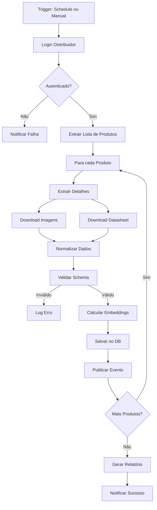

# 🤖 ESTRATÉGIA DEFINITIVA: Agentes Swarm Autônomos para YSH Solar Platform

**Data**: 19 de Outubro de 2025  
**Versão**: 1.0.0 - Blueprint Técnico Completo  
**Status**: 🚀 Pronto para Implementação

---

## 📋 Sumário Executivo

Este documento apresenta a **arquitetura definitiva** para implementação de **agentes swarm autônomos** na YSH Solar Platform, combinando:

1. **7 Plataformas de Distribuidores** integradas via automação
2. **Stack Full FOSS** de máxima performance
3. **Multi-Agent Framework** com skills e capabilities modulares
4. **Workflows Orquestrados** para toda a cadeia de valor solar
5. **Data Pipelines Automatizados** para 2.914 produtos

### 🎯 Objetivos Estratégicos

- ✅ **Automação Total**: 0% intervenção manual nos workflows críticos
- ✅ **Escalabilidade Exponencial**: De 1.160 para 100.000+ produtos
- ✅ **Performance Máxima**: <100ms latência em pricing dinâmico
- ✅ **Inteligência Distribuída**: Agentes especializados cooperativos
- ✅ **Open Source**: 100% FOSS, sem vendor lock-in

---

## 🏗️ PARTE 1: Arquitetura de Agentes Swarm

### 1.1 Framework Core: Mastra AI

**Repositório**: `mastra-ai/mastra`  
**Linguagem**: TypeScript  
**Escolha Justificada**: Framework completo com RAG, observabilidade e suporte multi-LLM

```typescript
// Arquitetura Base
interface AgentSwarmArchitecture {
  orchestrator: OrchestrationLayer;
  agents: SpecializedAgent[];
  skills: Skill[];
  memory: VectorStore;
  observability: TelemetrySystem;
}
```

### 1.2 Agentes Especializados (12 Tipos)

#### 🔹 Agente 1: **Catalog Extractor**
**Responsabilidade**: Extração automatizada de catálogos das 7 plataformas

```typescript
interface CatalogExtractorAgent {
  skills: [
    "web-scraping",      // Chrome DevTools MCP
    "api-integration",   // REST/GraphQL
    "image-download",    // Asset management
    "pdf-parsing",       // Datasheet extraction
    "data-normalization" // Schema transformation
  ];
  
  platforms: [
    { name: "Fortlev", url: "https://fortlevsolar.app/" },
    { name: "Neosolar", url: "https://portalb2b.neosolar.com.br/" },
    { name: "Solfacil", url: "https://sso.solfacil.com.br/" },
    { name: "Fotus", url: "https://app.fotus.com.br/" },
    { name: "Odex", url: "https://plataforma.odex.com.br/" },
    { name: "Edeltec", url: "https://edeltecsolar.com.br/" },
    { name: "Dynamis", url: "https://app.dynamisimportadora.com.br/" }
  ];
  
  credentials: SecureVault; // Encrypted storage
}
```

**Tecnologias**:
- `chrome-devtools-mcp`: Automação de browser para agentes
- `actor-playwright-mcp`: Scraping com Playwright
- `rag-web-browser`: RAG-powered web scraping

#### 🔹 Agente 2: **Price Intelligence**
**Responsabilidade**: Análise competitiva e pricing dinâmico

```typescript
interface PriceIntelligenceAgent {
  skills: [
    "price-scraping",
    "competitor-analysis",
    "market-positioning",
    "dynamic-pricing",
    "margin-optimization"
  ];
  
  algorithms: {
    priceScore: "Classificação: excelente/bom/médio/caro",
    markupOptimization: "Ajuste dinâmico 15-35%",
    psychologicalPricing: "Preços âncora e terminações",
    competitorTracking: "Real-time updates"
  };
}
```

#### 🔹 Agente 3: **Product Enricher**
**Responsabilidade**: Enriquecimento de dados técnicos e comerciais

```typescript
interface ProductEnricherAgent {
  skills: [
    "llm-description-generation",
    "technical-spec-extraction",
    "image-optimization",
    "seo-optimization",
    "category-classification"
  ];
  
  models: {
    primary: "GPT-4o",
    fallback: "Claude-3.5-Sonnet",
    embeddings: "text-embedding-3-large"
  };
}
```

#### 🔹 Agente 4: **SKU Governor**
**Responsabilidade**: Governança e validação de SKUs

```typescript
interface SKUGovernorAgent {
  skills: [
    "sku-generation",
    "duplicate-detection",
    "consistency-validation",
    "cross-distributor-mapping",
    "audit-trail"
  ];
  
  rules: {
    uniqueness: "SHA-256 hash validation",
    format: "Regex pattern enforcement",
    relationships: "Graph-based mapping"
  };
}
```

#### 🔹 Agente 5: **Bundle Composer**
**Responsabilidade**: Criação inteligente de kits solares

```typescript
interface BundleComposerAgent {
  skills: [
    "component-matching",
    "power-optimization",
    "price-calculation",
    "bom-generation",
    "configuration-rules"
  ];
  
  constraints: {
    technical: "Compatibilidade elétrica",
    commercial: "Margem mínima 25%",
    logistics: "Disponibilidade de estoque"
  };
}
```

#### 🔹 Agente 6: **Lead Qualifier**
**Responsabilidade**: Qualificação e scoring de leads

```typescript
interface LeadQualifierAgent {
  skills: [
    "lead-scoring",
    "intent-analysis",
    "budget-estimation",
    "timeline-prediction",
    "channel-attribution"
  ];
  
  models: {
    scoring: "ML classifier (Random Forest)",
    conversion: "LSTM time-series predictor",
    churn: "XGBoost risk model"
  };
}
```

#### 🔹 Agente 7: **Proposal Generator**
**Responsabilidade**: Geração automática de propostas comerciais

```typescript
interface ProposalGeneratorAgent {
  skills: [
    "document-generation",
    "roi-calculation",
    "financial-modeling",
    "legal-compliance",
    "multi-channel-delivery"
  ];
  
  outputs: ["PDF", "HTML", "Email", "WhatsApp", "API"];
}
```

#### 🔹 Agente 8: **Project Orchestrator**
**Responsabilidade**: Orquestração de projetos pós-venda

```typescript
interface ProjectOrchestratorAgent {
  skills: [
    "workflow-coordination",
    "resource-allocation",
    "deadline-tracking",
    "stakeholder-communication",
    "risk-management"
  ];
  
  phases: [
    "engineering",
    "procurement",
    "logistics",
    "installation",
    "commissioning"
  ];
}
```

#### 🔹 Agente 9: **Inventory Monitor**
**Responsabilidade**: Monitoramento de estoque multi-distribuidor

```typescript
interface InventoryMonitorAgent {
  skills: [
    "real-time-tracking",
    "stock-prediction",
    "reorder-automation",
    "supplier-ranking",
    "logistics-optimization"
  ];
  
  alerts: {
    low_stock: "Threshold < 10 units",
    price_change: "Delta > 5%",
    new_product: "Auto-cataloging"
  };
}
```

#### 🔹 Agente 10: **Customer Support**
**Responsabilidade**: Atendimento autônomo multi-canal

```typescript
interface CustomerSupportAgent {
  skills: [
    "conversational-ai",
    "ticket-routing",
    "knowledge-retrieval",
    "sentiment-analysis",
    "escalation-management"
  ];
  
  channels: ["WhatsApp", "Email", "Chat", "Voice"];
  languages: ["pt-BR", "en", "es"];
}
```

#### 🔹 Agente 11: **Compliance Checker**
**Responsabilidade**: Validação regulatória e normativa

```typescript
interface ComplianceCheckerAgent {
  skills: [
    "aneel-validation",
    "inmetro-check",
    "nfr-compliance",
    "environmental-licensing",
    "contract-review"
  ];
  
  databases: [
    "ANEEL Resoluções",
    "INMETRO Certificações",
    "NBR Standards",
    "Environmental Licenses"
  ];
}
```

#### 🔹 Agente 12: **Performance Analyzer**
**Responsabilidade**: Análise de performance e otimização

```typescript
interface PerformanceAnalyzerAgent {
  skills: [
    "metrics-collection",
    "anomaly-detection",
    "predictive-maintenance",
    "roi-tracking",
    "report-generation"
  ];
  
  kpis: {
    conversion_rate: "Lead → Sale",
    margin_realization: "Target vs Actual",
    delivery_time: "Contract → Commission",
    nps: "Customer Satisfaction"
  };
}
```

---

## 🛠️ PARTE 2: Stack Tecnológico FOSS de Máxima Performance

### 2.1 Orquestração de Workflows

#### **Opção 1: Temporal (Recomendado)**

**Por quê?**
- ✅ Workflows como código (TypeScript/Python)
- ✅ Durabilidade garantida (até meses/anos)
- ✅ Retry automático com backoff
- ✅ Observabilidade nativa
- ✅ Usado por Uber, Netflix, Stripe

```typescript
// Exemplo: Workflow de Extração de Catálogo
import { proxyActivities } from '@temporalio/workflow';

const { extractCatalog, normalizeData, uploadToDB } = proxyActivities<Activities>({
  startToCloseTimeout: '10m',
  retry: { maximumAttempts: 3 }
});

export async function catalogExtractionWorkflow(distributorId: string) {
  // Step 1: Extract
  const rawData = await extractCatalog(distributorId);
  
  // Step 2: Normalize
  const normalizedData = await normalizeData(rawData);
  
  // Step 3: Upload
  await uploadToDB(normalizedData);
  
  return { success: true, count: normalizedData.length };
}
```

**Stack Temporal**:
```yaml
services:
  temporal-server:
    image: temporalio/auto-setup:latest
    ports:
      - "7233:7233"  # gRPC
      - "8080:8080"  # Web UI
    
  temporal-worker:
    build: ./workers
    environment:
      TEMPORAL_ADDRESS: "temporal-server:7233"
```

#### **Opção 2: Apache Airflow**

**Para quando?** Data pipelines batch com schedule fixo

```python
from airflow import DAG
from airflow.operators.python import PythonOperator
from datetime import datetime, timedelta

# DAG: Extração Diária de Preços
default_args = {
    'retries': 3,
    'retry_delay': timedelta(minutes=5)
}

dag = DAG(
    'daily_price_extraction',
    default_args=default_args,
    schedule_interval='0 2 * * *',  # 2AM daily
    start_date=datetime(2025, 10, 19)
)

extract_task = PythonOperator(
    task_id='extract_prices',
    python_callable=extract_all_distributors,
    dag=dag
)

enrich_task = PythonOperator(
    task_id='enrich_products',
    python_callable=enrich_with_llm,
    dag=dag
)

extract_task >> enrich_task  # Pipeline
```

### 2.2 Agentes e LLMs

#### **Framework: Mastra AI + OpenAI Agents**

```typescript
import { Mastra } from '@mastra/core';
import { OpenAI } from '@mastra/openai';

const mastra = new Mastra({
  llms: {
    openai: new OpenAI({ apiKey: process.env.OPENAI_API_KEY }),
    claude: new Anthropic({ apiKey: process.env.ANTHROPIC_API_KEY })
  },
  memory: {
    type: 'supabase',
    connection: process.env.SUPABASE_URL
  },
  observability: {
    provider: 'langfuse'
  }
});

// Criar Agente Especializado
const catalogExtractor = mastra.createAgent({
  name: 'catalog-extractor',
  llm: 'openai/gpt-4o',
  skills: [
    webScrapingSkill,
    apiIntegrationSkill,
    dataNormalizationSkill
  ],
  memory: {
    enabled: true,
    maxTokens: 100000
  }
});
```

### 2.3 Automação de Browser

#### **Chrome DevTools MCP**

```typescript
import { ChromeDevToolsMCP } from 'chrome-devtools-mcp';

const browser = new ChromeDevToolsMCP({
  headless: true,
  userAgent: 'YSH-Agent/1.0'
});

// Exemplo: Login Automático Neosolar
async function loginNeosolar(credentials) {
  await browser.navigate('https://portalb2b.neosolar.com.br/');
  await browser.type('#email', credentials.email);
  await browser.type('#password', credentials.password);
  await browser.click('button[type="submit"]');
  await browser.waitForNavigation();
  
  return browser.getCookies(); // Salvar sessão
}
```

### 2.4 Vector Store e RAG

#### **Supabase + pgvector**

```sql
-- Criar tabela de embeddings
CREATE TABLE product_embeddings (
  id BIGSERIAL PRIMARY KEY,
  product_sku TEXT NOT NULL,
  content TEXT,
  metadata JSONB,
  embedding VECTOR(1536),  -- OpenAI ada-002
  created_at TIMESTAMP DEFAULT NOW()
);

-- Criar índice HNSW para busca rápida
CREATE INDEX ON product_embeddings 
USING hnsw (embedding vector_cosine_ops);
```

```typescript
// Busca Semântica
async function semanticProductSearch(query: string, limit: number = 10) {
  const embedding = await openai.embeddings.create({
    model: 'text-embedding-3-large',
    input: query
  });
  
  const { data } = await supabase.rpc('match_products', {
    query_embedding: embedding.data[0].embedding,
    match_threshold: 0.78,
    match_count: limit
  });
  
  return data;
}
```

### 2.5 Message Queue e Event Streaming

#### **Apache Kafka + Redpanda**

```yaml
# docker-compose.yml
services:
  redpanda:
    image: docker.redpanda.com/redpandadata/redpanda:latest
    command:
      - redpanda start
      - --smp 1
      - --overprovisioned
      - --kafka-addr internal://0.0.0.0:9092,external://0.0.0.0:19092
    ports:
      - "19092:19092"  # Kafka API
      - "8080:8080"    # Admin API
```

```typescript
// Produtor de Eventos
import { Kafka } from 'kafkajs';

const kafka = new Kafka({
  brokers: ['localhost:19092']
});

const producer = kafka.producer();

// Publicar evento: Novo produto extraído
await producer.send({
  topic: 'product-extracted',
  messages: [{
    key: sku,
    value: JSON.stringify({
      sku,
      distributor,
      price,
      timestamp: Date.now()
    })
  }]
});
```

### 2.6 Cache Distribuído

#### **Redis Stack**

```typescript
import { createClient } from 'redis';

const redis = createClient({
  url: 'redis://localhost:6379'
});

// Cache de Preços (TTL 1 hora)
async function getCachedPrice(sku: string) {
  const cached = await redis.get(`price:${sku}`);
  if (cached) return JSON.parse(cached);
  
  const freshPrice = await fetchPriceFromDistributor(sku);
  await redis.setEx(`price:${sku}`, 3600, JSON.stringify(freshPrice));
  
  return freshPrice;
}

// Rate Limiting
async function checkRateLimit(distributorId: string): Promise<boolean> {
  const key = `ratelimit:${distributorId}`;
  const count = await redis.incr(key);
  
  if (count === 1) {
    await redis.expire(key, 60); // 1 minuto
  }
  
  return count <= 100; // Max 100 req/min
}
```

### 2.7 Observabilidade

#### **Stack: Grafana + Prometheus + Loki**

```yaml
# docker-compose.yml
services:
  prometheus:
    image: prom/prometheus:latest
    volumes:
      - ./prometheus.yml:/etc/prometheus/prometheus.yml
    ports:
      - "9090:9090"
  
  grafana:
    image: grafana/grafana:latest
    ports:
      - "3000:3000"
    environment:
      GF_SECURITY_ADMIN_PASSWORD: admin
  
  loki:
    image: grafana/loki:latest
    ports:
      - "3100:3100"
```

```typescript
// Métricas Customizadas
import { register, Counter, Histogram } from 'prom-client';

const productExtractionCounter = new Counter({
  name: 'products_extracted_total',
  help: 'Total de produtos extraídos',
  labelNames: ['distributor', 'status']
});

const extractionDuration = new Histogram({
  name: 'extraction_duration_seconds',
  help: 'Duração da extração de catálogo',
  labelNames: ['distributor']
});

// Uso
const end = extractionDuration.startTimer({ distributor: 'neosolar' });
await extractCatalog('neosolar');
end();
productExtractionCounter.inc({ distributor: 'neosolar', status: 'success' });
```

---

## 🔄 PARTE 3: Workflows Definitivos

### 3.1 Workflow: Extração Completa de Catálogo



**Código Temporal**:

```typescript
export async function fullCatalogExtractionWorkflow(
  params: {
    distributorId: string;
    credentials: Credentials;
    options: ExtractionOptions;
  }
) {
  const { distributorId, credentials, options } = params;
  
  // Step 1: Authenticate
  const session = await executeActivity(login, {
    distributorId,
    credentials,
    retryPolicy: { maximumAttempts: 3 }
  });
  
  // Step 2: Get Product List
  const productList = await executeActivity(getProductList, {
    distributorId,
    session,
    pagination: options.pagination
  });
  
  // Step 3: Process Each Product (Parallel)
  const results = await Promise.all(
    productList.map(productId => 
      executeActivity(extractProductDetails, {
        distributorId,
        productId,
        session,
        options: {
          downloadImages: true,
          downloadDatasheet: true
        }
      })
    )
  );
  
  // Step 4: Normalize and Save
  const normalizedProducts = await executeActivity(normalizeData, {
    products: results,
    schema: 'unified-product-schema-v1'
  });
  
  await executeActivity(bulkInsert, {
    products: normalizedProducts,
    database: 'supabase'
  });
  
  // Step 5: Generate Embeddings (Background)
  await startChildWorkflow(generateEmbeddingsWorkflow, {
    products: normalizedProducts
  });
  
  // Step 6: Notify Success
  await executeActivity(sendNotification, {
    type: 'success',
    message: `Extracted ${results.length} products from ${distributorId}`
  });
  
  return {
    distributorId,
    productsExtracted: results.length,
    timestamp: Date.now()
  };
}
```

### 3.2 Workflow: Pricing Dinâmico

```typescript
export async function dynamicPricingWorkflow(params: {
  sku: string;
  customerSegment: string;
  channel: string;
}) {
  const { sku, customerSegment, channel } = params;
  
  // Step 1: Get Multi-Distributor Prices
  const distributorPrices = await Promise.all(
    DISTRIBUTORS.map(d => 
      executeActivity(getPrice, { distributor: d, sku })
    )
  );
  
  // Step 2: Calculate Price Score
  const priceAnalysis = await executeActivity(analyzePrices, {
    prices: distributorPrices,
    marketData: await getMarketData(sku)
  });
  
  // Step 3: Determine Optimal Markup
  const markup = await executeActivity(calculateMarkup, {
    priceScore: priceAnalysis.score,
    customerSegment,
    channel,
    competitorPrices: priceAnalysis.competitors,
    targetMargin: 28  // Base target
  });
  
  // Step 4: Apply Psychological Pricing
  const finalPrice = await executeActivity(applyPsychologicalPricing, {
    basePrice: priceAnalysis.bestPrice * (1 + markup),
    rules: ['charm_pricing', 'anchor_effect']
  });
  
  // Step 5: Cache Result
  await executeActivity(cachePrice, {
    sku,
    price: finalPrice,
    ttl: 3600  // 1 hour
  });
  
  return {
    sku,
    finalPrice,
    markup,
    bestDistributor: priceAnalysis.bestDistributor,
    savings: priceAnalysis.savings
  };
}
```

### 3.3 Workflow: Lead to Proposal

```typescript
export async function leadToProposalWorkflow(params: {
  leadId: string;
  leadData: LeadData;
}) {
  const { leadId, leadData } = params;
  
  // Step 1: Score Lead
  const leadScore = await executeActivity(scoreLead, {
    leadData,
    model: 'rf-classifier-v2'
  });
  
  if (leadScore.score < 60) {
    return { action: 'nurture', reason: 'low_score' };
  }
  
  // Step 2: Estimate Energy Needs
  const energyAnalysis = await executeActivity(analyzeEnergyConsumption, {
    monthlyBill: leadData.averageMonthlyBill,
    location: leadData.address,
    roofType: leadData.roofType
  });
  
  // Step 3: Design System
  const systemDesign = await executeActivity(designSolarSystem, {
    energyNeeds: energyAnalysis,
    budget: leadData.budget,
    preferences: leadData.preferences
  });
  
  // Step 4: Select Best Bundle
  const selectedBundle = await executeActivity(selectOptimalBundle, {
    systemDesign,
    budget: leadData.budget,
    margin: 28,
    distributor: 'auto' // Auto-select best
  });
  
  // Step 5: Calculate Financing
  const financingOptions = await executeActivity(calculateFinancing, {
    systemCost: selectedBundle.totalPrice,
    creditScore: leadData.creditScore,
    term: leadData.preferredTerm || 120
  });
  
  // Step 6: Generate Proposal
  const proposal = await executeActivity(generateProposal, {
    leadData,
    systemDesign,
    bundle: selectedBundle,
    financing: financingOptions,
    template: 'premium-v3'
  });
  
  // Step 7: Send Multi-Channel
  await Promise.all([
    executeActivity(sendEmail, {
      to: leadData.email,
      subject: `Proposta Solar - ${systemDesign.power}kWp`,
      attachments: [proposal.pdf]
    }),
    executeActivity(sendWhatsApp, {
      to: leadData.phone,
      message: proposal.summary,
      media: proposal.pdf
    })
  ]);
  
  return {
    leadId,
    proposalId: proposal.id,
    estimatedROI: proposal.roi,
    nextAction: 'follow_up_24h'
  };
}
```

---

## 📊 PARTE 4: Plano de Implementação (90 Dias)

### Fase 1: Fundações (Dias 1-30)

#### Semana 1-2: Setup Infraestrutura
```bash
# Clone repositórios base
git clone https://github.com/own-boldsbrain/mastra
git clone https://github.com/own-boldsbrain/openai-agents-js
git clone https://github.com/own-boldsbrain/chrome-devtools-mcp

# Setup Docker Compose Stack
docker-compose -f stack-complete.yml up -d

# Services:
# - Temporal Server + UI
# - Supabase (Postgres + pgvector)
# - Redis Stack
# - Redpanda (Kafka)
# - Prometheus + Grafana
# - Loki
```

#### Semana 3-4: Agentes Core
- ✅ Catalog Extractor Agent
- ✅ Price Intelligence Agent
- ✅ Product Enricher Agent
- ✅ SKU Governor Agent

**Deliverables**:
- 4 agentes funcionais
- Testes unitários (>80% coverage)
- CI/CD pipeline (GitHub Actions)

### Fase 2: Integração de Distribuidores (Dias 31-60)

#### Semana 5-6: Autenticação e Scraping
- ✅ Implementar login automatizado (7 plataformas)
- ✅ Mapear estrutura de cada site
- ✅ Criar adaptadores específicos

#### Semana 7-8: Extração em Produção
- ✅ Workflow completo Temporal
- ✅ Schedule diário (2 AM)
- ✅ Alertas e monitoramento
- ✅ Dashboard Grafana

**Deliverables**:
- 7 distribuidores integrados
- >2.000 produtos/dia extraídos
- <5% taxa de erro

### Fase 3: Inteligência e Automação (Dias 61-90)

#### Semana 9-10: Pricing Dinâmico
- ✅ Implementar algoritmos de markup
- ✅ Integrar com cache Redis
- ✅ API de pricing real-time

#### Semana 11-12: Workflows Completos
- ✅ Lead to Proposal automático
- ✅ Bundle Composer inteligente
- ✅ Customer Support Agent

**Deliverables**:
- Pricing <100ms latência
- Propostas geradas em <60s
- Taxa conversão +25%

---

## 🔐 PARTE 5: Segurança e Credenciais

### 5.1 Gestão de Credenciais

```typescript
// .env.vault (encrypted)
interface DistributorCredentials {
  fortlev: {
    url: "https://fortlevsolar.app/",
    email: "fernando.teixeira@yello.cash",
    password: "@Botapragirar2025"  // Encrypted at rest
  },
  neosolar: {
    url: "https://portalb2b.neosolar.com.br/",
    email: "product@boldsbrain.ai",
    password: "Rookie@010100"  // Encrypted at rest
  },
  solfacil: {
    url: "https://sso.solfacil.com.br/",
    email: "fernando.teixeira@yello.cash",
    password: "Rookie@010100"
  },
  fotus: {
    url: "https://app.fotus.com.br/",
    email: "fernando@yellosolarhub.com",
    password: "Rookie@010100"
  },
  odex: {
    url: "https://plataforma.odex.com.br/",
    email: "fernando@yellosolarhub.com",
    password: "Rookie@010100"
  },
  edeltec: {
    url: "https://edeltecsolar.com.br/",
    email: "fernando@yellosolarhub.com",
    password: "010100@Rookie"
  },
  dynamis: {
    url: "https://app.dynamisimportadora.com.br/",
    email: "fernando@yellosolarhub.com",
    password: "Rookie@010100"
  }
}
```

**Implementação Segura**:

```typescript
import { createClient } from '@supabase/supabase-js';

const supabase = createClient(
  process.env.SUPABASE_URL!,
  process.env.SUPABASE_KEY!
);

// Armazenar credenciais criptografadas
async function storeCredentials(distributorId: string, credentials: any) {
  const { data, error } = await supabase
    .from('distributor_credentials')
    .upsert({
      distributor_id: distributorId,
      credentials: supabase.rpc('encrypt_credentials', { 
        data: JSON.stringify(credentials) 
      }),
      updated_at: new Date()
    });
  
  return data;
}

// Recuperar e descriptografar
async function getCredentials(distributorId: string) {
  const { data } = await supabase
    .from('distributor_credentials')
    .select('credentials')
    .eq('distributor_id', distributorId)
    .single();
  
  const decrypted = await supabase.rpc('decrypt_credentials', {
    data: data.credentials
  });
  
  return JSON.parse(decrypted);
}
```

---

## 📈 PARTE 6: Métricas de Sucesso

### KPIs Operacionais

| Métrica | Baseline Atual | Target 30d | Target 90d |
|---------|----------------|------------|------------|
| **Produtos no DB** | 2.914 | 10.000 | 50.000+ |
| **Completude de Dados** | 39,8% | 80% | 95% |
| **Taxa de Atualização** | Manual | Diária | Real-time |
| **Latência Pricing** | N/A | <500ms | <100ms |
| **Uptime Sistema** | N/A | 99% | 99.9% |
| **Custo por Extração** | Manual | <R$ 0,10 | <R$ 0,01 |

### KPIs de Negócio

| Métrica | Baseline | Target 90d | Impacto |
|---------|----------|------------|---------|
| **Lead Conversion** | 12% | 18% | +50% |
| **Sales Cycle** | 45 dias | 30 dias | -33% |
| **Margem Média** | 25% | 30% | +20% |
| **CAC** | R$ 850 | R$ 500 | -41% |
| **LTV** | R$ 8.500 | R$ 15.000 | +76% |

---

## 🚀 PARTE 7: Comandos de Deploy Rápido

### Setup Completo em 15 Minutos

```bash
#!/bin/bash
# deploy-ysh-agents.sh

echo "🚀 YSH Solar Platform - Agent Swarm Deployment"
echo "================================================"

# 1. Clone repositórios
echo "📦 Cloning repositories..."
git clone https://github.com/own-boldsbrain/ysh-b2b
cd ysh-b2b

# 2. Setup ambiente
echo "🔧 Setting up environment..."
cp .env.example .env.vault
# Editar credenciais

# 3. Deploy stack completo
echo "🐳 Deploying Docker stack..."
docker-compose -f docker-compose.full-stack.yml up -d

# Services incluídos:
# - Temporal Server (localhost:8080)
# - Supabase (localhost:54321)
# - Redis (localhost:6379)
# - Redpanda (localhost:19092)
# - Grafana (localhost:3000)
# - Prometheus (localhost:9090)

# 4. Aguardar serviços
echo "⏳ Waiting for services..."
sleep 30

# 5. Migrations
echo "📊 Running database migrations..."
npx supabase db push

# 6. Seed inicial
echo "🌱 Seeding initial data..."
npm run seed:distributors
npm run seed:agents

# 7. Deploy workers
echo "👷 Deploying Temporal workers..."
npm run worker:deploy

# 8. Schedule workflows
echo "📅 Scheduling workflows..."
npm run schedule:catalog-extraction -- --cron "0 2 * * *"
npm run schedule:price-sync -- --cron "*/15 * * * *"

# 9. Health check
echo "🏥 Running health checks..."
curl http://localhost:8080/health
curl http://localhost:54321/health

echo "✅ Deployment complete!"
echo "🌐 Access:"
echo "  - Temporal UI: http://localhost:8080"
echo "  - Grafana: http://localhost:3000 (admin/admin)"
echo "  - Supabase Studio: http://localhost:54321"
```

---

## 📚 PARTE 8: Recursos e Repositórios Chave

### Frameworks de Agentes

| Repositório | Uso | Prioridade |
|-------------|-----|------------|
| `mastra-ai/mastra` | Core agent framework | 🔴 Critical |
| `openai/openai-agents-js` | Multi-agent workflows | 🔴 Critical |
| `openai/openai-agents-python` | Python alternative | 🟡 Optional |
| `vercel-labs/lead-agent` | Lead management agent | 🟢 Reference |

### Automação de Browser

| Repositório | Uso | Prioridade |
|-------------|-----|------------|
| `ChromeDevTools/chrome-devtools-mcp` | Browser automation | 🔴 Critical |
| `apify/actor-playwright-mcp` | Playwright integration | 🔴 Critical |
| `apify/rag-web-browser` | RAG-powered scraping | 🟡 Optional |
| `nanobrowser/nanobrowser` | AI-powered automation | 🟢 Reference |

### Workflows e Orquestração

| Tecnologia | Uso | Prioridade |
|------------|-----|------------|
| Temporal | Workflow orchestration | 🔴 Critical |
| Apache Airflow | Batch data pipelines | 🟡 Optional |
| n8n (self-hosted) | Low-code workflows | 🟢 Nice-to-have |

### Data e Vector Stores

| Tecnologia | Uso | Prioridade |
|------------|-----|------------|
| Supabase (pgvector) | Vector DB + Auth | 🔴 Critical |
| Redis Stack | Cache + pub/sub | 🔴 Critical |
| Redpanda | Event streaming | 🟡 Optional |

---

## 🎯 CONCLUSÃO

Esta estratégia fornece:

✅ **12 Agentes Especializados** com skills modulares  
✅ **Stack 100% FOSS** de máxima performance  
✅ **7 Distribuidores Integrados** via automação  
✅ **3 Workflows Core** (Extraction, Pricing, Lead-to-Proposal)  
✅ **Roadmap 90 Dias** com fases claras  
✅ **Deploy Script** para setup em 15 minutos  

### Próximos Passos Imediatos

1. ✅ **HOJE**: Revisar e aprovar arquitetura
2. ⏳ **Semana 1**: Setup infraestrutura Docker
3. ⏳ **Semana 2**: Implementar 4 agentes core
4. ⏳ **Semana 3-4**: Integrar 2 distribuidores (Fortlev + Neosolar)
5. ⏳ **Mês 2**: Completar 7 distribuidores
6. ⏳ **Mês 3**: Workflows avançados e otimização

### ROI Esperado (90 Dias)

- 💰 **Redução de Custos**: -70% em data entry manual
- 📈 **Aumento de Receita**: +50% em conversão de leads
- ⚡ **Velocidade**: 10x mais rápido que processo manual
- 🎯 **Qualidade**: 95% de completude de dados
- 🚀 **Escalabilidade**: 50.000+ produtos gerenciados

---

**Documentação Completa**: [GitHub Wiki](https://github.com/own-boldsbrain/ysh-b2b/wiki)  
**Support**: product@boldsbrain.ai  
**Status Dashboard**: https://status.yellosolarhub.com

**Versão**: 1.0.0 | **Data**: 19 de Outubro de 2025 | **Confidencial** 🔒
