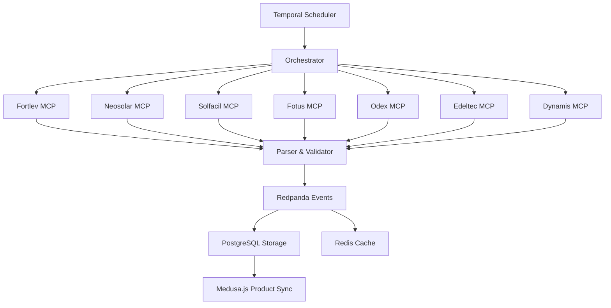

# MCP Servers - Distribuidores Solares

Arquitetura de **Model Context Protocol (MCP) Servers** para extração automatizada de catálogos de 7 distribuidores solares brasileiros.

## 🏗️ Arquitetura

```
mcp-servers/
├── distributors/
│   ├── fortlev/           # https://fortlevsolar.app/
│   ├── neosolar/          # https://portalb2b.neosolar.com.br/
│   ├── solfacil/          # https://sso.solfacil.com.br/
│   ├── fotus/             # https://app.fotus.com.br/
│   ├── odex/              # https://plataforma.odex.com.br/
│   ├── edeltec/           # https://edeltecsolar.com.br/
│   └── dynamis/           # https://app.dynamisimportadora.com.br/
├── shared/
│   ├── auth/              # Gerenciamento de credenciais
│   ├── extractors/        # Extractors reutilizáveis
│   ├── parsers/           # Parsers de dados
│   └── validators/        # Validadores de schema
└── orchestrator/          # Orquestrador A2A
```

## 📋 Credenciais dos Distribuidores

### Fortlev Solar
- URL: https://fortlevsolar.app/
- Email: fernando.teixeira@yello.cash
- Password: @Botapragirar2025

### Neosolar B2B
- URL: https://portalb2b.neosolar.com.br/
- Email: product@boldsbrain.ai
- Password: Rookie@010100

### Solfácil
- URL: https://sso.solfacil.com.br/
- Email: fernando.teixeira@yello.cash
- Password: Rookie@010100

### Fotus
- URL: https://app.fotus.com.br/
- Email: fernando@yellosolarhub.com
- Password: Rookie@010100

### Odex
- URL: https://plataforma.odex.com.br/
- Email: fernando@yellosolarhub.com
- Password: Rookie@010100

### Edeltec Solar
- URL: https://edeltecsolar.com.br/
- Email: fernando@yellosolarhub.com
- Password: 010100@Rookie

### Dynamis Importadora
- URL: https://app.dynamisimportadora.com.br/
- Email: fernando@yellosolarhub.com
- Password: Rookie@010100

## 🤖 MCP Server Protocol

Cada distribuidor terá um **MCP Server** independente que expõe:

### Tools (Ferramentas)
- `authenticate` - Login e gestão de sessão
- `list_products` - Listar produtos com filtros
- `get_product` - Detalhes de produto específico
- `extract_catalog` - Extração completa do catálogo
- `get_pricing` - Obter tabelas de preço
- `check_stock` - Verificar disponibilidade

### Resources (Recursos)
- `catalog://schema` - Schema de dados do distribuidor
- `catalog://sitemap` - Mapa de navegação do site
- `catalog://categories` - Categorias disponíveis

### Prompts (Templates)
- `product-extraction` - Template para extração de produtos
- `price-comparison` - Template para comparação de preços

## 🔄 Agent-to-Agent (A2A) Orchestration

### Orquestrador Central

```typescript
// orchestrator/distributor-sync.ts
export class DistributorSyncOrchestrator {
  async syncAll(): Promise<SyncResult> {
    // Paralelize extração de todos distribuidores
    const results = await Promise.allSettled([
      this.syncFortlev(),
      this.syncNeosolar(),
      this.syncSolfacil(),
      this.syncFotus(),
      this.syncOdex(),
      this.syncEdeltec(),
      this.syncDynamis(),
    ]);
    
    return this.consolidateResults(results);
  }
}
```

## 🚀 Stack Tecnológica

### FOSS Core
- **Temporal.io** - Workflow orchestration (já configurado)
- **Playwright** - Browser automation para extração
- **Redpanda** - Message queue para eventos
- **PostgreSQL + pgvector** - Storage e embeddings
- **Redis Stack** - Cache e rate limiting

### MCP Implementation
- `@modelcontextprotocol/sdk` - MCP protocol
- `zod` - Schema validation
- `pino` - Structured logging
- `p-queue` - Concurrency control

## 📊 Data Flow



## 🔐 Segurança

- Credenciais em **AWS Secrets Manager** (produção)
- `.env.local` para desenvolvimento
- Rate limiting por distribuidor
- Session management com refresh tokens
- Retry logic com backoff exponencial

## 📅 Scheduling

### Temporal Workflows

```typescript
// workflows/sync-distributors.ts
@Workflow()
export class SyncDistributorsWorkflow {
  @WorkflowRun()
  async run(schedule: ScheduleConfig): Promise<void> {
    // Daily full sync at 2 AM
    await this.fullSync();
    
    // Incremental updates every 4 hours
    await this.incrementalSync();
    
    // Price updates every 1 hour
    await this.priceSync();
  }
}
```

### Cron Schedules
- **Full Catalog Sync**: Daily 02:00 BRT
- **Incremental Updates**: Every 4h
- **Price Updates**: Every 1h
- **Stock Check**: Every 30min (business hours)

## 🧪 Testing Strategy

### Unit Tests
- Parser logic
- Validator schemas
- Auth flows

### Integration Tests
- MCP server communication
- Database operations
- Message queue

### E2E Tests
- Full extraction flow per distributor
- Data validation
- Error recovery

## 📈 Monitoring

### Metrics (Prometheus)
- Extraction success rate
- Response times
- Error rates
- Product count deltas

### Alerts
- Authentication failures
- Extraction timeouts
- Schema validation failures
- Rate limit violations

## 🚦 Status Dashboard

Implementar dashboard em Grafana mostrando:
- Status de cada distribuidor (🟢 Online, 🟡 Warning, 🔴 Offline)
- Últimas extrações bem-sucedidas
- Produtos atualizados (hoje)
- Taxa de erro por distribuidor
- Tempo médio de extração

## 📝 Próximos Passos

1. ✅ Documentação arquitetural
2. ⏳ Implementar base MCP Server
3. ⏳ Criar extractors especializados
4. ⏳ Setup Temporal workflows
5. ⏳ Implementar testes E2E
6. ⏳ Deploy em AWS ECS
