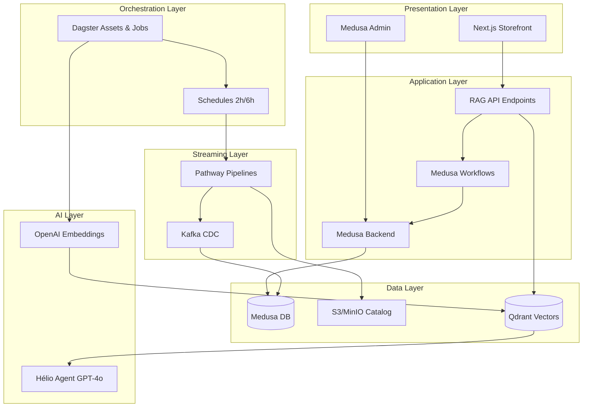

# 🤖 Integração Pathway + Dagster + Qdrant + Hélio AI

## Guia Completo de Integração para RAG em Tempo Real no YSH B2B

**Data**: 7 de outubro de 2025  
**Autor**: YSH Engineering Team  
**Versão**: 1.0.0

---

## 📋 Índice

1. [Visão Geral](#visão-geral)
2. [Arquitetura](#arquitetura)
3. [Componentes](#componentes)
4. [Fluxo de Dados](#fluxo-de-dados)
5. [Assets Dagster](#assets-dagster)
6. [Workflows Medusa](#workflows-medusa)
7. [API Endpoints](#api-endpoints)
8. [Pathway Pipelines](#pathway-pipelines)
9. [Deployment](#deployment)
10. [Monitoramento](#monitoramento)
11. [Troubleshooting](#troubleshooting)

---

## 🎯 Visão Geral

Esta integração conecta **5 sistemas críticos** para criar uma plataforma B2B inteligente:

```
┌─────────────┐     ┌──────────┐     ┌─────────┐     ┌─────────┐     ┌────────┐
│   Medusa    │────▶│ Pathway  │────▶│ Dagster │────▶│ Qdrant  │────▶│ Hélio  │
│   Backend   │     │ Streaming│     │ Assets  │     │ Vector  │     │   AI   │
└─────────────┘     └──────────┘     └─────────┘     └─────────┘     └────────┘
      │                   │                │               │               │
      │                   │                │               │               │
      ▼                   ▼                ▼               ▼               ▼
  Postgres           Kafka/CDC         Schedules      3072-dim        OpenAI
  (OLTP)             (Events)          (2h/6h)       Embeddings      GPT-4o
```

### Benefícios

✅ **Tempo Real**: Atualizações instantâneas de catálogo/preços via Pathway  
✅ **RAG Inteligente**: Hélio responde com contexto de 5 bases de conhecimento  
✅ **Automação**: Dagster orquestra ETL e embeddings em schedules  
✅ **Escalável**: FOSS stack sem vendor lock-in (Qdrant vs Pinecone)  
✅ **Observabilidade**: Dagster UI + Qdrant metrics + Medusa logs  

---

## 🏗️ Arquitetura

### Camadas da Stack



### Fluxo de Dados Completo

```
1. INGEST (Pathway)
   ├─ CSV de distribuidores → S3 → Pathway catalog_etl.py
   ├─ Mudanças DB → Kafka CDC → Pathway pricing_streaming.py
   └─ Events Medusa → Kafka → Pathway order_streaming.py

2. TRANSFORM (Dagster)
   ├─ catalog_kb asset → Normaliza specs técnicas
   ├─ pricing_kb asset → Calcula margens B1/B3
   ├─ regulatory_kb asset → Valida ANEEL/Inmetro
   ├─ technical_kb asset → Enriquece datasheets
   └─ sales_kb asset → Histórico de cotações

3. EMBED (OpenAI + Qdrant)
   ├─ OpenAI text-embedding-3-large (3072 dims)
   ├─ Chunking semântico (500 tokens overlap 50)
   └─ Upsert em Qdrant collections (helio-catalog, helio-pricing, etc)

4. QUERY (Hélio AI)
   ├─ User query → Embedding → Qdrant similarity search
   ├─ Top 5 chunks relevantes → Context GPT-4o
   └─ Response estruturada → Frontend
```

---

## 🧩 Componentes

### 1. Dagster Assets (5 KBs)

**Localização**: `data-platform/dagster/assets/helio_kb.py`

```python
# 5 assets para as bases de conhecimento do Hélio
@asset(group_name="helio")
def catalog_kb(context, postgres: PostgresResource, qdrant: QdrantResource):
    """KB de Catálogo: 11,000+ produtos FV com specs técnicas"""
    # 1. Extract produtos do Medusa DB
    # 2. Normalizar specs (potência, tensão, eficiência)
    # 3. Chunking semântico (500 tokens)
    # 4. Embeddings OpenAI
    # 5. Upsert em Qdrant collection "helio-catalog"

@asset(group_name="helio")
def pricing_kb(context, postgres: PostgresResource, qdrant: QdrantResource):
    """KB de Preços: Tabelas B1/B3 multi-distribuidor"""
    # 1. Extract preços + margens
    # 2. Calcular competitividade
    # 3. Embeddings de regras de pricing
    # 4. Upsert em "helio-pricing"

@asset(group_name="helio")
def regulatory_kb(context, postgres: PostgresResource, qdrant: QdrantResource):
    """KB Regulatória: ANEEL, Inmetro, REN 482, REN 1000"""
    # 1. Scrape docs oficiais (se necessário)
    # 2. Extract artigos, portarias, normas
    # 3. Embeddings de textos legais
    # 4. Upsert em "helio-regulatory"

@asset(group_name="helio")
def technical_kb(context, postgres: PostgresResource, qdrant: QdrantResource):
    """KB Técnica: Datasheets, dimensionamento, instalação"""
    # 1. Extract PDFs de fabricantes
    # 2. Parse especificações técnicas
    # 3. Chunking de manuais
    # 4. Upsert em "helio-technical"

@asset(group_name="helio")
def sales_kb(context, postgres: PostgresResource, qdrant: QdrantResource):
    """KB de Vendas: Histórico cotações, objeções, argumentos"""
    # 1. Extract quotes do Medusa
    # 2. Identificar padrões de sucesso/falha
    # 3. Embeddings de sales playbooks
    # 4. Upsert em "helio-sales"
```

**Schedules**:
- `helio_kb_schedule`: Diário às **02:00** (atualiza todas KBs)
- `catalog_schedule`: Diário às **02:00** (apenas catálogo)
- `tarifas_schedule`: Diário às **06:00** (tarifas ANEEL)

### 2. Workflows Medusa (3 principais)

**Localização**: `backend/src/workflows/helio/`

#### a) `quote-with-ai.ts` - Cotação Inteligente

```typescript
// Fluxo: Cart → Hélio → Recomendações → Quote
export const quoteWithAIWorkflow = createWorkflow(
  "quote-with-ai",
  (input: QuoteWithAIInput) => {
    // 1. Analisar itens do carrinho
    const analysis = analyzeCartStep(input.cart_id)
    
    // 2. Consultar Hélio (RAG)
    const recommendations = getHelioRecommendationsStep({
      products: analysis.items,
      customer_type: input.customer_type
    })
    
    // 3. Calcular preços B1/B3
    const pricing = calculatePricingStep(recommendations)
    
    // 4. Criar quote com contexto AI
    const quote = createQuoteStep({
      cart_id: input.cart_id,
      recommendations: recommendations,
      pricing: pricing,
      ai_context: recommendations.reasoning
    })
    
    return { quote }
  }
)
```

#### b) `product-recommendation.ts` - Recomendações de Kit

```typescript
// Fluxo: Produto → Hélio → Kits compatíveis
export const productRecommendationWorkflow = createWorkflow(
  "product-recommendation",
  (input: ProductRecommendationInput) => {
    // 1. Buscar produto
    const product = getProductStep(input.product_id)
    
    // 2. Consultar Hélio (RAG técnico)
    const compatible = getCompatibleProductsStep({
      product: product,
      use_case: input.use_case // "residencial", "comercial", "industrial"
    })
    
    // 3. Montar kits recomendados
    const kits = buildKitsStep(compatible)
    
    return { kits }
  }
)
```

#### c) `homologacao-ai.ts` - Homologação Inteligente

```typescript
// Fluxo: Ordem → Documentos → Hélio → Status
export const homologacaoAIWorkflow = createWorkflow(
  "homologacao-ai",
  (input: HomologacaoAIInput) => {
    // 1. Extrair documentos da ordem
    const docs = extractDocumentsStep(input.order_id)
    
    // 2. Validar com Hélio (RAG regulatória)
    const validation = validateWithHelioStep({
      documents: docs,
      distributor: input.distributor
    })
    
    // 3. Agendar vistoria (se aprovado)
    const schedule = agendarVistoriaStep
      .when({ validation: (v) => v.approved })
      .then((v) => scheduleInspectionStep(v))
    
    // 4. Atualizar status
    const status = updateHomologacaoStatusStep({
      order_id: input.order_id,
      validation: validation,
      schedule: schedule
    })
    
    return { status }
  }
)
```

### 3. API Endpoints (3 rotas)

**Localização**: `backend/src/api/store/helio/`

#### a) `/store/helio/ask` - Chat Conversacional

```typescript
// POST /store/helio/ask
{
  "question": "Qual inversor é melhor para projeto comercial 50kWp?",
  "context": {
    "customer_type": "b1",
    "location": "São Paulo/SP"
  }
}

// Response
{
  "answer": "Para projeto comercial de 50kWp em São Paulo, recomendo...",
  "sources": [
    { "type": "catalog_kb", "product": "Inversor XYZ 50kW", "relevance": 0.92 },
    { "type": "technical_kb", "doc": "Dimensionamento comercial", "relevance": 0.88 }
  ],
  "recommendations": ["product_id_1", "product_id_2"]
}
```

#### b) `/store/helio/recommend` - Recomendações de Produto

```typescript
// POST /store/helio/recommend
{
  "product_id": "prod_123",
  "quantity": 10,
  "use_case": "residencial"
}

// Response
{
  "kit": {
    "inverter": { "id": "prod_456", "reason": "Compatível com potência" },
    "structure": { "id": "prod_789", "reason": "Adequado para telhado" },
    "cables": [...]
  },
  "estimated_savings": "R$ 1.200,00",
  "technical_notes": "Este kit atende NBR 16690..."
}
```

#### c) `/store/helio/search` - Busca Semântica

```typescript
// GET /store/helio/search?q=painel+550w+monocristalino&top_k=5
{
  "results": [
    {
      "product_id": "prod_abc",
      "name": "Painel Canadian Solar 550W Mono",
      "score": 0.94,
      "specs": {...}
    },
    ...
  ],
  "query_embedding_time_ms": 45,
  "search_time_ms": 12
}
```

---

## 🔄 Fluxo de Dados Detalhado

### 1. Atualização de Catálogo (Real-Time)

```
┌──────────────────────────────────────────────────────────────┐
│  DISTRIBUIDOR ATUALIZA CSV → S3                             │
└────────────────┬─────────────────────────────────────────────┘
                 │
                 ▼
┌──────────────────────────────────────────────────────────────┐
│  Pathway catalog_etl.py detecta mudança (S3 watcher)        │
│  - Parse CSV                                                 │
│  - Normaliza schemas                                         │
│  - Valida specs técnicas                                     │
└────────────────┬─────────────────────────────────────────────┘
                 │
                 ▼
┌──────────────────────────────────────────────────────────────┐
│  Upsert em Postgres (Medusa DB)                             │
│  - Tabela: product                                           │
│  - Trigger: catalog_updated event                            │
└────────────────┬─────────────────────────────────────────────┘
                 │
                 ▼
┌──────────────────────────────────────────────────────────────┐
│  Kafka CDC captura mudança                                   │
│  - Topic: medusa.product.updated                             │
└────────────────┬─────────────────────────────────────────────┘
                 │
                 ▼
┌──────────────────────────────────────────────────────────────┐
│  Dagster sensor detecta evento (ou schedule 2h)             │
│  - Materializa asset: catalog_kb                             │
└────────────────┬─────────────────────────────────────────────┘
                 │
                 ▼
┌──────────────────────────────────────────────────────────────┐
│  OpenAI Embeddings + Qdrant Upsert                          │
│  - text-embedding-3-large (3072 dims)                        │
│  - Collection: helio-catalog                                 │
│  - Metadata: product_id, distributor, specs                  │
└────────────────┬─────────────────────────────────────────────┘
                 │
                 ▼
┌──────────────────────────────────────────────────────────────┐
│  Hélio AI atualizado em tempo real                          │
│  - Novas buscas já retornam produto atualizado               │
│  - Latência total: < 2 minutos                               │
└──────────────────────────────────────────────────────────────┘
```

### 2. Cotação com Hélio (User-Triggered)

```
USER: "Preciso de kit 10kWp para comercial"
                 │
                 ▼
POST /store/helio/ask
                 │
                 ▼
Embeddings da query (OpenAI)
                 │
                 ▼
Qdrant similarity search (top_k=5)
  ├─ helio-catalog (produtos)
  ├─ helio-pricing (preços)
  └─ helio-technical (dimensionamento)
                 │
                 ▼
GPT-4o com contexto RAG
                 │
                 ▼
Response estruturada:
  ├─ Recomendação de produtos
  ├─ Justificativa técnica
  ├─ Preços B1/B3
  └─ Links para datasheets
```

---

## 🚀 Deployment

### 1. Local Development

```bash
# 1. Subir infraestrutura
cd ysh-store/data-platform

# Qdrant + Kafka + MinIO
docker-compose -f docker-compose.pathway.yml up -d

# Dagster
docker-compose -f docker-compose.dagster.yml up -d

# 2. Criar collections Qdrant
curl -X PUT http://localhost:6333/collections/helio-catalog \
  -H "Content-Type: application/json" \
  -d '{"vectors":{"size":3072,"distance":"Cosine"}}'

curl -X PUT http://localhost:6333/collections/helio-pricing \
  -H "Content-Type: application/json" \
  -d '{"vectors":{"size":3072,"distance":"Cosine"}}'

curl -X PUT http://localhost:6333/collections/helio-regulatory \
  -H "Content-Type: application/json" \
  -d '{"vectors":{"size":3072,"distance":"Cosine"}}'

curl -X PUT http://localhost:6333/collections/helio-technical \
  -H "Content-Type: application/json" \
  -d '{"vectors":{"size":3072,"distance":"Cosine"}}'

curl -X PUT http://localhost:6333/collections/helio-sales \
  -H "Content-Type: application/json" \
  -d '{"vectors":{"size":3072,"distance":"Cosine"}}'

# 3. Materializar assets iniciais
# Dagster UI: http://localhost:3001
# → Jobs → helio_kb_job → Launch Run

# 4. Subir Medusa backend
cd ../backend
yarn dev
```

### 2. Production (AWS ECS)

```bash
# Seguir roadmap em PATHWAY_DAGSTER_NEXT_STEPS.md
# - ECS Fargate para Dagster
# - MSK (Kafka gerenciado)
# - S3 para data lake
# - Qdrant em EC2 (ou Qdrant Cloud)
# - OpenAI API com rate limiting
```

---

## 📊 Monitoramento

### Métricas Críticas

| Métrica | Target | Alerta | Tool |
|---------|--------|--------|------|
| Dagster asset success rate | > 95% | < 90% | Dagster UI |
| Qdrant query latency | < 50ms | > 100ms | Qdrant metrics |
| OpenAI embedding latency | < 200ms | > 500ms | Custom logs |
| Pathway pipeline lag | < 30s | > 2min | Kafka consumer lag |
| Hélio API response time | < 2s | > 5s | Medusa logs |

### Dashboards

1. **Dagster UI** (`http://localhost:3001`)
   - Asset materialization history
   - Job run logs
   - Schedule status

2. **Qdrant Dashboard** (`http://localhost:6333/dashboard`)
   - Collection sizes
   - Query performance
   - Index health

3. **Medusa Admin** (`http://localhost:9000/admin`)
   - Workflow executions
   - API endpoint metrics
   - Error logs

---

## 🔧 Troubleshooting

### Problema 1: Dagster assets falham com "No module named 'definitions'"

**Solução**:
```bash
# Verificar pyproject.toml existe
ls data-platform/dagster/pyproject.toml

# Reconstruir imagem Docker
docker-compose -f docker-compose.dagster.yml up -d --build

# Verificar logs
docker logs ysh-dagster-daemon
```

### Problema 2: Qdrant retorna "Collection not found"

**Solução**:
```bash
# Listar collections
curl http://localhost:6333/collections

# Criar collection faltando
curl -X PUT http://localhost:6333/collections/helio-catalog \
  -H "Content-Type: application/json" \
  -d '{"vectors":{"size":3072,"distance":"Cosine"}}'
```

### Problema 3: Hélio retorna respostas genéricas (sem contexto)

**Causas possíveis**:
1. Collections vazias (não materializou assets)
2. Embeddings desatualizados
3. Query embedding falhou

**Solução**:
```bash
# 1. Verificar count de vectors
curl http://localhost:6333/collections/helio-catalog

# 2. Forçar materialização
# Dagster UI → Assets → catalog_kb → Materialize

# 3. Testar query direta no Qdrant
curl -X POST http://localhost:6333/collections/helio-catalog/points/search \
  -H "Content-Type: application/json" \
  -d '{
    "vector": [0.1, 0.2, ...],  # Test embedding
    "limit": 5
  }'
```

---

## 📚 Referências

- [Pathway Documentation](https://pathway.com/docs)
- [Dagster Asset-Centric Orchestration](https://docs.dagster.io/concepts/assets)
- [Qdrant Vector Search](https://qdrant.tech/documentation)
- [Medusa Workflows](https://docs.medusajs.com/learn/fundamentals/workflows)
- [OpenAI Embeddings](https://platform.openai.com/docs/guides/embeddings)

---

## 🎯 Próximos Passos

1. ✅ **Implementar mocks → produção**
   - Substituir `context.log.info()` por código real
   - Conectar S3/MinIO
   - Integrar OpenAI API

2. ✅ **Testar end-to-end**
   - Subir CSV → S3
   - Validar Pathway captura mudança
   - Verificar Dagster materializa asset
   - Confirmar Qdrant recebe embeddings
   - Testar API `/store/helio/ask`

3. ✅ **Deploy staging**
   - AWS ECS para Dagster
   - MSK para Kafka
   - Qdrant em EC2

4. ✅ **Monitoramento**
   - Configurar alertas (PagerDuty/Slack)
   - Dashboards Grafana
   - Cost tracking (OpenAI API)

---

**Contato**: eng@yellowsolarhub.com  
**Licença**: Proprietário YSH  
**Última atualização**: 7 de outubro de 2025
