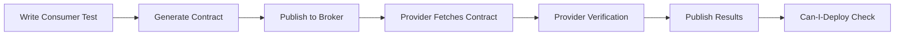

# Pact Testing Setup Guide - Backend & Storefront

## 📦 Required Dependencies

### Storefront (Consumer)

```bash
cd storefront
npm install --save-dev @pact-foundation/pact jest-pact
```

### Backend (Provider)

```bash
cd backend
npm install --save-dev @pact-foundation/pact
```

---

## 🚀 Quick Start Guide

### 1. Start Infrastructure

```powershell
# Start Pact Broker and other FOSS services
docker-compose -f docker-compose.foss.yml up -d

# Verify Pact Broker is running
# Open http://localhost:9292 (pact/pact)
```

### 2. Consumer Tests (Storefront)

```powershell
cd storefront

# Install dependencies first
npm install --save-dev @pact-foundation/pact jest-pact

# Run consumer tests to generate contracts
npm run test:pact:consumer

# Publish contracts to Pact Broker
npm run test:pact:publish
```

**What this does:**

- Generates contract files in `storefront/pacts/`
- Tests Products, Cart, Approvals, and Quotes APIs
- Publishes contracts to Pact Broker at localhost:9292

### 3. Provider Tests (Backend)

```powershell
cd backend

# Install dependencies first
npm install --save-dev @pact-foundation/pact

# Ensure backend is running
npm run dev
# Or via Docker: docker-compose up backend

# Run provider verification
npm run test:pact:provider

# Check if backend can deploy
npm run test:pact:can-i-deploy
```

**What this does:**

- Fetches contracts from Pact Broker
- Verifies backend implements all consumer expectations
- Publishes verification results back to broker

---

## 📋 Available Consumer Tests

### Products API (`products-api.pact.test.ts`)

- ✅ GET /store/products - List with pagination
- ✅ GET /store/products/:id - Get single product
- ✅ GET /store/products/:id - 404 not found

### Cart API (`cart-api.pact.test.ts`)

- ✅ POST /store/carts - Create cart
- ✅ POST /store/carts/:id/line-items - Add item
- ✅ PATCH /store/carts/:id/line-items/:line_id - Update quantity
- ✅ DELETE /store/carts/:id/line-items/:line_id - Remove item
- ✅ POST /store/carts/:id/complete - Complete checkout

### Approvals API (`approvals-api.pact.test.ts`)

- ✅ GET /store/approvals - List approvals
- ✅ GET /store/approvals/:id - Get approval details
- ✅ POST /store/approvals/:id/approve - Approve request
- ✅ POST /store/approvals/:id/reject - Reject request

### Quotes API (`quotes-api.pact.test.ts`)

- ✅ POST /store/quotes - Create quote
- ✅ GET /store/quotes - List quotes
- ✅ GET /store/quotes/:id - Get quote details
- ✅ POST /store/quotes/:id/messages - Send message
- ✅ POST /store/quotes/:id/accept - Accept quote

---

## 📋 Available Provider Tests

### Products Provider (`products-provider.pact.test.ts`)

- Verifies Products API contract
- State handlers for product availability

### Cart Provider (`cart-provider.pact.test.ts`)

- Verifies Cart API contract
- State handlers for cart operations

### Approvals Provider (`approvals-provider.pact.test.ts`)

- Verifies Approvals API contract
- State handlers for approval workflows

### Quotes Provider (`quotes-provider.pact.test.ts`)

- Verifies Quotes API contract
- State handlers for quote lifecycle

---

## 🔧 Troubleshooting

### Issue: "Cannot find module 'jest-pact'"

**Solution:**

```powershell
cd storefront
npm install --save-dev @pact-foundation/pact jest-pact
```

### Issue: "Cannot find module '@pact-foundation/pact'"

**Solution:**

```powershell
cd backend
npm install --save-dev @pact-foundation/pact
```

### Issue: "Pact Broker connection refused"

**Solution:**

```powershell
# Ensure Pact Broker is running
docker-compose -f docker-compose.foss.yml ps pact-broker

# Restart if needed
docker-compose -f docker-compose.foss.yml restart pact-broker

# Check logs
docker-compose -f docker-compose.foss.yml logs pact-broker
```

### Issue: "Provider verification fails"

**Solution:**

1. Ensure backend is running on port 9000
2. Check if contracts exist in Pact Broker (<http://localhost:9292>)
3. Verify state handlers match consumer expectations
4. Check backend logs for errors

### Issue: "can-i-deploy fails"

**Solution:**

```powershell
# Check verification status in Pact Broker
# Open http://localhost:9292

# Ensure provider verification ran successfully
cd backend
npm run test:pact:provider

# Check for breaking changes
pact-broker can-i-deploy \
  --pacticipant=ysh-backend \
  --latest \
  --to-environment=production \
  --broker-base-url=http://localhost:9292 \
  --broker-username=pact \
  --broker-password=pact
```

---

## 🎯 CI/CD Integration

The GitHub Actions workflow `.github/workflows/contract-testing.yml` handles:

1. **Consumer Tests**: Runs storefront tests, publishes contracts
2. **Provider Tests**: Starts backend, verifies contracts
3. **Can-I-Deploy**: Checks if deployment is safe
4. **PR Comments**: Reports contract testing results

---

## 📊 Viewing Results

### Pact Broker UI

- **URL**: <http://localhost:9292>
- **Credentials**: pact / pact
- **Features**:
  - View all contracts
  - See verification status
  - Check compatibility matrix
  - View contract changes

### Test Reports

- Consumer tests output: `storefront/pacts/`
- Provider verification logs: Console output
- CI/CD reports: GitHub Actions workflow

---

## 🔄 Workflow



---

## 📝 Best Practices

1. **Write consumer tests first** - Define expectations before implementation
2. **Use Pact matchers** - Make contracts flexible (regex, types, etc.)
3. **Setup state handlers** - Ensure provider can handle all states
4. **Run provider verification frequently** - Don't break consumers
5. **Use can-i-deploy** - Check before deploying to production
6. **Version your contracts** - Tag with git commit or version number
7. **Document state requirements** - Make state handlers clear

---

## 📚 Additional Resources

- [Pact Documentation](https://docs.pact.io/)
- [CONTRACT_TESTING_FOSS_GUIDE.md](./CONTRACT_TESTING_FOSS_GUIDE.md)
- [FOSS_TESTING_DOCUMENTATION_INDEX.md](./FOSS_TESTING_DOCUMENTATION_INDEX.md)
- [Pact Broker GitHub](https://github.com/pact-foundation/pact_broker)

---

**Status**: ✅ **Ready for Use**

All consumer and provider tests are implemented. Install dependencies and run tests to get started!
