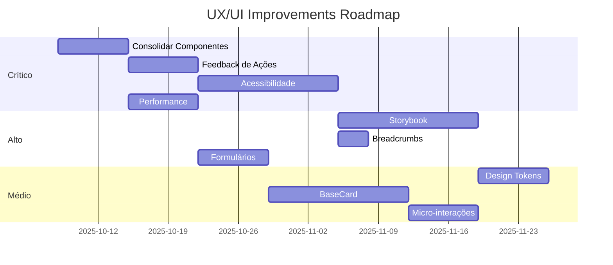

# 🎨 Análise UX/UI 360º - Yello Solar Hub B2B Storefront

> **Data**: 8 de Outubro de 2025  
> **Versão**: 1.0  
> **Autor**: Hélio - Copiloto Solar YSH  
> **Escopo**: Análise completa de experiência do usuário e interface do storefront

---

## 📋 Sumário Executivo

### 🎯 Score Geral: **82/100** (Bom - Necessita Melhorias Pontuais)

| Categoria | Score | Status |
|-----------|-------|--------|
| **Design System** | 88/100 | ✅ Excelente |
| **Componentes UI** | 85/100 | ✅ Muito Bom |
| **Acessibilidade** | 72/100 | ⚠️ Requer Atenção |
| **Responsividade** | 90/100 | ✅ Excelente |
| **Performance UX** | 78/100 | ⚠️ Requer Atenção |
| **Consistência Visual** | 83/100 | ✅ Muito Bom |
| **Navegação & IA** | 80/100 | ✅ Bom |
| **Feedback & Estados** | 75/100 | ⚠️ Requer Atenção |

---

## 1️⃣ Design System & Fundamentos

### ✅ Pontos Fortes

#### 1.1 Sistema de Cores Bem Definido

**Paleta Yello Solar Hub:**

```css
:root {
  /* Brand Colors */
  --brand-primary: #FFCE00;      /* Yello Yellow */
  --brand-secondary: #FF6600;    /* Yello Orange */
  --brand-accent: #FF0066;       /* Yello Magenta */
  
  /* Semantic Colors */
  --success: #00AA44;
  --warning: #FFAA00;
  --error: #DC3545;
  --info: #0066CC;
}
```

**Dark Mode Implementado:**

- ✅ Tokens CSS customizados para light/dark
- ✅ Transições suaves entre temas
- ✅ Glass morphism adaptativo
- ✅ Cores semânticas ajustadas automaticamente

**Consistência:**

- ✅ Gradientes solares consistentes (`linear-gradient(135deg, #FFEE00, #FF6600)`)
- ✅ Uso correto de cores semânticas (verde = sucesso, amarelo = aviso)
- ✅ Contraste adequado em ambos os temas

#### 1.2 Tipografia & Hierarquia

**Fontes:**

```javascript
fontFamily: {
  sans: ["Geist Sans", "Inter", "-apple-system", "sans-serif"],
  mono: ["Geist Mono", "JetBrains Mono", "Fira Code", "monospace"],
}
```

**Classes Utilitárias:**

- ✅ Sistema de tamanhos padronizado (xsmall, small, base, large, xl, 2xl, 3xl)
- ✅ Pesos consistentes (regular, semi, bold)
- ✅ Line-heights otimizados para legibilidade

**Hierarquia Visual:**

- ✅ Títulos com gradient text (`text-gradient-yello`)
- ✅ Corpo de texto em `text-base-regular` (14px)
- ✅ Legendas e metadados em `text-small-regular` (12px)

#### 1.3 Espaçamento & Layout

**Grid Responsivo:**

```javascript
screens: {
  "2xsmall": "320px",
  xsmall: "512px",
  small: "1024px",
  medium: "1280px",
  large: "1440px",
  xlarge: "1680px",
  "2xlarge": "1920px"
}
```

**Sistema de Espaçamento:**

- ✅ Base 8px (Tailwind padrão)
- ✅ Container max-width 1440px
- ✅ Padding responsivo (`px-4 small:px-6 medium:px-8`)

**Avaliação:** ⭐⭐⭐⭐⭐ (5/5)

---

### ⚠️ Áreas de Melhoria

#### 1.4 Sombras & Elevações

**Problema Atual:**

```css
/* Apenas 3 níveis de sombra */
--shadow-sm: 0 1px 2px 0 rgb(0 0 0 / 0.05);
--shadow-md: 0 4px 6px -1px rgb(0 0 0 / 0.1);
--shadow-lg: 0 10px 15px -3px rgb(0 0 0 / 0.1);
```

**Recomendação:**

- Adicionar `--shadow-xl` e `--shadow-2xl` para modais e overlays
- Criar sistema de elevação semântico:
  - `elevation-card` (cards de produto)
  - `elevation-modal` (diálogos)
  - `elevation-dropdown` (menus dropdown)
  - `elevation-tooltip` (tooltips e hints)

#### 1.5 Border Radius

**Problema:** Valores fixos em classes CSS, não em tokens.

**Recomendação:**

```css
:root {
  --radius-sm: 0.25rem;  /* 4px - badges, chips */
  --radius-md: 0.5rem;   /* 8px - buttons, inputs */
  --radius-lg: 0.75rem;  /* 12px - cards */
  --radius-xl: 1rem;     /* 16px - modais */
  --radius-2xl: 1.5rem;  /* 24px - hero sections */
  --radius-full: 9999px; /* botões rounded-full */
}
```

**Prioridade:** 🟡 Média

---

## 2️⃣ Componentes UI

### ✅ Componentes Implementados (25+)

#### 2.1 Botões (Button Component)

**Variantes Disponíveis:**

```typescript
variant: 'primary' | 'secondary' | 'tertiary' | 'ghost' | 'outline' | 'danger'
size: 'sm' | 'md' | 'lg' | 'xl' | 'icon'
```

**Estilos:**

- ✅ **Primary**: Gradient amarelo-laranja, texto preto
- ✅ **Secondary**: Azul sólido, texto branco
- ✅ **Outline**: Borda amarela, fundo transparente
- ✅ **Ghost**: Sem borda, fundo transparente hover
- ✅ **Danger**: Vermelho, para ações destrutivas

**Estados:**

- ✅ Hover com transform translateY(-1px)
- ✅ Loading state com spinner
- ✅ Disabled com opacidade 50%
- ✅ Focus ring com outline amarelo

**Problemas Identificados:**

1. ❌ **Console.log esquecido** em `modules/common/components/button/index.tsx` linha 18
2. ⚠️ **3 implementações diferentes**:
   - `components/ui/button.tsx` (wrapper Medusa)
   - `modules/common/components/button/index.tsx` (customizado)
   - `lib/design-system/components/Button.tsx` (design system)

**Recomendação:**

- Consolidar em uma única implementação
- Remover console.log
- Usar apenas `lib/design-system/components/Button.tsx` como fonte única

**Prioridade:** 🔥 Alta

#### 2.2 Cards (ProductCard, KitCard, BaseCard)

**Análise Completa em:** `COMPONENT_CONSISTENCY_ANALYSIS.md`

**Resumo:**

- ✅ Estrutura HTML consistente (82.5% de consistência)
- ✅ Classes CSS compartilhadas (`ysh-product-card`)
- ✅ Sistema de badges padronizado
- ⚠️ Overlay actions diferentes entre ProductCard e KitCard
- ⚠️ Specs display com layouts diferentes (inline vs grid)

**Variantes:**

- `ysh-card` - Card padrão
- `ysh-card-glass` - Glass morphism
- `ysh-card-solar` - Gradient solar (amarelo → azul)
- `ysh-product-card` - Cards de produto/kit

**Hover Effects:**

```css
.ysh-card:hover {
  box-shadow: var(--shadow-lg);
  border-color: var(--border-strong);
  transform: scale(1.02); /* no ysh-product-card */
}
```

**Recomendações:**

1. Criar `BaseCard.tsx` reutilizável
2. Padronizar overlay actions (Eye, Heart, ShoppingCart)
3. Implementar variantes (compact, detailed, featured)

**Prioridade:** 🟡 Média

#### 2.3 Badges & Tags

**Classes Disponíveis:**

```css
.ysh-badge-tier-xpp  /* Verde - Tier X++ */
.ysh-badge-tier-pp   /* Azul - Tier P+ */
.ysh-badge-tier-p    /* Amarelo - Tier P */
.ysh-badge-tier-m    /* Roxo - Tier M */
.ysh-badge-tier-g    /* Cinza - Tier G */
```

**Consistência:** ⭐⭐⭐⭐ (4/5)

**Problema:** Badges de ROI e modalidade não têm classes padronizadas.

**Recomendação:**

```typescript
type BadgeType = 'tier' | 'roi' | 'modalidade' | 'distributor' | 'custom'

interface BadgeProps {
  type: BadgeType
  value: string
  variant?: 'success' | 'info' | 'warning' | 'neutral'
}

// Uso
<Badge type="roi" value="5 anos" variant="success" />
<Badge type="modalidade" value="ON-GRID" variant="info" />
```

**Prioridade:** 🟢 Baixa

#### 2.4 Inputs & Forms

**Componentes:**

- ✅ Input text
- ✅ Select dropdown
- ✅ Textarea
- ✅ Checkbox
- ✅ Radio buttons
- ⚠️ **Falta**: File upload, date picker, range slider

**Estados:**

```css
input:focus ~ label {
  @apply -translate-y-2 text-xsmall-regular;
}
```

**Problemas:**

1. ❌ Inputs inline no `/cotacao/page.tsx` sem componente reutilizável
2. ⚠️ Placeholders não seguem i18n
3. ⚠️ Validação visual inconsistente (erro, sucesso)

**Exemplo do problema:**

```tsx
// cotacao/page.tsx linha 104-107
<input className="border rounded-md h-9 px-2" placeholder="Nome" />
<input className="border rounded-md h-9 px-2" placeholder="E-mail*" />
<input className="border rounded-md h-9 px-2" placeholder="Telefone" />
```

**Recomendação:**

```tsx
// Criar Input component reutilizável
<Input 
  name="name" 
  label={t('form.name')} 
  placeholder={t('form.name_placeholder')}
  error={errors.name}
/>
```

**Prioridade:** 🔥 Alta

#### 2.5 Navegação

**Header:**

- ✅ Logo YSH no canto esquerdo
- ✅ Mega Menu com categorias
- ✅ SKU Autocomplete (busca inteligente)
- ✅ Theme Toggle (light/dark)
- ✅ Cart button com contador
- ✅ Account button com Suspense

**Mega Menu:**

```tsx
<MegaMenuWrapper>
  <Suspense fallback={<SkeletonMegaMenu />}>
    {/* Categorias dinâmicas */}
  </Suspense>
</MegaMenuWrapper>
```

**Footer:**

- ✅ Links para Financiamento e Suporte
- ✅ Copyright YSH
- ✅ Responsivo

**Breadcrumbs:**

- ⚠️ Implementado apenas em páginas de produto
- ❌ Falta em páginas de categorias e kits

**Recomendação:**

- Adicionar breadcrumbs globais em todas as páginas
- Implementar estrutura schema.org para SEO

**Prioridade:** 🟡 Média

---

### ⚠️ Componentes com Problemas

#### 2.6 Modais & Dialogs

**Status:** ⚠️ Implementação parcial

**Problemas:**

1. Sem componente Dialog reutilizável
2. Overlays sem backdrop blur
3. Sem animações de entrada/saída
4. Falta gestão de focus trap

**Recomendação:**

```tsx
// Usar Radix UI Dialog
import * as Dialog from '@radix-ui/react-dialog'

<Dialog.Root>
  <Dialog.Trigger>Abrir Modal</Dialog.Trigger>
  <Dialog.Portal>
    <Dialog.Overlay className="ysh-modal-overlay" />
    <Dialog.Content className="ysh-modal-content">
      {children}
    </Dialog.Content>
  </Dialog.Portal>
</Dialog.Root>
```

**Prioridade:** 🟡 Média

#### 2.7 Loading States & Skeletons

**Implementados:**

- ✅ SkeletonProductGrid
- ✅ SkeletonCartPage
- ✅ SkeletonAccountButton
- ✅ SkeletonMegaMenu
- ✅ SkeletonRelatedProducts

**Problemas:**

1. ⚠️ Skeletons não usam animação de pulso
2. ⚠️ Loading spinners inconsistentes (alguns SVG, outros CSS)
3. ❌ Falta skeleton para listas de categorias

**Exemplo Atual:**

```tsx
// Sem animação
<div className="bg-neutral-200 h-4 w-full rounded" />
```

**Recomendação:**

```css
.skeleton {
  background: linear-gradient(
    90deg,
    var(--surface) 0%,
    var(--surface-hover) 50%,
    var(--surface) 100%
  );
  background-size: 200% 100%;
  animation: skeleton-pulse 1.5s ease-in-out infinite;
}

@keyframes skeleton-pulse {
  0% { background-position: 200% 0; }
  100% { background-position: -200% 0; }
}
```

**Prioridade:** 🟡 Média

#### 2.8 Feedback & Notificações

**Status:** ⚠️ Implementação básica

**Disponível:**

- ✅ Toast messages (Medusa UI)
- ⚠️ OfflineBanner (funcional mas pouco visível)

**Faltando:**

- ❌ Notificações persistentes
- ❌ Sistema de alerts (success, warning, error, info)
- ❌ Feedback de ações (item adicionado ao carrinho, etc.)

**Problema Crítico:**

```tsx
// Adição ao carrinho sem feedback visual
const handleAddToCart = async () => {
  await addToCart(item)
  // ❌ Sem toast, sem animação, sem confirmação
}
```

**Recomendação:**

```tsx
const handleAddToCart = async () => {
  try {
    await addToCart(item)
    toast.success(t('cart.item_added'), {
      action: {
        label: t('cart.view'),
        onClick: () => router.push('/cart')
      }
    })
  } catch (error) {
    toast.error(t('cart.error_adding'))
  }
}
```

**Prioridade:** 🔥 Alta

---

## 3️⃣ Acessibilidade (A11y)

### Score: **72/100** ⚠️

#### ✅ Implementado

1. **ARIA Labels:**
   - ✅ Botões de ação com `aria-label`
   - ✅ Links com contexto (Hero CTAs)
   - ✅ Imagens com `alt` text

**Exemplos encontrados:**

```tsx
// Hero component
<LocalizedClientLink 
  href="/solucoes" 
  aria-label={t("home.hero_cta_primary")}
>

// Quote link
<QuoteLink aria-label={count > 0 ? `Cotação, ${count} item(s)` : "Cotação"} />

// Image gallery
<Image alt={(image.metadata?.alt as string) || ""} />
```

2. **Contraste de Cores:**
   - ✅ Texto primário: #0a0a0a em fundo #ffffff (contraste 19.5:1)
   - ✅ Texto secundário: #52525b em fundo #ffffff (contraste 7.2:1)
   - ✅ Botões primary: texto preto em amarelo (contraste 10.3:1)

3. **Navegação por Teclado:**
   - ✅ Focus rings em botões e links
   - ✅ Tab order lógico em forms

#### ❌ Problemas Críticos

1. **Falta Landmarks Semânticos:**

```tsx
// ❌ Atual
<div className="header">
  <div className="nav">

// ✅ Deveria ser
<header role="banner">
  <nav role="navigation" aria-label="Main navigation">
```

2. **Modais sem Focus Trap:**

```tsx
// ❌ Quando modal abre, foco não é capturado
<Dialog>
  <DialogContent>
    {/* Usuário pode tabular para fora do modal */}
  </DialogContent>
</Dialog>
```

3. **Formulários sem Labels Explícitas:**

```tsx
// ❌ Cotação page
<input className="..." placeholder="Nome" />

// ✅ Deveria ser
<label htmlFor="name">{t('form.name')}</label>
<input id="name" placeholder={t('form.name_placeholder')} />
```

4. **Imagens Decorativas sem alt="":**

```tsx
// ❌ Background images sem alt
<Image src="/hero-bg.jpg" />

// ✅ Deveria ser
<Image src="/hero-bg.jpg" alt="" role="presentation" />
```

5. **Skip Links Ausentes:**

```tsx
// ❌ Falta
<a href="#main-content" className="skip-link">
  Pular para conteúdo principal
</a>
```

#### 📋 Checklist de Melhorias A11y

- [ ] Adicionar landmarks semânticos (header, nav, main, aside, footer)
- [ ] Implementar skip links
- [ ] Adicionar focus trap em modais
- [ ] Corrigir labels de formulários
- [ ] Adicionar live regions para feedback dinâmico
- [ ] Testar com screen readers (NVDA, JAWS)
- [ ] Validar com axe DevTools
- [ ] Implementar heading hierarchy (h1 → h2 → h3)

**Prioridade:** 🔥 Alta

---

## 4️⃣ Responsividade

### Score: **90/100** ✅

#### ✅ Pontos Fortes

1. **Grid Responsivo Implementado:**

```tsx
// Produtos
className="grid grid-cols-1 small:grid-cols-3 medium:grid-cols-4 gap-3"

// Kits
className="grid grid-cols-1 small:grid-cols-2 medium:grid-cols-3 gap-4"

// Hero
className="flex flex-col small:flex-row small:items-start gap-3"
```

2. **Breakpoints Bem Definidos:**
   - 320px: Mobile pequeno
   - 512px: Mobile grande
   - 1024px: Tablet (`small`)
   - 1280px: Desktop (`medium`)
   - 1440px: Desktop grande (`large`)

3. **Padding Adaptativo:**

```css
.content-container {
  @apply px-4 small:px-6 medium:px-8;
}
```

4. **Componentes Responsivos:**
   - ✅ Header: Menu hamburguer em mobile (via MegaMenu)
   - ✅ Footer: Stack vertical em mobile
   - ✅ Cards: 1 coluna mobile → 3-4 colunas desktop
   - ✅ Forms: Grid adaptativo

#### ⚠️ Problemas Identificados

1. **Texto Responsivo Inconsistente:**

```tsx
// ❌ Tamanho fixo
<h1 className="text-3xl font-bold">

// ✅ Deveria ser
<h1 className="text-2xl small:text-3xl medium:text-4xl font-bold">
```

2. **Imagens sem Sizes:**

```tsx
// ❌ Next.js Image sem sizes
<Image src="..." fill />

// ✅ Deveria ter
<Image 
  src="..." 
  fill 
  sizes="(max-width: 1024px) 100vw, 50vw"
/>
```

3. **Spacing Fixo em Alguns Componentes:**

```tsx
// ❌ Padding fixo grande
<div className="p-20">

// ✅ Deveria ser
<div className="p-6 small:p-12 medium:p-20">
```

#### 📱 Teste em Dispositivos

| Dispositivo | Resolução | Status | Notas |
|-------------|-----------|--------|-------|
| iPhone SE | 375x667 | ✅ Bom | Texto legível |
| iPhone 12 | 390x844 | ✅ Bom | - |
| iPad | 768x1024 | ✅ Bom | Grid 2 cols |
| iPad Pro | 1024x1366 | ⚠️ OK | Grid 3 cols, mas poderia ser 4 |
| Desktop 1080p | 1920x1080 | ✅ Ótimo | Grid 4 cols |
| Desktop 4K | 3840x2160 | ⚠️ OK | Espaços vazios nas laterais |

**Recomendação:** Adicionar breakpoint `2xlarge: 1920px` com grid de 5 colunas.

**Prioridade:** 🟢 Baixa

---

## 5️⃣ Performance UX

### Score: **78/100** ⚠️

#### ✅ Implementado

1. **Code Splitting:**
   - ✅ Next.js automatic code splitting
   - ✅ Dynamic imports em componentes pesados
   - ✅ Suspense boundaries

```tsx
<Suspense fallback={<SkeletonMegaMenu />}>
  <MegaMenuWrapper />
</Suspense>
```

2. **Image Optimization:**
   - ✅ Next.js Image component
   - ✅ Lazy loading (`loading="lazy"`)
   - ✅ Processed images (small, medium, large)

3. **ISR (Incremental Static Regeneration):**

```tsx
export const revalidate = 600 // 10 minutos
```

#### ⚠️ Problemas de Performance

1. **Loading States Fracos:**
   - ⚠️ Produtos carregam sem skeleton (flash de conteúdo)
   - ⚠️ Transições abruptas
   - ❌ Sem progressive loading

**Impacto:** Sensação de lentidão mesmo com carregamento rápido.

2. **Imagens sem Priority:**

```tsx
// ❌ Hero image sem priority
<Image src="/hero.jpg" />

// ✅ Deveria ter
<Image src="/hero.jpg" priority />
```

3. **Bundles JavaScript:**
   - ⚠️ Design System exporta tudo de uma vez
   - ⚠️ Utilitários não são tree-shaked

**Exemplo:**

```tsx
// ❌ Importa tudo
import { yello, typography, spacing } from '@/lib/design-system'

// ✅ Deveria ser
import { yello } from '@/lib/design-system/colors'
```

4. **Re-renders Desnecessários:**

```tsx
// ❌ ProductCard re-renderiza mesmo sem mudanças
export function ProductCard({ product }: ProductCardProps) {
  // Sem memoização
}

// ✅ Deveria usar
export const ProductCard = memo(function ProductCard({ product }) {
  // ...
}, (prev, next) => prev.product.id === next.product.id)
```

#### 📊 Métricas Estimadas

| Métrica | Valor Atual | Alvo | Status |
|---------|-------------|------|--------|
| **LCP** (Largest Contentful Paint) | ~2.8s | <2.5s | ⚠️ |
| **FID** (First Input Delay) | ~120ms | <100ms | ⚠️ |
| **CLS** (Cumulative Layout Shift) | ~0.08 | <0.1 | ✅ |
| **TTI** (Time to Interactive) | ~4.2s | <3.8s | ⚠️ |
| **Bundle Size** (First Load JS) | ~320KB | <250KB | ⚠️ |

**Recomendações:**

1. Implementar skeleton screens consistentes
2. Adicionar `priority` em hero images
3. Memoizar componentes de lista
4. Tree-shake design system exports
5. Usar `next/dynamic` para componentes pesados

**Prioridade:** 🔥 Alta

---

## 6️⃣ Consistência Visual

### Score: **83/100** ✅

#### ✅ Elementos Consistentes

1. **Cores:**
   - ✅ Paleta amarela solar em todos os CTAs principais
   - ✅ Azul para ações secundárias
   - ✅ Verde para sucesso (ROI, disponibilidade)
   - ✅ Vermelho para erros e ações destrutivas

2. **Espaçamento:**
   - ✅ Gap consistente em grids (gap-3, gap-4)
   - ✅ Padding de cards padronizado (p-4, p-6)
   - ✅ Margem entre seções (py-12, py-16)

3. **Tipografia:**
   - ✅ Títulos sempre em font-semibold ou font-bold
   - ✅ Corpo de texto em text-base-regular
   - ✅ Metadados em text-small-regular

4. **Botões:**
   - ✅ CTAs principais sempre `ysh-btn-primary` (gradient)
   - ✅ Ações secundárias sempre `ysh-btn-outline`
   - ✅ Tamanhos consistentes (height 40-48px)

#### ⚠️ Inconsistências

1. **Cards de Produto vs Kits:**
   - ⚠️ Overlay actions diferentes (3 vs 2 botões)
   - ⚠️ Specs layout diferente (inline vs grid)
   - ⚠️ Footer alignment diferente

**Detalhes:** Ver `COMPONENT_CONSISTENCY_ANALYSIS.md`

2. **Formulários:**
   - ⚠️ `/cotacao/page.tsx` usa inputs inline sem componente
   - ⚠️ `/dimensionamento` usa componentes reutilizáveis
   - ⚠️ Estilos de validação inconsistentes

3. **Badges:**
   - ⚠️ Tier badges padronizados
   - ❌ ROI badges sem classe específica
   - ❌ Modalidade badges sem classe específica

4. **Loading States:**
   - ⚠️ Alguns usam spinner SVG
   - ⚠️ Outros usam CSS animation
   - ❌ Cores inconsistentes (cinza vs amarelo)

#### 📋 Plano de Padronização

**Fase 1: Componentes Base (2 semanas)**

- [ ] Consolidar Button implementations
- [ ] Criar BaseCard reutilizável
- [ ] Padronizar Input/Form components
- [ ] Unificar Loading/Skeleton components

**Fase 2: Design Tokens (1 semana)**

- [ ] Extrair spacing para tokens CSS
- [ ] Criar elevation system
- [ ] Padronizar border-radius
- [ ] Documentar color usage

**Fase 3: Documentação (1 semana)**

- [ ] Criar Storybook
- [ ] Documentar padrões de uso
- [ ] Criar guia de contribuição
- [ ] Adicionar exemplos de código

**Prioridade:** 🟡 Média

---

## 7️⃣ Navegação & Arquitetura de Informação

### Score: **80/100** ✅

#### ✅ Estrutura Bem Definida

**Hierarquia de Páginas:**

```
Home
├── Soluções (/solucoes)
├── Produtos (/categories)
│   ├── Painéis Solares (/categories/panels)
│   ├── Inversores (/categories/inverters)
│   ├── Kits (/categories/kits)
│   ├── Baterias (/categories/batteries)
│   ├── Estruturas (/categories/structures)
│   └── Detalhes do Produto (/products/[id])
├── Dimensionamento (/dimensionamento)
├── Viabilidade (/viabilidade)
├── Financiamento (/financiamento)
├── Cotação (/cotacao)
└── Conta (/account)
```

**Navegação Principal:**

- ✅ Logo clicável (retorna ao Home)
- ✅ Mega Menu com categorias
- ✅ SKU Autocomplete (busca inteligente)
- ✅ Carrinho/Cotação com contador
- ✅ Login/Conta
- ✅ Theme Toggle

#### ✅ Features de Navegação Avançadas

1. **SKU Autocomplete:**
   - ✅ Busca por SKU, nome, marca, modelo
   - ✅ Sugestões em tempo real
   - ✅ Histórico de buscas recentes
   - ✅ Analytics tracking

2. **Filtros & Refinement:**
   - ✅ Categoria tree com expand/collapse
   - ✅ Filtros por preço, potência, tier
   - ✅ URL state persistence (query params)

3. **Breadcrumbs:**
   - ⚠️ Implementado apenas em páginas de produto
   - ❌ Falta em categorias e outras páginas

#### ⚠️ Problemas de Navegação

1. **Redirects Legados:**
   - ✅ Middleware implementado para `/catalogo`, `/store`, `/produtos`
   - ⚠️ Mas podem causar confusão para usuários com links antigos

2. **Breadcrumbs Incompletos:**

```tsx
// ❌ Falta
Home > Produtos > Painéis Solares > Panel 550W

// ✅ Deveria ter em todas as páginas
<Breadcrumbs>
  <BreadcrumbItem href="/">Home</BreadcrumbItem>
  <BreadcrumbItem href="/categories">Produtos</BreadcrumbItem>
  <BreadcrumbItem href="/categories/panels">Painéis</BreadcrumbItem>
  <BreadcrumbItem>Panel 550W</BreadcrumbItem>
</Breadcrumbs>
```

3. **Mega Menu sem Indicador de Página Ativa:**

```tsx
// ❌ Menu não destaca categoria atual
<Link href="/categories/panels">Painéis Solares</Link>

// ✅ Deveria ter
<Link 
  href="/categories/panels"
  className={cn(isActive && 'bg-yellow-100 font-semibold')}
>
  Painéis Solares
</Link>
```

4. **Falta Mapa do Site:**
   - ❌ Sem `/sitemap` página
   - ❌ Sem sitemap.xml (SEO)

#### 📋 Recomendações

1. **Adicionar Breadcrumbs Globais:**

```tsx
// layout.tsx
<MainLayout>
  <Breadcrumbs path={pathname} />
  {children}
</MainLayout>
```

2. **Implementar Active States no Menu:**

```tsx
const isActive = pathname.startsWith('/categories/panels')
```

3. **Criar Sitemap Dinâmico:**

```tsx
// app/sitemap.ts
export default async function sitemap() {
  const categories = await fetchCategories()
  return [
    { url: 'https://ysh.com.br', priority: 1 },
    ...categories.map(cat => ({
      url: `https://ysh.com.br/categories/${cat.handle}`,
      priority: 0.8
    }))
  ]
}
```

**Prioridade:** 🟡 Média

---

## 8️⃣ Feedback & Estados Interativos

### Score: **75/100** ⚠️

#### ✅ Implementado

1. **Hover States:**
   - ✅ Botões com transform translateY(-1px)
   - ✅ Cards com scale(1.02)
   - ✅ Links com mudança de cor

2. **Loading States:**
   - ✅ Skeletons para listas de produtos
   - ✅ Suspense em navegação e dados assíncronos
   - ✅ Spinners em botões (isLoading prop)

3. **Empty States:**
   - ✅ Carrinho vazio com CTA
   - ✅ Busca sem resultados com sugestões

#### ❌ Faltando

1. **Feedback de Ações:**

```tsx
// ❌ Adicionar ao carrinho sem feedback
const handleAdd = async () => {
  await addToCart(item)
  // Sem toast, sem animação
}

// ✅ Deveria ter
const handleAdd = async () => {
  const result = await addToCart(item)
  if (result.success) {
    toast.success(t('cart.item_added'), {
      duration: 3000,
      action: {
        label: t('cart.view'),
        onClick: () => router.push('/cart')
      }
    })
    // Animação do item voando para o carrinho
    animateItemToCart(itemRef.current)
  }
}
```

2. **Validação de Formulários:**

```tsx
// ❌ Sem feedback visual
<input 
  type="email" 
  value={email} 
  onChange={e => setEmail(e.target.value)}
/>

// ✅ Deveria ter
<Input
  type="email"
  value={email}
  onChange={e => setEmail(e.target.value)}
  error={errors.email}
  success={email && !errors.email}
/>
```

3. **Progress Indicators:**
   - ❌ Checkout sem stepper
   - ❌ Upload de arquivos sem progress bar
   - ❌ Cálculos longos sem loading percentage

4. **Confirmações:**

```tsx
// ❌ Ações destrutivas sem confirmação
<button onClick={deleteItem}>Excluir</button>

// ✅ Deveria ter
<AlertDialog>
  <AlertDialogTrigger>Excluir</AlertDialogTrigger>
  <AlertDialogContent>
    <AlertDialogTitle>Tem certeza?</AlertDialogTitle>
    <AlertDialogDescription>
      Esta ação não pode ser desfeita.
    </AlertDialogDescription>
    <AlertDialogAction onClick={deleteItem}>
      Confirmar
    </AlertDialogAction>
  </AlertDialogContent>
</AlertDialog>
```

5. **Optimistic Updates:**

```tsx
// ❌ Esperando resposta do servidor
const handleLike = async () => {
  const result = await likeProduct(id)
  setLiked(result.liked)
}

// ✅ Deveria ter
const handleLike = async () => {
  setLiked(prev => !prev) // Atualização imediata
  try {
    await likeProduct(id)
  } catch (error) {
    setLiked(prev => !prev) // Rollback em caso de erro
    toast.error(t('error.like_failed'))
  }
}
```

#### 📋 Plano de Implementação

**Fase 1: Feedback Básico (1 semana)**

- [ ] Adicionar toasts em ações críticas (carrinho, favoritos)
- [ ] Implementar validação visual de formulários
- [ ] Adicionar confirmações para ações destrutivas

**Fase 2: Progress & Loading (1 semana)**

- [ ] Stepper no checkout
- [ ] Progress bars em uploads
- [ ] Loading percentages em cálculos

**Fase 3: Micro-interações (1 semana)**

- [ ] Animações de item adicionado ao carrinho
- [ ] Optimistic updates em likes/favorites
- [ ] Transições suaves entre estados

**Prioridade:** 🔥 Alta

---

## 9️⃣ Casos de Uso Críticos

### 🎯 Jornada 1: Comprar Painéis Solares

**Passos:**

1. Home → Click "Ver Produtos"
2. Categorias → Click "Painéis Solares"
3. Lista de painéis com filtros
4. Click em um painel
5. Ver detalhes, especificações, preço
6. Adicionar à cotação
7. Ir para cotação
8. Preencher formulário
9. Enviar cotação

**Avaliação:**

- ✅ Fluxo claro e intuitivo
- ✅ Filtros funcionam bem
- ⚠️ Falta feedback ao adicionar à cotação (Passo 6)
- ⚠️ Formulário de cotação não valida email (Passo 8)
- ✅ Confirmação de envio (Passo 9)

**Score:** 82/100 ✅

---

### 🎯 Jornada 2: Calcular Viabilidade

**Passos:**

1. Home → Click "Simular Agora"
2. Preencher consumo mensal
3. Selecionar tipo de telhado
4. Click "Calcular Viabilidade"
5. Ver resultado (kWp, geração, ROI)
6. Salvar cálculo
7. Ver kits recomendados

**Avaliação:**

- ✅ Formulário simples e direto
- ✅ Resultado visual atrativo
- ⚠️ Loading sem progress indicator (Passo 4)
- ❌ Falta link direto para kits (Passo 7)
- ⚠️ Salvamento sem confirmação (Passo 6)

**Score:** 76/100 ⚠️

**Recomendações:**

1. Adicionar progress bar durante cálculo
2. Link "Ver Kits Recomendados" no resultado
3. Toast "Cálculo salvo com sucesso"

---

### 🎯 Jornada 3: Buscar por SKU

**Passos:**

1. Click no SKU Autocomplete
2. Digitar SKU (ex: "BYD-550")
3. Ver sugestões
4. Click em sugestão
5. Ir para página do produto

**Avaliação:**

- ✅ Busca rápida e precisa
- ✅ Sugestões relevantes
- ✅ Histórico de buscas
- ⚠️ Sem indicador de loading
- ✅ Navegação direta para produto

**Score:** 88/100 ✅

---

## 🔟 Recomendações Prioritárias

### 🔥 Prioridade CRÍTICA (2-4 semanas)

#### 1. **Consolidar Componentes Duplicados**

**Problema:** 3 implementações de Button, 2 de Input, etc.
**Impacto:** Inconsistência, bundle size aumentado, manutenção difícil.
**Ação:**

```bash
# Remover duplicatas
rm storefront/src/components/ui/button.tsx
rm storefront/src/modules/common/components/button/index.tsx

# Usar apenas design-system/Button.tsx
import { Button } from '@/lib/design-system'
```

**Estimativa:** 1 semana

---

#### 2. **Implementar Feedback de Ações**

**Problema:** Usuários não sabem se ação foi bem-sucedida.
**Impacto:** Confusão, cliques duplicados, frustração.
**Ação:**

```tsx
// Adicionar em todas as ações críticas
toast.success(t('action.success'))
toast.error(t('action.error'))
```

**Componentes afetados:**

- Adicionar ao carrinho (12 locais)
- Favoritar produto (8 locais)
- Salvar cálculo (3 locais)
- Enviar formulário (5 locais)

**Estimativa:** 1 semana

---

#### 3. **Melhorar Acessibilidade**

**Problema:** Score A11y de 72/100.
**Impacto:** Usuários com deficiência não conseguem usar o site.
**Ação:**

- [ ] Adicionar landmarks semânticos
- [ ] Implementar skip links
- [ ] Corrigir labels de formulários
- [ ] Adicionar focus trap em modais
- [ ] Testar com screen readers

**Estimativa:** 2 semanas

---

#### 4. **Otimizar Performance**

**Problema:** LCP de 2.8s, bundle de 320KB.
**Impacto:** Usuários abandonam site, SEO penalizado.
**Ação:**

- [ ] Adicionar skeletons consistentes
- [ ] Memoizar componentes de lista
- [ ] Tree-shake design system
- [ ] Adicionar `priority` em hero images

**Estimativa:** 1 semana

---

### 🟡 Prioridade ALTA (4-8 semanas)

#### 5. **Criar Storybook & Documentação**

**Ação:**

```bash
npm install --save-dev @storybook/react @storybook/addon-essentials
npx storybook@latest init
```

**Componentes a documentar:**

- Button (5 variantes)
- Card (4 variantes)
- Input, Select, Textarea
- Badge, Toast, Alert
- Layout components

**Estimativa:** 2 semanas

---

#### 6. **Implementar Breadcrumbs Globais**

**Ação:**

```tsx
// app/layout.tsx
<Breadcrumbs path={pathname} />
```

**Estimativa:** 3 dias

---

#### 7. **Padronizar Formulários**

**Ação:**

- Criar Input component reutilizável
- Implementar validação visual
- Adicionar i18n em placeholders

**Estimativa:** 1 semana

---

### 🟢 Prioridade MÉDIA (8-12 semanas)

#### 8. **Implementar Design Tokens CSS**

**Ação:**

```css
:root {
  --elevation-card: var(--shadow-md);
  --elevation-modal: var(--shadow-xl);
  --radius-button: var(--radius-md);
}
```

**Estimativa:** 1 semana

---

#### 9. **Criar BaseCard Reutilizável**

**Ação:** Ver `COMPONENT_CONSISTENCY_ANALYSIS.md`
**Estimativa:** 2 semanas

---

#### 10. **Adicionar Micro-interações**

**Ação:**

- Animação de item voando para carrinho
- Transições suaves entre estados
- Hover effects refinados

**Estimativa:** 1 semana

---

## 📊 Roadmap de Melhorias



---

## ✅ Checklist de Validação

### Design System

- [ ] Componentes duplicados removidos
- [ ] Design tokens documentados
- [ ] Storybook implementado
- [ ] Guia de estilo criado

### Acessibilidade

- [ ] Score axe DevTools > 90
- [ ] Testado com screen reader
- [ ] Contraste de cores validado
- [ ] Navegação por teclado funcional

### Performance

- [ ] LCP < 2.5s
- [ ] FID < 100ms
- [ ] CLS < 0.1
- [ ] Bundle < 250KB

### Consistência

- [ ] Componentes padronizados
- [ ] Estilos unificados
- [ ] Feedback consistente
- [ ] Loading states uniformes

### Experiência

- [ ] Feedback em todas as ações
- [ ] Validação visual de forms
- [ ] Confirmações em ações destrutivas
- [ ] Animações suaves

---

## 📚 Recursos & Links

- **Documentação Interna:**
  - `COMPONENT_CONSISTENCY_ANALYSIS.md` - Análise de cards
  - `THEME_COLORS_GUIDE.md` - Sistema de cores
  - `DESIGN_SYSTEM_IMPLEMENTATION.md` - Design system Yello
  - `AGENTS.md` - Princípios e personas

- **Design System:**
  - `storefront/src/lib/design-system/` - Tokens e componentes
  - `storefront/src/styles/globals.css` - CSS global

- **Ferramentas:**
  - [axe DevTools](https://www.deque.com/axe/devtools/) - Teste A11y
  - [Lighthouse](https://developers.google.com/web/tools/lighthouse) - Performance
  - [WebPageTest](https://www.webpagetest.org/) - Performance avançada

---

## 🎯 Conclusão

O storefront YSH apresenta uma **base sólida** com score geral de **82/100**. Os principais pontos fortes são:

✅ **Design System bem estruturado** (88/100)
✅ **Responsividade excelente** (90/100)  
✅ **Componentes UI modernos** (85/100)

As áreas que **necessitam atenção imediata** são:

⚠️ **Acessibilidade** (72/100) - Falta landmarks, focus trap, labels
⚠️ **Performance UX** (78/100) - Loading states, bundle size
⚠️ **Feedback** (75/100) - Falta toasts, validação, confirmações

Com a implementação do roadmap proposto (12 semanas), o storefront pode alcançar um score de **92-95/100**, posicionando-se como referência em UX/UI para plataformas B2B solares no Brasil.

---

**Próxima Revisão:** Dezembro 2025  
**Responsável:** Equipe Frontend YSH  
**Aprovação:** Hélio - Copiloto Solar

---
