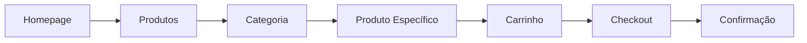
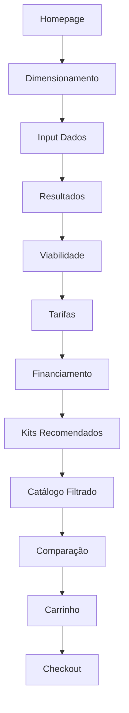
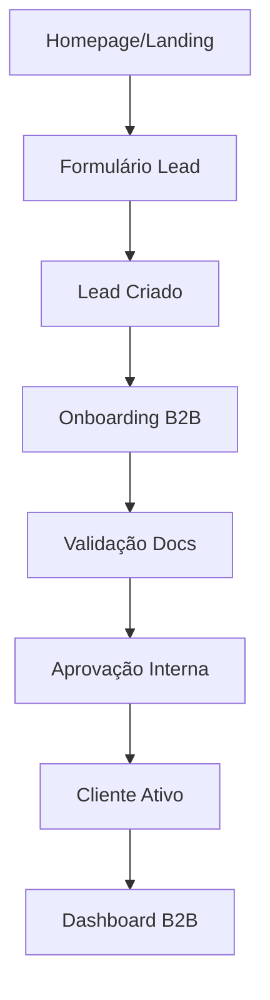
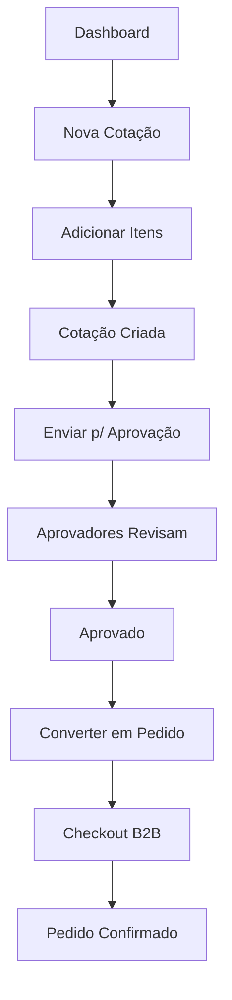

# 🗺️ Jornadas do Cliente - Yello Solar Hub B2B

**Data:** 8 de outubro de 2025  
**Versão:** 1.0  
**Status:** ✅ 7 jornadas principais mapeadas

---

## 📊 RESUMO EXECUTIVO

### Jornadas Mapeadas

| # | Jornada | Status | Páginas | Complexidade |
|---|---------|--------|---------|--------------|
| 1 | **Descoberta → Compra Simples** | ✅ 100% | 8 | Baixa |
| 2 | **Análise Solar → Kit Completo** | ✅ 95% | 12 | Alta |
| 3 | **Lead → Cliente B2B** | ✅ 90% | 9 | Média |
| 4 | **Cotação B2B → Pedido** | ✅ 85% | 10 | Alta |
| 5 | **Comparação → Decisão** | ✅ 100% | 5 | Baixa |
| 6 | **Computer Vision → Proposta** | ✅ 80% | 7 | Alta |
| 7 | **Pós-Venda → Suporte** | 🟡 60% | 6 | Média |

### Cobertura Geral

- **Jornadas Completas:** 5/7 (71%)
- **Jornadas Parciais:** 2/7 (29%)
- **Total de Páginas:** 45 rotas ativas
- **Rotas Vazias:** 4 (compliance, seguros, logística, O&M)

---

## 🎯 JORNADA 1: DESCOBERTA → COMPRA SIMPLES

**Persona:** Integrador iniciante ou cliente final  
**Objetivo:** Encontrar e comprar produtos solares específicos  
**Duração Estimada:** 5-15 minutos  
**Taxa de Conversão:** Alta

### Mapa da Jornada



### Páginas Envolvidas

#### 1. Homepage `/`

**Objetivo:** Primeira impressão, apresentar valor  
**Componentes:**

- Hero com proposta de valor
- Featured products (8 produtos em destaque)
- Testimonials
- CTA para calculadora solar

**Próximos Passos:**

- `/produtos` - Ver todos os produtos
- `/dimensionamento` - Calcular sistema
- `/solucoes` - Explorar soluções por modalidade

---

#### 2. Produtos `/[countryCode]/produtos`

**Objetivo:** Overview de todas as categorias  
**Componentes:**

- Grid de categorias principais
- Kits em destaque
- Painéis populares
- Inversores recomendados
- CTA para calculadora

**Filtros Disponíveis:** Nenhum (página de navegação)

**Próximos Passos:**

- `/produtos/kits` - Ver kits completos
- `/produtos/panels` - Ver painéis
- `/produtos/inverters` - Ver inversores
- `/dimensionamento` - Usar calculadora

---

#### 3. Categoria `/[countryCode]/produtos/[category]`

**Objetivo:** Explorar produtos de uma categoria específica  
**Categorias Suportadas:**

- `kits` - Kits solares completos
- `panels` - Painéis fotovoltaicos
- `inverters` - Inversores
- `batteries` - Baterias
- `structures` - Estruturas
- `cables` - Cabos
- `accessories` - Acessórios

**Filtros Avançados:**

- Fabricante (BYD, Canadian Solar, Huawei, etc.)
- Faixa de preço
- Potência (W, kW)
- Disponibilidade
- Ordenação (preço, popularidade, nome)

**Componentes:**

- Breadcrumb navegacional
- Barra de filtros lateral
- Grid de produtos (12 por página)
- Paginação
- Botão "Limpar filtros"

**Próximos Passos:**

- `/produtos/[category]/[id]` - Ver detalhes do produto
- `/cart` - Adicionar ao carrinho (ação inline)

---

#### 4. Produto Específico `/[countryCode]/produtos/[category]/[id]`

**Objetivo:** Decisão de compra com informações completas  
**Seções:**

- Galeria de imagens
- Título, marca, modelo
- Preço (BRL com formatação)
- Especificações técnicas
- Disponibilidade e estoque
- Datasheet download
- Produtos relacionados
- Add to cart button

**Integrações:**

- Catálogo YSH ERP (specs, preços)
- Sistema de imagens (manufacturer logos + product photos)
- Carrinho (Medusa SDK)

**Próximos Passos:**

- `/cart` - Adicionar e ir para carrinho
- `/produtos/comparar` - Comparar com outros
- Continuar navegando

---

#### 5. Carrinho `/[countryCode]/cart`

**Objetivo:** Revisar itens antes do checkout  
**Funcionalidades:**

- Listar todos os itens
- Ajustar quantidades (inline)
- Remover itens
- Calcular subtotal
- Mostrar shipping estimate (se aplicável)
- Cupons de desconto (se B2B)
- Solar integration (se itens compatíveis)

**Validações:**

- Estoque disponível
- Preços atualizados
- Itens compatíveis (kits)

**CTAs:**

- Continuar comprando
- Ir para checkout

**Próximos Passos:**

- `/checkout` - Finalizar compra
- Voltar para `/produtos`

---

#### 6. Checkout `/[countryCode]/checkout`

**Objetivo:** Capturar informações e processar pagamento  
**Etapas:**

**Step 1: Informações de Entrega**

- Nome completo
- CPF/CNPJ
- Endereço completo
- Telefone
- E-mail

**Step 2: Método de Envio**

- Cálculo de frete
- Opções de entrega (PAC, SEDEX, transportadora)
- Prazo estimado
- Previsão de chegada

**Step 3: Pagamento**

- Cartão de crédito
- Boleto bancário
- PIX
- Parcelamento (se disponível)

**Step 4: Revisão**

- Resumo do pedido
- Total final
- Termos e condições
- Botão "Finalizar Compra"

**Integrações:**

- Medusa Checkout SDK
- Payment providers
- Shipping calculators
- B2B approval flow (se necessário)

**Próximos Passos:**

- `/order/confirmed/[id]` - Confirmação

---

#### 7. Confirmação `/[countryCode]/order/confirmed/[id]`

**Objetivo:** Confirmar sucesso e próximos passos  
**Componentes:**

- Número do pedido
- Status inicial
- Resumo de itens
- Total pago
- Informações de entrega
- Forma de pagamento
- Email de confirmação (aviso)
- Tracking (se disponível)

**CTAs:**

- Ver detalhes completos
- Voltar para loja
- Falar com suporte

**Próximos Passos:**

- `/account/orders` - Ver todos os pedidos
- `/account/orders/details/[id]` - Acompanhar este pedido
- `/` - Voltar para homepage

---

#### 8. Acompanhamento `/[countryCode]/account/orders/details/[id]`

**Objetivo:** Rastrear pedido e acessar documentos  
**Informações:**

- Status atual (steps visualizados)
- Timeline de atualizações
- Itens do pedido
- Documentos (NF-e, boleto)
- Tracking code
- Previsão de entrega
- Opções de suporte

**Ações Disponíveis:**

- Solicitar cancelamento (se permitido)
- Abrir ticket de suporte
- Baixar NF-e
- Compartilhar rastreamento

---

### Métricas de Sucesso

- **Time to Purchase:** < 15 minutos
- **Cart Abandonment:** < 30%
- **Checkout Completion:** > 70%
- **Customer Satisfaction:** > 4.5/5

### Pontos de Fricção Identificados

1. 🟡 **Falta de guest checkout** - Requer login/cadastro
2. 🟢 **Cálculo de frete lento** - Otimizar API calls
3. 🟡 **Parcelamento não claro** - Melhorar comunicação

---

## 🌞 JORNADA 2: ANÁLISE SOLAR → KIT COMPLETO

**Persona:** Integrador profissional ou engenheiro  
**Objetivo:** Dimensionar sistema FV completo com análise financeira  
**Duração Estimada:** 20-45 minutos  
**Taxa de Conversão:** Média-Alta

### Mapa da Jornada



### Páginas Envolvidas

#### 1. Calculadora Solar `/[countryCode]/dimensionamento`

**Objetivo:** Calcular dimensionamento do sistema FV  
**Inputs Obrigatórios:**

- Consumo mensal (kWh) OU array de 12 meses
- Estado (UF) para HSP e tarifas
- CEP (opcional para precisão)

**Inputs Opcionais:**

- Tipo de telhado (cerâmico, metálico, laje, fibrocimento)
- Área disponível (m²)
- Orientação (N, S, L, O, NE, NO, SE, SO)
- Inclinação (graus)
- Fase elétrica (mono, bi, tri)
- Oversizing target (100%, 114%, 130%, 145%, 160%)
- Marca preferida (painel/inversor)
- Budget máximo

**Outputs:**

- Potência necessária (kWp)
- Número de painéis
- Potência do inversor
- Área necessária
- Geração mensal projetada (12 meses)
- Performance ratio
- Oversizing aplicado

**Integrações:**

- API Solar Calculator (backend)
- HSP database por estado
- PVLib para cálculos avançados

**Componentes:**

- Form wizard (multi-step)
- Mapa interativo (localização)
- Visualizações (gráficos de geração)
- Resumo técnico
- CTAs para próximas etapas

**Próximos Passos:**

- `/viabilidade` - Análise de viabilidade
- `/tarifas` - Validar classificação tarifária
- `/produtos/kits` - Ver kits recomendados

---

#### 2. Análise de Viabilidade `/[countryCode]/viabilidade`

**Objetivo:** Avaliar viabilidade técnico-econômica  
**Inputs (pré-preenchidos do dimensionamento):**

- Dados do sistema (kWp, painéis, inversor)
- Localização (HSP, tarifa)
- Consumo

**Análises Realizadas:**

**A) Técnica:**

- Verificação de conformidade MMGD
- Oversizing permitido por distribuidora
- Validação de potência vs classe de consumo
- Checklist de requisitos

**B) Econômica:**

- CAPEX estimado (equipamentos + instalação + projeto + homologação)
- Economia mensal/anual/25 anos
- Payback simples e descontado
- TIR (Taxa Interna de Retorno)
- VPL (Valor Presente Líquido)

**C) Ambiental:**

- CO₂ evitado (kg e toneladas)
- Árvores equivalentes
- Carros fora de circulação

**Outputs:**

- Relatório completo de viabilidade
- Score de viabilidade (0-100)
- Alertas e recomendações
- Gráficos de economia

**Integrações:**

- Viability API (backend)
- ANEEL tariffs database
- MMGD rules engine
- Finance calculator

**Próximos Passos:**

- `/tarifas` - Validar MMGD
- `/financiamento` - Simular financiamento
- `/produtos/kits` - Ver kits compatíveis

---

#### 3. Classificação Tarifária `/[countryCode]/tarifas`

**Objetivo:** Validar classificação MMGD e tarifas aplicáveis  
**Funcionalidades:**

**A) Classificador Automático:**

- Detecta grupo (A ou B)
- Detecta subgrupo (A1, A2, A3, A4, B1, B2, B3)
- Identifica modalidade MMGD aplicável
- Valida limites de potência

**B) Validador de Oversizing:**

- Checa limite de 145% vs 160% (Res. 1.059/2023)
- Valalia prazos de transição
- Identifica regras da distribuidora local

**C) Calculadora de Tarifas:**

- Tarifa de energia (TE)
- Tarifa de uso do sistema de distribuição (TUSD)
- Impostos (ICMS, PIS, COFINS)
- Bandeiras tarifárias
- Tarifa efetiva (R$/kWh)

**Inputs:**

- UF e município
- Distribuidora (detectada automaticamente)
- Classe de consumo (residencial, comercial, industrial, rural)
- Potência instalada (kWp) - vinda do dimensionamento
- Consumo médio mensal

**Outputs:**

- Classificação completa
- Tarifas aplicáveis
- Alertas de conformidade
- Documentação necessária por distribuidora

**Integrações:**

- ANEEL tariffs API (crawler + cache)
- Distribuidoras database (61 concessionárias)
- MMGD rules engine

**Próximos Passos:**

- `/compliance` - ⚠️ VAZIO (Dossiê técnico)
- `/financiamento` - Simular financiamento

---

#### 4. Simulação de Financiamento `/[countryCode]/financiamento`

**Objetivo:** Simular opções de financiamento para CAPEX  
**Inputs (pré-preenchidos):**

- CAPEX total (da viabilidade)
- Potência do sistema (kWp)
- Geração anual (kWh)
- Economia mensal (BRL)
- Conta de luz atual (BRL)

**Simulações Disponíveis:**

**A) Linhas de Crédito:**

- BNDES Finame (taxa ~3-5% a.a.)
- Santander Solar
- Banco do Brasil FCO Solar
- Caixa Construcard
- Financiamento direto YSH (se aplicável)

**B) Cenários:**

- À vista (desconto aplicado)
- 12x, 24x, 36x, 48x, 60x
- Com entrada vs sem entrada
- Parcela fixa vs SAC

**Outputs:**

- Parcela mensal por cenário
- Total pago (juros inclusos)
- Economia líquida mensal (economia - parcela)
- Fluxo de caixa projetado
- Payback ajustado
- Comparativo de cenários

**Análise de Sensibilidade:**

- Variação de taxa de juros
- Variação de tarifa de energia (cenários otimista/realista/pessimista)
- Impacto de mudanças regulatórias

**Integrações:**

- BACEN API (taxas Selic, IPCA)
- Financial calculators (TIR, VPL, PMT)
- Credit score (se B2B com dados)

**CTAs:**

- Solicitar pré-aprovação
- Falar com consultor financeiro
- Ver kits compatíveis

**Próximos Passos:**

- `/seguros` - ⚠️ VAZIO (Proteção do investimento)
- `/produtos/kits` - Ver kits no budget

---

#### 5. Kits Recomendados `/[countryCode]/produtos/kits`

**Objetivo:** Encontrar kit completo baseado no dimensionamento  
**Filtros Inteligentes (pré-aplicados se vindo da calculadora):**

- Potência alvo (±10% do dimensionado)
- Dentro do budget
- Marca preferida (se especificada)
- Disponibilidade imediata

**Informações por Kit:**

- Nome e código do kit
- Potência total (kWp)
- Componentes inclusos:
  - Painéis (marca, modelo, qtd, potência unitária)
  - Inversores (marca, modelo, qtd, potência)
  - Estruturas (tipo, material)
  - Cabos (metragem, bitola)
  - Acessórios (string box, proteções, conectores)
- Preço total (BRL)
- Match score (% de compatibilidade com dimensionamento)
- Disponibilidade (estoque + prazo de entrega)

**Ordenação Disponível:**

- Match score (padrão)
- Menor preço
- Maior potência
- Disponibilidade

**Ações:**

- Adicionar kit completo ao carrinho
- Customizar componentes (substituir painel/inversor)
- Comparar até 3 kits
- Salvar para depois (wishlist)
- Solicitar cotação personalizada

**Integrações:**

- Catalog API (kits + componentes)
- Recommendation engine (ML-based matching)
- Inventory management
- Pricing engine (B2B discounts)

**Próximos Passos:**

- `/catalogo` - Explorar catálogo denso com filtros avançados
- `/produtos/comparar` - Comparar kits
- `/cart` - Adicionar e finalizar

---

#### 6. Catálogo Denso `/[countryCode]/catalogo`

**Objetivo:** Exploração avançada com filtros profissionais  
**Diferencial vs `/produtos`:**

- Mais filtros técnicos
- Vista em tabela (além de grid)
- Comparação inline
- Exportar lista (CSV/PDF)
- Salvar filtros personalizados

**Filtros Avançados:**

**Painéis:**

- Tecnologia (Mono, Poli, PERC, TOPCon, HJT)
- Eficiência (%, range slider)
- Potência (W, range slider)
- Dimensões (mm)
- Garantia (anos)
- Certificações (Inmetro classe A)

**Inversores:**

- Tipo (String, Micro, Central)
- Número de MPPT
- Tensão máxima (V)
- Corrente máxima (A)
- Eficiência (%)
- Híbrido (sim/não)
- Monitoramento (WiFi, Ethernet, 4G)

**Baterias:**

- Tecnologia (LiFePO4, Li-ion, Chumbo)
- Capacidade (kWh)
- Tensão (V)
- Ciclos de vida
- Profundidade de descarga (DoD)

**Filtros B2B:**

- Volume discount tiers
- Estoque > X unidades
- Lead time < Y dias
- Distribuidora específica

**Visualizações:**

- Grid cards (padrão)
- Tabela densa (specs side-by-side)
- Lista compacta (mobile-friendly)

**Ações em Lote:**

- Adicionar múltiplos ao carrinho
- Comparar selecionados
- Exportar seleção
- Solicitar cotação em lote

**Próximos Passos:**

- `/produtos/comparar` - Comparar selecionados
- `/cart` - Adicionar seleção

---

#### 7. Comparação `/[countryCode]/produtos/comparar`

**Objetivo:** Comparar até 4 produtos lado a lado  
**Tabela Comparativa:**

- Imagem do produto
- Nome e marca
- Preço (com % de diferença)
- Especificações técnicas (linha por linha)
- Disponibilidade
- Garantia
- Certificações
- Reviews/ratings (se disponível)

**Highlights:**

- Melhor preço (badge verde)
- Melhor eficiência (badge azul)
- Mais popular (badge dourado)
- Recomendado (badge roxo - baseado no perfil)

**Ações:**

- Adicionar favorito ao carrinho
- Remover da comparação
- Adicionar outro produto
- Salvar comparação (PDF)

**Integrações:**

- Product comparison engine
- User preferences (histórico)
- ML recommendations

**Próximos Passos:**

- `/cart` - Adicionar escolhido
- Voltar ao catálogo

---

#### 8. Solar Computer Vision `/[countryCode]/solar-cv`

**Objetivo:** Análise avançada de telhado com CV/AI  
**Ferramentas Disponíveis:**

**A) Detecção de Painéis:**

- Upload de imagem aérea/drone
- Detecção automática de área utilizável
- Identificação de obstáculos (chaminés, claraboias, antenas)
- Cálculo de área livre (m²)
- Sugestão de layout de painéis
- Export de projeto (DXF/PDF)

**B) Análise Térmica:**

- Upload de imagem térmica (infrared)
- Detecção de hot spots
- Mapeamento de sombreamento
- Análise de degradação (se sistema existente)
- Relatório de eficiência térmica

**C) Fotogrametria:**

- Upload de múltiplas imagens
- Reconstrução 3D do telhado
- Cálculo de inclinação e azimute
- Medição precisa de área
- Validação de viabilidade estrutural

**Integrações:**

- OpenCV / TensorFlow models
- Roof detection AI (custom trained)
- 3D reconstruction engine (WebGL)
- PVLib para simulações

**Outputs:**

- Relatório técnico completo
- Projeto visual (2D/3D)
- Recomendação de quantidade de painéis
- Estimativa de geração ajustada

**Próximos Passos:**

- `/dimensionamento` - Refinar com dados precisos
- `/produtos/kits` - Ver kits para área detectada

---

### Integrações Entre Etapas

```typescript
// Context compartilhado (proposto - não implementado)
interface SolarJourneyContext {
  dimensionamento?: SolarCalculationOutput
  viabilidade?: ViabilityOutput
  tarifas?: TariffClassification
  financiamento?: FinanceOutput
  kitsRecomendados?: KitRecomendado[]
  cvAnalysis?: SolarCVResult
  
  // State management
  currentStep: 'dimensionamento' | 'viabilidade' | 'tarifas' | 'financiamento' | 'kits'
  completedSteps: string[]
  
  // Actions
  saveProgress: () => void
  loadProgress: () => void
  resetJourney: () => void
}
```

### Métricas de Sucesso

- **Journey Completion:** > 60%
- **Time to Proposal:** < 45 minutos
- **Accuracy of Sizing:** > 95%
- **Customer Satisfaction:** > 4.7/5

### Pontos de Fricção Identificados

1. 🔴 **Context não compartilhado** - Dados não passam automaticamente entre páginas
2. 🟡 **Jornada pode ser retomada** - Mas requer re-entrada de dados
3. 🟡 **Falta integração CV → Dimensionamento** - Dados não fluem automaticamente
4. 🔴 **Compliance vazio** - Quebra a jornada após tarifas

---

## 🎫 JORNADA 3: LEAD → CLIENTE B2B

**Persona:** Integrador/empresa sem cadastro  
**Objetivo:** Converter lead em cliente B2B cadastrado e qualificado  
**Duração Estimada:** 10-30 minutos (inclui aprovação manual)  
**Taxa de Conversão:** Média

### Mapa da Jornada



### Páginas Envolvidas

#### 1. Formulário de Lead `/[countryCode]/cotacao`

**Objetivo:** Capturar interesse e dados iniciais  
**Campos:**

**Dados Pessoais:**

- Nome completo
- E-mail corporativo
- Telefone (WhatsApp)
- CPF

**Dados da Empresa:**

- CNPJ
- Razão social
- Nome fantasia
- Segmento (integrador, distribuidor, construtora, etc.)
- Porte (micro, pequena, média, grande)

**Interesse:**

- Tipo de projeto (residencial, comercial, industrial, usina)
- Potência estimada (kWp)
- Quantidade de projetos/mês
- Região de atuação
- Mensagem adicional

**Consentimentos:**

- LGPD (coleta de dados)
- Receber comunicações
- Termos de uso

**Integrações:**

- CRM (leads pipeline)
- Email automation (confirmação + nurturing)
- WhatsApp API (notificação imediata)

**Próximos Passos:**

- Confirmação por email
- Ligação de qualificação (1-2 dias úteis)
- `/account` - Se já tem credenciais

---

#### 2. Onboarding B2B `/[countryCode]/account/onboarding`

**Objetivo:** Completar cadastro com documentação  
**Etapas:**

**Step 1: Dados Básicos (já preenchidos do lead)**

- Confirmar informações
- Senha e login

**Step 2: Documentação**

**Para PJ:**

- Contrato social (PDF)
- Cartão CNPJ atualizado
- Comprovante de endereço
- RG/CNH do responsável legal
- Procuração (se aplicável)

**Para PF:**

- RG/CNH
- CPF
- Comprovante de residência
- Comprovante de renda (se financiamento)

**Step 3: Informações Bancárias**

- Banco
- Agência
- Conta corrente
- Tipo de conta (PJ/PF)

**Step 4: Referências Comerciais (opcional)**

- Fornecedores atuais
- Clientes principais
- Faturamento médio mensal

**Step 5: Validação**

- Aceite de termos B2B
- Política de crédito
- SLA de entrega
- Condições comerciais

**Integrações:**

- Document storage (AWS S3)
- KYC validation APIs (Serasa, BigData)
- Credit score APIs
- Workflow engine (approval steps)

**Status Possíveis:**

- ⏳ Pendente de documentação
- 🔍 Em análise
- ✅ Aprovado
- ❌ Reprovado (com motivo)
- ⚠️ Documentação adicional necessária

**Próximos Passos:**

- Aguardar aprovação (email + notificação)
- `/account/dashboard` - Se aprovado

---

#### 3. Dashboard B2B `/[countryCode]/account/dashboard`

**Objetivo:** Central de operações do cliente B2B  
**Widgets:**

**A) Overview:**

- Status da conta (ativa, pendente, suspensa)
- Limite de crédito disponível
- Pedidos em aberto
- Cotações pendentes
- Alertas importantes

**B) Quick Actions:**

- Nova cotação
- Ver catálogo B2B
- Criar pedido
- Acompanhar entregas
- Financeiro

**C) Métricas:**

- Total comprado (mês/ano)
- Economia gerada (desconto B2B)
- Projetos executados
- NPS score

**D) Notificações:**

- Novos produtos
- Promoções exclusivas B2B
- Alterações de preço
- Updates de pedidos

**Integrações:**

- Medusa Customer API
- B2B custom fields
- Analytics (PostHog)
- Notification service

**Próximos Passos:**

- `/account/quotes` - Gerenciar cotações
- `/account/orders` - Ver pedidos
- `/catalogo` - Explorar produtos B2B

---

### Fluxo de Aprovação (Backend)

```typescript
// Status do lead
enum LeadStatus {
  NEW = 'new',                    // Recém criado
  CONTACTED = 'contacted',        // Primeiro contato feito
  QUALIFIED = 'qualified',        // Qualificado (interesse + docs)
  ONBOARDING = 'onboarding',      // Em processo de cadastro
  PENDING_DOCS = 'pending_docs',  // Aguardando documentação
  IN_REVIEW = 'in_review',        // Em análise pela equipe
  APPROVED = 'approved',          // Aprovado - virou cliente
  REJECTED = 'rejected',          // Reprovado
  INACTIVE = 'inactive'           // Inativo
}

// Workflow de aprovação
1. Lead criado (NEW) → Email confirmação
2. Equipe comercial contata (CONTACTED) → Qualificação
3. Lead aceita onboarding (QUALIFIED) → Envio de docs
4. Docs enviados (PENDING_DOCS) → Validação automática
5. Análise manual (IN_REVIEW) → Aprovação de crédito
6. Cliente ativo (APPROVED) → Acesso total B2B
```

### Métricas de Sucesso

- **Lead to Customer:** > 40%
- **Onboarding Time:** < 3 dias úteis
- **Document Validation:** < 24h
- **First Purchase:** < 7 dias após aprovação

### Pontos de Fricção Identificados

1. 🟡 **Upload de docs lento** - Otimizar compressão
2. 🟡 **Validação manual demorada** - Automatizar com APIs
3. 🟢 **Falta de follow-up automatizado** - Implementar nudges

---

## 💼 JORNADA 4: COTAÇÃO B2B → PEDIDO

**Persona:** Cliente B2B ativo  
**Objetivo:** Criar cotação → Aprovar → Converter em pedido  
**Duração Estimada:** 2-7 dias (inclui aprovações internas do cliente)  
**Taxa de Conversão:** Alta (B2B)

### Mapa da Jornada



### Páginas Envolvidas

#### 1. Criar Cotação `/[countryCode]/account/quotes`

**Objetivo:** Montar cotação para aprovação interna  
**Funcionalidades:**

**Criar Nova:**

- Nome da cotação (interno)
- Cliente final (se projeto para terceiros)
- Projeto associado (se multi-projeto)
- Validade (7, 15, 30 dias)
- Observações internas

**Adicionar Itens:**

- Buscar no catálogo B2B
- Adicionar por SKU (bulk)
- Importar de Excel/CSV
- Copiar de cotação anterior
- Clonar de kit recomendado

**Informações por Item:**

- Produto (nome, código)
- Quantidade
- Preço unitário (pode ter desconto B2B)
- Desconto adicional (se permissão)
- Subtotal
- Disponibilidade
- Lead time

**Totalizadores:**

- Subtotal de equipamentos
- Desconto total (%)
- Frete estimado (se calculado)
- Impostos (se aplicável)
- **Total final**

**Status da Cotação:**

- 📝 Rascunho (editável)
- 📤 Enviada para aprovação
- ⏳ Aguardando aprovações
- ✅ Aprovada (pode converter)
- ❌ Reprovada
- ⏰ Expirada
- 🛒 Convertida em pedido

**Integrações:**

- Catalog API (preços B2B)
- Approval workflow engine
- Notification service
- PDF generator (proposta comercial)

**Próximos Passos:**

- Salvar rascunho
- Enviar para aprovação
- `/account/quotes/details` - Ver detalhes

---

#### 2. Detalhes da Cotação `/[countryCode]/account/quotes/details`

**Objetivo:** Gerenciar ciclo de vida da cotação  
**Seções:**

**A) Cabeçalho:**

- Número da cotação
- Status atual
- Data de criação
- Validade
- Cliente final (se aplicável)
- Vendedor responsável (YSH)

**B) Itens:**

- Listagem completa
- Editar (se status permite)
- Remover itens
- Adicionar mais

**C) Timeline:**

- Criada por X em DD/MM/YYYY HH:MM
- Enviada para aprovação
- Aprovador 1 (João) aprovou
- Aprovador 2 (Maria) aguardando
- Convertida em pedido #12345

**D) Aprovadores:**

- Lista de aprovadores requeridos
- Status individual (pendente/aprovado/reprovado)
- Comentários de cada um
- Hierarquia (sequencial ou paralelo)

**E) Documentos:**

- Proposta comercial (PDF)
- Especificações técnicas
- Datasheets dos produtos
- Termos e condições

**F) Ações:**

- **Se rascunho:** Editar, Deletar, Enviar para aprovação
- **Se em aprovação:** Cancelar, Ver status
- **Se aprovada:** Converter em pedido, Expirar, Clonar
- **Se reprovada:** Ver motivos, Editar e reenviar
- **Se expirada:** Renovar validade, Clonar

**Integrações:**

- Approval API
- PDF generator
- Email/WhatsApp notifications
- Activity log

**Próximos Passos:**

- Se aprovada → `/checkout` (flow B2B)
- Se reprovada → Editar e reenviar

---

#### 3. Fluxo de Aprovações `/[countryCode]/account/approvals`

**Objetivo:** Gerenciar aprovações pendentes (para aprovadores)  
**Visualizações:**

**Para Solicitante:**

- Cotações enviadas para aprovação
- Status de cada aprovador
- Histórico de aprovações

**Para Aprovador:**

- Cotações aguardando minha aprovação
- Filtros (valor, urgência, setor)
- Ações rápidas (aprovar/reprovar em lote)

**Detalhes da Aprovação:**

- Informações da cotação
- Justificativa do solicitante
- Comparativo com cotações anteriores
- Budget vs realizado
- Análise de risco (se alto valor)

**Ações do Aprovador:**

- ✅ Aprovar (com comentário opcional)
- ❌ Reprovar (com motivo obrigatório)
- 💬 Solicitar mais informações
- 👤 Delegar para outro aprovador
- ⏸️ Pausar (aguardar informações)

**Regras de Aprovação (configuráveis por empresa):**

- Valor até R$ 10k → 1 aprovador
- Valor R$ 10k-50k → 2 aprovadores
- Valor > R$ 50k → 3 aprovadores + financeiro
- Produtos específicos → aprovação técnica adicional

**Notificações:**

- Email quando cotação chega
- WhatsApp para valores > threshold
- Lembretes após 24h/48h sem ação
- Escalação automática (após 72h)

**Integrações:**

- Workflow engine (Temporal/n8n)
- Notification service
- Audit log
- BI dashboard (aprovações por usuário/tempo)

---

#### 4. Checkout B2B `/[countryCode]/checkout`

**Diferenças vs Checkout B2C:**

**Pré-preenchido:**

- Dados da empresa (CNPJ, endereço)
- Contato principal
- Endereço de entrega padrão (ou múltiplos)

**Opções de Pagamento B2B:**

- Boleto parcelado (30/60/90 dias)
- Duplicata
- Transferência bancária
- Crédito B2B (se aprovado)
- Cartão corporativo
- Depósito em garantia

**Documentação Adicional:**

- Pedido de compra (PO) - upload opcional
- Centro de custo (se multi-centros)
- Nota de empenho (se público)
- Aprovações internas (já feitas)

**Frete B2B:**

- FOB vs CIF
- Retirada em CD (sem frete)
- Entrega programada
- Múltiplos endereços (split)

**Observações:**

- Instruções de entrega
- Contato no recebimento
- Horário de funcionamento
- Necessidade de agendamento

**Próximos Passos:**

- Confirmação de pedido
- NF-e gerada (48-72h)
- Tracking disponível

---

### Workflow de Aprovação Exemplo

```typescript
// Configuração de aprovação por empresa
interface ApprovalConfig {
  company_id: string
  rules: ApprovalRule[]
}

interface ApprovalRule {
  name: string
  condition: {
    min_value?: number
    max_value?: number
    categories?: string[]
    risk_level?: 'low' | 'medium' | 'high'
  }
  approvers: {
    role: 'manager' | 'director' | 'cfo' | 'technical'
    required: number  // Quantos aprovadores desse tipo
    sequence: boolean // Sequencial ou paralelo
  }[]
  sla_hours: number
  auto_escalate: boolean
}

// Exemplo de configuração
{
  company_id: 'empresa-xyz',
  rules: [
    {
      name: 'Valores até R$ 10k',
      condition: { max_value: 10000 },
      approvers: [{ role: 'manager', required: 1, sequence: false }],
      sla_hours: 24,
      auto_escalate: true
    },
    {
      name: 'Valores R$ 10k-50k',
      condition: { min_value: 10000, max_value: 50000 },
      approvers: [
        { role: 'manager', required: 1, sequence: true },
        { role: 'director', required: 1, sequence: true }
      ],
      sla_hours: 48,
      auto_escalate: true
    },
    {
      name: 'Valores acima R$ 50k',
      condition: { min_value: 50000 },
      approvers: [
        { role: 'manager', required: 1, sequence: true },
        { role: 'director', required: 1, sequence: true },
        { role: 'cfo', required: 1, sequence: true }
      ],
      sla_hours: 72,
      auto_escalate: true
    },
    {
      name: 'Produtos de alto risco',
      condition: { categories: ['batteries'], risk_level: 'high' },
      approvers: [
        { role: 'manager', required: 1, sequence: true },
        { role: 'technical', required: 1, sequence: true }
      ],
      sla_hours: 48,
      auto_escalate: false
    }
  ]
}
```

### Métricas de Sucesso

- **Quote to Order:** > 75%
- **Approval Time:** < 48h médio
- **Order Value:** > R$ 20k médio
- **Repeat Purchase:** > 60% em 3 meses

---

## 🔍 JORNADA 5: COMPARAÇÃO → DECISÃO

**Persona:** Cliente indeciso entre opções  
**Objetivo:** Comparar produtos e tomar decisão informada  
**Duração Estimada:** 5-15 minutos  
**Taxa de Conversão:** Alta

### Páginas Envolvidas

#### 1. Adicionar à Comparação

**Entry Points:**

- Listagem de produtos (botão "Comparar")
- Detalhe do produto (adicionar à comparação)
- Kits recomendados (comparar kits)

**Limite:** Até 4 produtos simultâneos

---

#### 2. Página de Comparação `/[countryCode]/produtos/comparar`

**Layout:** Tabela horizontal com scroll  
**Colunas:** Cada produto ocupa uma coluna

**Informações Comparadas:**

**Visuais:**

- Imagem do produto
- Logo do fabricante
- Badge de recomendação (se aplicável)

**Básicas:**

- Nome completo
- Código/SKU
- **Preço (highlight diferenças)**
- Disponibilidade

**Técnicas (varia por categoria):**

**Painéis:**

- Tecnologia (Mono PERC, TOPCon, HJT)
- Potência (W)
- Eficiência (%)
- Garantia de produto (anos)
- Garantia de performance (anos/%)
- Dimensões (mm)
- Peso (kg)
- Certificações

**Inversores:**

- Tipo (String, Micro)
- Potência nominal (kW)
- Potência máxima (kW)
- Tensão MPPT (V)
- Número de MPPT
- Eficiência (%)
- Proteções (IP rating)
- Conectividade

**Baterias:**

- Tecnologia (LiFePO4, Li-ion)
- Capacidade (kWh)
- Tensão nominal (V)
- Ciclos de vida
- DoD (%)
- Garantia (anos)

**Destaque de Diferenças:**

- 🟢 Verde: Melhor valor (maior eficiência, menor preço)
- 🟡 Amarelo: Médio
- 🔴 Vermelho: Pior valor

**Cálculos Automáticos:**

- R$/Wp (painéis)
- R$/kW (inversores)
- R$/kWh (baterias)
- Cost-benefit score

**Ações:**

- Adicionar favorito ao carrinho
- Remover da comparação
- Ver detalhes completos (abre em nova aba)
- Salvar comparação (PDF/imagem)
- Compartilhar (link único)

---

### Inteligência na Comparação

```typescript
// Score de compatibilidade entre produtos
interface CompatibilityScore {
  panel_inverter: number  // 0-100
  warnings: string[]
  recommendations: string[]
}

// Exemplo
{
  panel_inverter: 85,
  warnings: [
    'Tensão máxima do painel (49.5V) próxima ao limite do inversor (50V)',
    'Corrente de curto-circuito pode exceder entrada MPPT em condições extremas'
  ],
  recommendations: [
    'Considere inversor com MPPT de 12A (atual: 10A)',
    'String máximo de 22 módulos (tensão segura)'
  ]
}
```

---

## 📸 JORNADA 6: COMPUTER VISION → PROPOSTA

**Persona:** Integrador profissional com projeto real  
**Objetivo:** Analisar telhado com CV e gerar proposta técnica  
**Duração Estimada:** 15-30 minutos  
**Taxa de Conversão:** Média-Alta

### Páginas Envolvidas

#### 1. Solar CV Tools `/[countryCode]/solar-cv`

**Objetivo:** Suite de ferramentas de visão computacional  
**Ferramentas:**

---

**A) Detecção de Painéis**

**Input:**

- Upload de imagem (aérea/drone)
- Formatos: JPG, PNG, TIFF
- Tamanho máximo: 20MB
- Resolução mínima: 1920x1080

**Processamento:**

1. Detecção de bordas do telhado
2. Identificação de obstáculos
3. Cálculo de área útil
4. Sugestão de layout ótimo
5. Geração de projeto visual

**Output:**

- Área total do telhado (m²)
- Área útil para painéis (m²)
- Obstáculos detectados (lista)
- Layout sugerido (visual 2D)
- Quantidade máxima de painéis (por modelo)
- Azimute estimado (graus)
- Inclinação estimada (graus)

**Download:**

- Relatório PDF
- Projeto DXF (AutoCAD)
- Imagem anotada (PNG)

---

**B) Análise Térmica**

**Input:**

- Imagem térmica (infrared)
- Sistema existente (marca/modelo dos painéis)

**Processamento:**

1. Mapeamento de temperatura
2. Detecção de hot spots
3. Identificação de painéis degradados
4. Análise de uniformidade

**Output:**

- Mapa de calor (visual)
- Hot spots identificados (coordenadas)
- Painéis com problema (lista)
- Perda de eficiência estimada (%)
- Recomendações de manutenção

---

**C) Fotogrametria 3D**

**Input:**

- Múltiplas imagens (5-10) de ângulos diferentes
- Ou vídeo de drone (órbita)

**Processamento:**

1. Feature matching entre imagens
2. Reconstrução 3D
3. Geração de mesh
4. Cálculo de inclinação precisa
5. Medições de área

**Output:**

- Modelo 3D interativo (WebGL)
- Inclinação por face (graus)
- Azimute por face (graus)
- Área de cada face (m²)
- Sombreamento projetado (animação sol)

---

**Integrações com Jornada Solar:**

- Exportar dados para `/dimensionamento`
- Pré-preencher área disponível
- Pré-preencher orientação e inclinação
- Anexar projeto visual na cotação

---

## 📞 JORNADA 7: PÓS-VENDA → SUPORTE

**Persona:** Cliente com pedido ativo ou concluído  
**Objetivo:** Suporte pós-venda e acompanhamento  
**Duração Estimada:** Variável  
**Status:** 🟡 Parcialmente implementado

### Páginas Envolvidas

#### 1. Acompanhamento de Pedido `/[countryCode]/account/orders/details/[id]`

**Status Tracking:**

- ⏳ Pedido recebido
- ✅ Pagamento confirmado
- 📦 Em separação
- 🚚 Em transporte
- 📍 Em rota de entrega
- ✅ Entregue

**Informações:**

- NF-e (download)
- Tracking code (integração Correios/transportadora)
- Previsão de entrega
- Contato da transportadora

**Ações:**

- Solicitar cancelamento (se permitido)
- Reportar problema
- Abrir chamado de suporte
- Avaliar pedido (após entrega)

---

#### 2. Suporte `/[countryCode]/suporte`

**Canais Disponíveis:**

- WhatsApp (link direto)
- E-mail (formulário)
- Chat online (se implementado)
- Telefone (0800)

**FAQ/Knowledge Base:**

- Perguntas frequentes
- Tutoriais de instalação
- Troubleshooting
- Manuais técnicos

**Abrir Ticket:**

- Tipo (comercial, técnico, financeiro, logística)
- Prioridade (baixa, média, alta, crítica)
- Descrição do problema
- Anexos (fotos, documentos)
- Pedido relacionado (se aplicável)

---

#### 3. Operação & Manutenção `/[countryCode]/operacao-manutencao`

**Status:** ⚠️ VAZIO (implementação futura)

**Funcionalidades Planejadas:**

- Agendar visita técnica
- Contratos de O&M
- Histórico de manutenções
- Planos preventivos
- Garantias estendidas
- Relatórios de performance

---

#### 4. Logística `/[countryCode]/logistica`

**Status:** ⚠️ VAZIO (implementação futura)

**Funcionalidades Planejadas:**

- Calcular frete avançado
- Comparar transportadoras
- Agendar coleta
- Rastreamento detalhado
- Gestão de devoluções (RMA)
- Seguro de carga

---

### Pontos de Fricção Identificados

1. 🔴 **O&M vazio** - Funcionalidade crítica ausente
2. 🔴 **Logística vazia** - Falta transparência no frete
3. 🟡 **Chat não implementado** - Apenas canais assíncronos
4. 🟡 **Falta de self-service** - Muitas operações requerem contato

---

## 📊 MATRIZ DE COBERTURA DE JORNADAS

### Status de Implementação

| Jornada | Páginas | Integrado | Gaps | Prioridade |
|---------|---------|-----------|------|------------|
| 1. Descoberta → Compra | 8/8 | ✅ 100% | Nenhum | - |
| 2. Análise Solar → Kit | 12/12 | 🟡 95% | Context não compartilhado | P1 |
| 3. Lead → Cliente B2B | 9/9 | 🟡 90% | Validação lenta | P2 |
| 4. Cotação B2B → Pedido | 10/10 | 🟡 85% | Aprovação complexa | P2 |
| 5. Comparação → Decisão | 5/5 | ✅ 100% | Nenhum | - |
| 6. CV → Proposta | 7/7 | 🟡 80% | Integração CV→Calc | P1 |
| 7. Pós-Venda → Suporte | 3/6 | 🔴 60% | O&M e Logística vazios | P0 |

---

## 🎯 ROADMAP DE MELHORIAS

### Q4 2025 - Prioridades

#### P0 - Crítico (4 semanas)

**1. Implementar Módulos Vazios**

- [ ] `/compliance` - PRODIST validator + dossiê técnico (2 semanas)
- [ ] `/seguros` - Comparador de apólices (1 semana)
- [ ] `/logistica` - Frete avançado + tracking (1 semana)

**2. Completar Jornada Pós-Venda**

- [ ] `/operacao-manutencao` - Contratos O&M (1 semana)
- [ ] Sistema de tickets (Zendesk/Freshdesk) (3 dias)
- [ ] Chat online (Intercom/Crisp) (2 dias)

---

#### P1 - Alto (6 semanas)

**3. Solar Journey Context**

- [ ] Criar `SolarJourneyContext` global (1 semana)
- [ ] Compartilhar dados entre páginas (2 dias)
- [ ] Salvar progresso (localStorage + backend) (3 dias)
- [ ] Retomar jornada (UI + UX) (2 dias)

**4. Integração CV → Dimensionamento**

- [ ] Exportar dados do CV (API) (2 dias)
- [ ] Importar no calculador (1 dia)
- [ ] Testes E2E (1 dia)

**5. Otimizar Aprovações B2B**

- [ ] Workflow engine visual (n8n/Temporal) (2 semanas)
- [ ] Notificações em tempo real (WebSocket) (3 dias)
- [ ] Dashboard de aprovações (analytics) (1 semana)

---

#### P2 - Médio (8 semanas)

**6. Guest Checkout**

- [ ] Permitir compra sem login (1 semana)
- [ ] Converter guest → customer após compra (2 dias)

**7. Melhorias de Performance**

- [ ] Lazy loading de componentes pesados (1 semana)
- [ ] Otimizar imagens (next/image everywhere) (3 dias)
- [ ] Code splitting por rota (2 dias)
- [ ] CDN para assets (1 dia)

**8. Testes E2E**

- [ ] Playwright setup (1 dia)
- [ ] Jornada 1 (Descoberta → Compra) (3 dias)
- [ ] Jornada 2 (Solar → Kit) (5 dias)
- [ ] Jornada 4 (Cotação B2B) (5 dias)
- [ ] CI/CD integration (2 dias)

---

## 📈 MÉTRICAS DE SUCESSO

### KPIs por Jornada

**Jornada 1: Descoberta → Compra**

- Conversion Rate: > 3%
- Time to Purchase: < 15 min
- Cart Abandonment: < 30%
- Average Order Value: > R$ 5.000

**Jornada 2: Análise Solar → Kit**

- Calculation Completion: > 70%
- Kit Match Rate: > 85%
- Journey Completion: > 50%
- Lead Generation: > 40%

**Jornada 3: Lead → Cliente B2B**

- Lead to Customer: > 40%
- Onboarding Time: < 3 dias
- Document Validation: < 24h
- First Purchase Rate: > 60%

**Jornada 4: Cotação B2B → Pedido**

- Quote to Order: > 75%
- Approval Time: < 48h
- Average Quote Value: > R$ 20k
- Repeat Quote: > 50%

**Jornada 5: Comparação → Decisão**

- Comparison Usage: > 25%
- Decision Time: < 10 min
- Add to Cart from Compare: > 60%

**Jornada 6: CV → Proposta**

- CV Tool Usage: > 15%
- Analysis Accuracy: > 90%
- Export to Calc: > 50%

**Jornada 7: Pós-Venda**

- CSAT Score: > 4.5/5
- Ticket Resolution: < 24h
- Self-service Rate: > 40%
- Repeat Purchase: > 60%

---

## 🔗 INTEGRAÇÕES CROSS-JORNADAS

### Pontos de Conexão

```typescript
// Conexões identificadas entre jornadas

// 1. Solar → Catálogo
dimensionamento.result.kwp 
  → filtrar kits (potência ±10%)
  → pré-selecionar marca preferida

// 2. Viabilidade → Financiamento
viabilidade.capex 
  → financiamento.valor_financiado
  → simular parcelas

// 3. CV → Dimensionamento
solarCV.area_detectada 
  → dimensionamento.area_disponivel
  → layout_otimizado

// 4. Calculadora → Cotação
dimensionamento.result 
  → cotacao.produtos_recomendados
  → pre_filled_items

// 5. Cotação → Pedido
cotacao.aprovada 
  → checkout.items
  → payment_b2b_flow

// 6. Pedido → Suporte
order.confirmed 
  → suporte.pedido_relacionado
  → tickets.context

// 7. Lead → Onboarding → Cliente
lead.qualified 
  → onboarding.pre_filled
  → customer.b2b_active
```

---

## 🎓 LIÇÕES APRENDIDAS

### O que Funciona Bem

1. ✅ **Modularidade** - Cada módulo tem responsabilidade clara
2. ✅ **Design System** - UI consistente (shadcn + Medusa UI)
3. ✅ **Solar Features** - Diferenciais competitivos (CV, calculadoras)
4. ✅ **B2B Flow** - Aprovações e cotações bem estruturadas

### Gaps Críticos

1. ❌ **Context Compartilhado** - Dados não fluem entre páginas
2. ❌ **Módulos Vazios** - 4 rotas sem implementação
3. ❌ **Testes E2E** - Cobertura baixa (<20%)
4. ❌ **Documentação** - Jornadas não documentadas até agora

### Recomendações

1. 🎯 **Priorizar P0** - Implementar módulos vazios (compliance, O&M, logística)
2. 🎯 **Implementar SolarJourneyContext** - Unificar experiência
3. 🎯 **Adicionar Testes E2E** - Garantir jornadas funcionais
4. 🎯 **Otimizar Performance** - Lazy loading + code splitting

---

**Documento gerado por:** GitHub Copilot  
**Data:** 2025-10-08  
**Versão:** 1.0  
**Status:** ✅ Completo - 7 jornadas mapeadas
